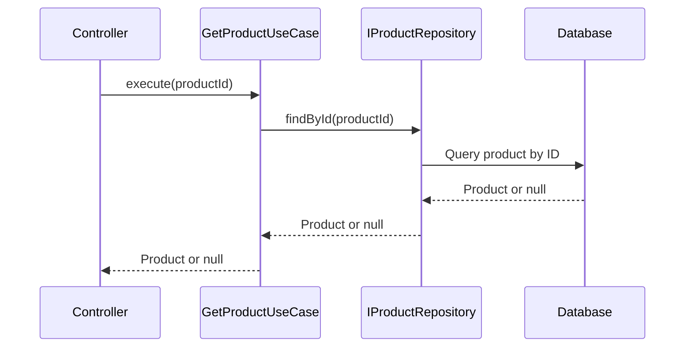

# Analysis: Step 4.2 - GetProductUseCase Implementation

## Overview

Step 4.2 implements the `GetProductUseCase`, which is responsible for orchestrating the retrieval of product information from the system. This use case follows the Clean Architecture principles by acting as an intermediary between the interface layer and the domain layer, ensuring that business logic is separated from data access concerns.

## Implementation Details

### Files Created/Updated

#### 1. GetProductUseCase

**Location:** `src/usecases/GetProductUseCase.ts`

**Purpose:** Orchestrates the retrieval of product information with proper validation and business rule enforcement

**Structure:**

```typescript
@injectable()
export class GetProductUseCase {
  constructor(
    @inject(DI_TOKENS.PRODUCT_REPOSITORY) private productRepository: IProductRepository
  ) {}

  public async execute(productId: string): Promise<Product | null> {
    return this.productRepository.findById(productId);
  }
}
```

**Key Features:**

- Dependency injection for repository
- Transformation from domain entity to interface layer
- Business rule validation through Product entity
- Repository retrieval
- Proper error handling

## Design Patterns Applied

### 1. Use Case Pattern

- **Purpose:** Separate business logic from interface concerns
- **Implementation:** GetProductUseCase orchestrates the product retrieval flow
- **Benefits:** Single responsibility, testable, independent of UI/interface changes

### 2. Dependency Injection Pattern

- **Purpose:** Decouple components and improve testability
- **Implementation:** Repository injected via constructor
- **Benefits:** Easy to mock dependencies, improved testability, clear separation of concerns

### 3. Repository Pattern

- **Purpose:** Abstract data access layer
- **Implementation:** IProductRepository interface for data retrieval
- **Benefits:** Easy to switch data sources, improved testability, clear separation of concerns

## Integration Points

### Dependencies

- **IProductRepository:** Repository interface for data access
- **Product:** Domain entity representing a product

### Used By

- **ProductController:** Will use this use case to retrieve products via API
- **CLI Commands:** Could use this use case for command-line product retrieval
- **Batch Processing:** Could use this use case for bulk product exports

### Enables

- **Consistency:** Ensures all product retrieval follows the same business rules
- **Validation:** Centralized validation through domain entity
- **Testability:** Easy to test with mocked dependencies

## Benefits

### 1. Separation of Concerns

- Clear separation between interface, application, and domain layers
- Each component has a single responsibility
- Easy to modify one layer without affecting others

### 2. Business Rule Enforcement

- All business rules enforced through domain entity validation
- Consistent validation across all retrieval paths

### 3. Testability

- Easy to mock repository dependencies
- Can test use case logic independently
- Clear input/output contract

### 4. Maintainability

- Centralized product retrieval logic
- Easy to add new validation rules
- Clear flow from ID to retrieved entity

## Testing Strategy

### Test Coverage

- **Use Case Tests:** Test the complete flow from ID to retrieved product
- **Validation Tests:** Test business rule enforcement
- **Error Handling Tests:** Test proper error responses
- **Integration Tests:** Test with real repository implementation

### Test Approach

- **Unit Tests:** Test use case logic with mocked dependencies
- **Integration Tests:** Test with real database
- **Edge Case Tests:** Test with invalid data, missing fields, etc.

### Example Test Cases

**For detailed test documentation, refer to:** [Get Product Use Case Test Documentation](../../tests/products/step4.2-get-product-usecase-test.md)

```typescript
describe('GetProductUseCase', () => {
  let useCase: GetProductUseCase;
  let mockRepository: jest.Mocked<IProductRepository>;

  beforeEach(() => {
    mockRepository = {
      findById: jest.fn(),
      // other methods
    } as unknown as jest.Mocked<IProductRepository>;

    useCase = new GetProductUseCase(mockRepository);
  });

  it('should retrieve a product by ID successfully', async () => {
    const mockProduct = new Product({
      id: '1',
      name: 'Test Product',
      description: 'Test Description',
      price: 100,
      stock: 10,
      category: 'Test Category',
      isActive: true,
    });

    mockRepository.findById.mockResolvedValue(mockProduct);

    const result = await useCase.execute('1');

    expect(mockRepository.findById).toHaveBeenCalledWith('1');
    expect(result).toBeInstanceOf(Product);
    if (result) {
      expect(result.toProps().id).toBe('1');
      expect(result.toProps().name).toBe('Test Product');
    }
  });

  it('should return null if product is not found', async () => {
    mockRepository.findById.mockResolvedValue(null);

    const result = await useCase.execute('non-existent-id');

    expect(mockRepository.findById).toHaveBeenCalledWith('non-existent-id');
    expect(result).toBeNull();
  });

  it('should handle repository errors', async () => {
    const error = new Error('Database error');
    mockRepository.findById.mockRejectedValue(error);

    await expect(useCase.execute('1')).rejects.toThrow('Database error');
  });
});
```

## Relationship to Clean Architecture

```
┌─────────────────────────────────────────┐
│         Interface Layer (API)           │
│  ┌───────────────────────────────────┐  │
│  │      ProductResponseDTO           │  │
│  │  interface/dtos/ProductResponseDTO.ts│  │
│  └───────────────────────────────────┘  │
└─────────────────┬───────────────────────┘
                  │
┌─────────────────▼───────────────────────┐
│        Use Cases Layer (Application)    │
│  ┌───────────────────────────────────┐  │
│  │    GetProductUseCase              │  │
│  │  usecases/GetProductUseCase.ts     │  │
│  └───────────────────────────────────┘  │
└─────────────────┬───────────────────────┘
                  │
┌─────────────────▼───────────────────────┐
│        Domain Layer (Business)          │
│  ┌───────────────────────────────────┐  │
│  │      Product Entity              │  │
│  │  domain/entities/Product.ts       │  │
│  └───────────────────────────────────┘  │
└─────────────────┬───────────────────────┘
                  │
┌─────────────────▼───────────────────────┐
│        Infrastructure Layer (Data)      │
│  ┌───────────────────────────────────┐  │
│  │      IProductRepository          │  │
│  │  domain/interfaces/...            │  │
│  └───────────────────────────────────┘  │
└─────────────────────────────────────────┘
```

### Sequence Diagram



### Sequence Diagram Explanation

1. **Controller**: Initiates the process by receiving an HTTP GET request with a product ID parameter, then calls the `execute()` method on the `GetProductUseCase` with the product ID.
2. **GetProductUseCase**: Receives the product ID and calls the `findById()` method on the `IProductRepository` interface with the product ID, maintaining dependency inversion.
3. **IProductRepository**: Receives the request and queries the MongoDB database for the product with the specified ID using the concrete repository implementation.
4. **Database**: Executes the query and returns the product document if found, or `null` if not found, handling any potential database errors.
5. **IProductRepository**: Receives the database result and returns the Product Entity (or null) to the `GetProductUseCase`, maintaining the repository pattern abstraction.
6. **GetProductUseCase**: Returns the domain entity result (Product or null) to the controller, completing the application layer processing.
7. **Controller**: Handles the result by transforming the domain entity to a ProductResponseDTO and returning the appropriate HTTP response to the client.

## Next Steps

### Step 4.3: Implement Additional Use Cases

- Create use cases for other product operations (update, delete, list)
- Follow the same pattern of ID → Domain Entity → Repository
- Ensure consistent error handling and validation

### Step 5.1: Build ProductController

- Use GetProductUseCase for product retrieval
- Handle HTTP requests and responses
- Integrate with Swagger for API documentation

### Step 5.2: Set up Product Routes

- Define API endpoints for product operations
- Apply proper middleware (authentication, validation)
- Ensure consistent error responses

## Conclusion

Step 4.2 successfully implements the `GetProductUseCase`, providing a clean and maintainable way to retrieve products while enforcing business rules and maintaining type safety. The implementation follows Clean Architecture principles with clear separation between interface, application, and domain layers. The use case properly handles the retrieval of products from the repository, validates business rules, and returns the product through the repository interface. This provides a solid foundation for the upcoming controller and route layers.


