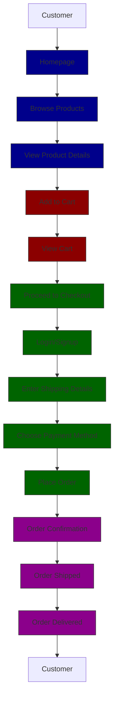

# JollyJet E-Commerce Flow

## Flow Explanation

1. **Customer**: The customer starts by visiting the JollyJet homepage.
2. **Homepage**: The homepage displays featured products and categories.
3. **Browse Products**: The customer browses through the available products.
4. **View Product Details**: The customer clicks on a product to view its details.
5. **Add to Cart**: The customer adds the product to their cart.
6. **View Cart**: The customer reviews the items in their cart.
7. **Proceed to Checkout**: The customer proceeds to the checkout process.
8. **Login/Signup**: The customer logs in or signs up if they haven't already.
9. **Enter Shipping Details**: The customer enters their shipping address.
10. **Choose Payment Method**: The customer selects a payment method.
11. **Place Order**: The customer places the order.
12. **Order Confirmation**: The customer receives an order confirmation.
13. **Order Shipped**: The order is shipped to the customer.
14. **Order Delivered**: The order is delivered to the customer.

This flowchart represents the typical e-commerce flow similar to platforms like Flipkart or Amazon, tailored for JollyJet.
