# JollyJet E-Commerce Application Flowchart

```mermaid
graph TD
    A[User] --> D[Frontend Application]
    D --> E[API Request]
    E --> F[Backend Server]
    F --> G[Request Handling]
    G --> H[Middleware]
    H --> I[Routing]
    I --> J[Use Cases]
    J --> K[Product Use Cases]
    K --> L[Create Product]
    K --> M[Get Product]
    K --> N[List Products]
    K --> O[Update Product]
    K --> P[Delete Product]
    K --> Q[Toggle Wishlist]
    J --> R[Domain Services]
    R --> S[Product Service]
    S --> T[Domain Entities]
    T --> U[Product Entity]
    S --> V[Interfaces]
    V --> W[IProductRepository]
    W --> X[Infrastructure Layer]
    X --> Y[Repositories]
    Y --> Z[Product Repository]
    Z --> AA[Database Layer]
    AA --> AB[MongoDB Database]
    AB --> AC[Product Model]
    AC --> AD[Database Operations]
    AD --> AE[Response]
    AE --> AF[Frontend Application]
    AF --> AI[User]

    style D fill:#00008B,stroke:#333
    style F fill:#00008B,stroke:#333
    style J fill:#8B0000,stroke:#333
    style R fill:#8B0000,stroke:#333
    style X fill:#8B0000,stroke:#333
    style AA fill:#8B0000,stroke:#333
    style V fill:#8B0000,stroke:#333
    style AF fill:#00008B,stroke:#333

```

## Flowchart Explanation

1. **User Interaction**: The user interacts with the Frontend Application.
2. **Frontend**: The frontend sends API requests to the server.
3. **API Request**: The frontend sends an API request to the server.
4. **Server Handling**: The server processes the request through middleware and routing.
5. **Use Cases**: The request is directed to the appropriate use case, such as creating, retrieving, listing, updating, or deleting a product, or toggling a wishlist.
6. **Domain Services**: The use cases interact with domain services like the Product Service.
7. **Domain Entities**: The domain services work with domain entities such as the Product Entity.
8. **Interfaces**: The domain services use interfaces like IProductRepository to interact with the infrastructure layer.
9. **Infrastructure**: The infrastructure layer includes repositories like the Product Repository, which handles database operations.
10. **Database**: The repositories interact with the database (MongoDB) to perform CRUD operations.
11. **Response**: The server sends a response back to the frontend, which displays it to the user.

This flowchart provides a comprehensive overview of the flow of data and interactions within the JollyJet e-commerce application.

