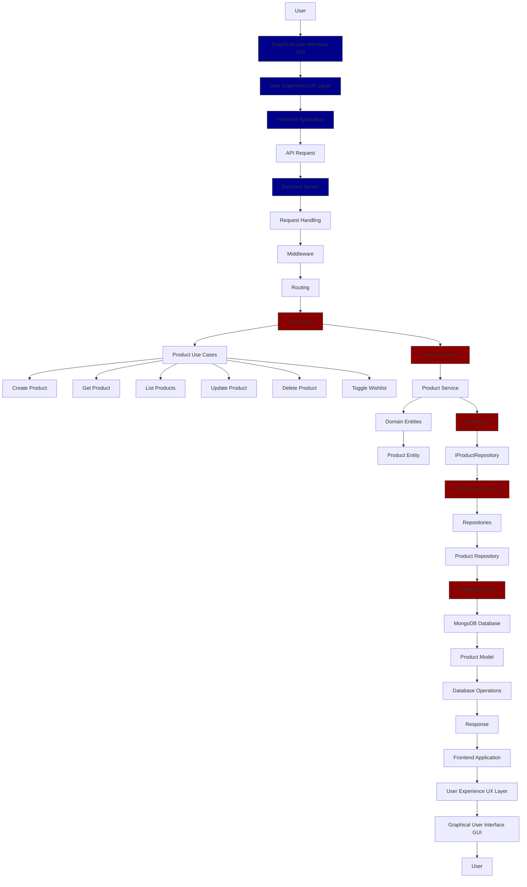

# JollyJet E-Commerce Application Flowchart

## Flowchart Explanation

1. **User Interaction**: The user interacts with the Graphical User Interface (GUI) of the application.
2. **User Experience (UX) Layer**: The GUI is enhanced by the UX layer to ensure a smooth and intuitive user experience.
3. **Frontend**: The UX layer interacts with the frontend, which sends API requests to the server.
4. **API Request**: The frontend sends an API request to the server.
5. **Server Handling**: The server processes the request through middleware and routing.
6. **Use Cases**: The request is directed to the appropriate use case, such as creating, retrieving, listing, updating, or deleting a product, or toggling a wishlist.
7. **Domain Services**: The use cases interact with domain services like the Product Service.
8. **Domain Entities**: The domain services work with domain entities such as the Product Entity.
9. **Interfaces**: The domain services use interfaces like IProductRepository to interact with the infrastructure layer.
10. **Infrastructure**: The infrastructure layer includes repositories like the Product Repository, which handles database operations.
11. **Database**: The repositories interact with the database (MongoDB) to perform CRUD operations.
12. **Response**: The server sends a response back to the frontend, which is then processed by the UX layer.
13. **User Experience (UX) Layer**: The UX layer enhances the response before displaying it in the GUI.
14. **Graphical User Interface (GUI)**: The GUI displays the response to the user.

This flowchart provides a comprehensive overview of the flow of data and interactions within the JollyJet e-commerce application, including the GUI and UX components.
