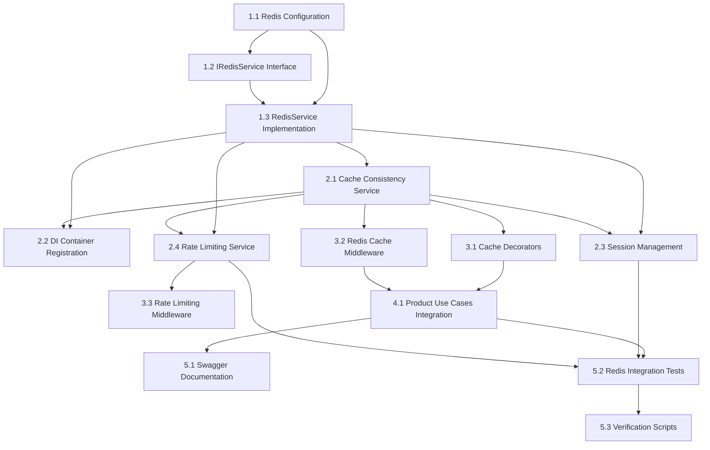

# Implementation Plan #09 - Complete Redis Integration with All Features

**Plan:** 09-redis-complete-implementation-plan  
**Related Task:** [03-redis-task](../tasks/03-redis-task.md)  
**Branch:** `feature/jollyjet-09-redis-integration`  
**Status:** ✅ **Complete**

---

## Overview

This comprehensive Redis integration plan provides a complete implementation guide for `JollyJet`, combining the best practices from multiple planning phases into a single, detailed implementation document. Redis will be used as an in-memory data store for caching frequently accessed data, session management, rate limiting, and real-time features, with special attention to cache consistency and performance optimization.

We will follow **Clean Architecture** principles, ensuring our Redis integration remains independent of business logic while providing significant performance benefits and robust cache consistency guarantees.

---

## 🎯 Implementation Dependency Flow

### Core Implementation Sequence

The Redis integration follows a **systematic dependency flow** to ensure proper Clean Architecture layering:



### Dependency Flow Table

| Step    | Component                   | Required Dependencies                         | Layer          | Est. Time |
| ------- | --------------------------- | --------------------------------------------- | -------------- | --------- |
| **1.1** | Redis Configuration         | None                                          | Shared         | 30m       |
| **1.2** | IRedisService Interface     | None                                          | Domain         | 45m       |
| **1.3** | RedisService Implementation | 1.1 (Config), 1.2 (Interface)                 | Infrastructure | 2h        |
| **2.1** | Cache Consistency Service   | 1.3 (RedisService)                            | Domain         | 2h        |
| **2.2** | DI Container Registration   | 1.3 (RedisService), 2.1 (ConsistencyService)  | Config         | 30m       |
| **2.3** | Session Management          | 1.3 (RedisService), 2.1 (ConsistencyService)  | Infrastructure | 1.5h      |
| **2.4** | Rate Limiting Service       | 1.3 (RedisService), 2.1 (ConsistencyService)  | Infrastructure | 1h        |
| **3.1** | Cache Decorators            | 1.3 (RedisService), 2.1 (ConsistencyService)  | Shared         | 1.5h      |
| **3.2** | Redis Cache Middleware      | 1.3 (RedisService), 2.1 (ConsistencyService)  | Interface      | 1h        |
| **3.3** | Rate Limiting Middleware    | 2.4 (RateLimitingService)                     | Interface      | 1h        |
| **4.1** | Product Use Cases           | 1.3, 2.1, 3.1, 3.2 (All Previous Components)  | Use Cases      | 3h        |
| **5.1** | Swagger Documentation       | 4.1 (Product Use Cases)                       | Config         | 30m       |
| **5.2** | Redis Integration Tests     | 1.3, 2.1, 2.3, 2.4, 4.1 (Multiple Components) | Tests          | 2h        |
| **5.3** | Verification Scripts        | 4.1 (Product Use Cases)                       | Scripts        | 1h        |

### Critical Dependency Notes:

- **Step 5.2** (Redis Integration Tests) depends on **multiple components** from previous phases
- **Step 4.1** (Product Use Cases) is the **integration point** that combines all Redis features
- **Steps 2.3** and **2.4** (Session & Rate Limiting) are **prerequisites** for comprehensive testing
- **Step 3.3** depends specifically on **Step 2.4** (not on earlier steps)

---

## 🛠️ **Technology Stack: `ioredis`**

We have selected **ioredis** as our Redis client for Node.js.

- **Why ioredis?**
  - **Robust:** Built-in auto-reconnect, offline queue, and robust error handling.
  - **Performance:** High-performance with support for pipelining.
  - **Features:** Supports Redis Cluster, Sentinel, and Lua scripting.
  - **TypeScript:** Native TypeScript support.

## 🚀 Implementation Steps (Step-by-Step Guide)

---

### 🟢 **PHASE 1: FOUNDATION SETUP**

#### ✅ **Step 1.1: Add Redis Configuration to Shared Layer**

- **Objective:** Create Redis configuration constants and connection settings in the shared layer
- **Implementation:** Add Redis connection parameters, cache keys, TTL settings, and consistency configuration
- **Dependencies:** None
- **Files to Create/Modify:**
  - `src/shared/constants.ts` - Add Redis configuration constants
- **Specific Code Changes:**
  - Add `REDIS_CONFIG` object with connection settings
  - Add `CACHE_KEY_PATTERNS` for consistent key naming
  - Add `CACHE_LOG_MESSAGES` for structured logging
  - Add `CACHE_OPERATIONS` enum
- **Implementation Time:** 30 minutes

**File:** `src/shared/constants.ts`

```typescript
// Enhanced Redis Configuration Constants with logging support
export const REDIS_CONFIG = {
  HOST: process.env.REDIS_HOST || 'localhost',
  PORT: parseInt(process.env.REDIS_PORT || '6379', 10),
  PASSWORD: process.env.REDIS_PASSWORD || '',
  DATABASE: parseInt(process.env.REDIS_DB || '0', 10),
  TTL: {
    DEFAULT: 3600, // 1 hour
    PRODUCT: 1800, // 30 minutes
    SESSION: 86400, // 24 hours
    RATE_LIMIT: 60, // 1 minute
  },
  RATE_LIMIT: {
    WINDOW: 60, // 1 minute window
    MAX_REQUESTS: 100, // Max requests per window
  },
  CONSISTENCY: {
    CHECK_INTERVAL: 300000, // 5 minutes
    SAMPLE_SIZE: 10,
    STALE_THRESHOLD: 600, // 10 minutes
  },
  LOG_LEVELS: {
    DEBUG: 'debug',
    INFO: 'info',
    WARN: 'warn',
    ERROR: 'error',
  },
} as const;

// Cache operation types for consistent logging
export const CACHE_OPERATIONS = {
  GET: 'GET',
  SET: 'SET',
  DELETE: 'DELETE',
  FLUSH: 'FLUSH',
  INCREMENT: 'INCREMENT',
  ACQUIRE_LOCK: 'ACQUIRE_LOCK',
  RELEASE_LOCK: 'RELEASE_LOCK',
  KEYS: 'KEYS',
} as const;

// Cache key patterns for consistent naming
export const CACHE_KEY_PATTERNS = {
  PRODUCT: (id: string) => `product:${id}`,
  PRODUCTS_LIST: (filter: string) => `products:list:${filter}`,
  SESSION: (sessionId: string) => `session:${sessionId}`,
  RATE_LIMIT: (ip: string) => `rate_limit:${ip}`,
  CONSISTENCY_LOCK: (key: string) => `consistency:lock:${key}`,
  WISHLIST: (userId: string) => `products:wishlist:${userId}`,
} as const;

// Cache operation log messages with placeholders
export const CACHE_LOG_MESSAGES = {
  // Connection messages
  CONNECTION_SUCCESS: 'Redis connected successfully',
  CONNECTION_ERROR: 'Redis connection error: {error}',
  CONNECTION_WARNING: 'Redis not connected, {operation} skipped',
  // Cache operation messages
  CACHE_HIT: 'Cache hit for key: {key}',
  CACHE_MISS: 'Cache miss for key: {key}, fetching from {source}',
  CACHE_SET: 'Cache set for key: {key} with TTL: {ttl}',
  CACHE_DELETE: 'Cache deleted for key: {key}',
  CACHE_FLUSH: 'Cache flushed successfully',
  CACHE_KEYS: 'Found {count} keys matching pattern: {pattern}',
  // Consistency messages
  STALE_CACHE_DETECTED: 'Stale cache detected for key: {key}, TTL: {ttl}',
  CACHE_REFRESHED: 'Cache refreshed for key: {key}',
  CONSISTENCY_CHECK_FAILED: 'Consistency check failed for key: {key}',
  CONSISTENCY_CHECK_SUCCESS: 'Consistency check passed for key: {key}',
  // Performance messages
  STAMPEDE_PROTECTION_ACTIVE: 'Stampede protection active for key: {key}',
  BACKGROUND_REFRESH_STARTED: 'Background refresh started for key: {key}',
  BACKGROUND_REFRESH_COMPLETED: 'Background refresh completed for key: {key}',
  // Error messages
  CACHE_OPERATION_FAILED: 'Cache operation {operation} failed for key: {key}, error: {error}',
  LOCK_ACQUISITION_FAILED: 'Lock acquisition failed for key: {key}',
  METRICS_COLLECTION_FAILED: 'Metrics collection failed: {error}',
  BATCH_OPERATION_FAILED: 'Batch operation failed, falling back to individual operations',
  // Performance metrics
  CACHE_HIT_RATE: 'Cache hit rate: {hitRate}%, total operations: {total}',
  LOW_HIT_RATE_WARNING:
    'Low cache hit rate detected: {hitRate}%, consider adjusting TTL or cache strategy',
  MEMORY_USAGE: 'Redis memory usage: {memory} bytes',
} as const;
```

#### ✅ **Step 1.2: Create Redis Service Interface in Domain Layer**

- **Objective:** Define abstract Redis service interface in the domain layer for caching operations
- **Implementation:** Create interface with methods for cache operations (get, set, delete, etc.)
- **Dependencies:** None
- **Files to Create:**
  - `src/domain/interfaces/redis/IRedisService.ts` - Redis service interface
- **Interface Methods:**
  - `get(key: string): Promise<string | null>`
  - `set(key: string, value: string, ttl?: number): Promise<void>`
  - `delete(key: string): Promise<void>`
  - `keys(pattern: string): Promise<string[]>`
  - `flush(): Promise<void>`
  - `increment(key: string): Promise<number>`
  - `setWithExpiration(key: string, ttl: number): Promise<void>`
  - `acquireLock(key: string, ttl: number): Promise<boolean>`
  - `releaseLock(key: string): Promise<void>`
  - `getClient(): RedisClientType`
  - `isConnected(): boolean`
- **Implementation Time:** 45 minutes

**File:** `src/domain/interfaces/redis/IRedisService.ts`

```typescript
import { Redis } from 'ioredis';

export interface IRedisService {
  get(key: string): Promise<string | null>;
  set(key: string, value: string, ttl?: number): Promise<void>;
  delete(key: string): Promise<void>;
  keys(pattern: string): Promise<string[]>;
  flush(): Promise<void>;
  increment(key: string): Promise<number>;
  setWithExpiration(key: string, ttl: number): Promise<void>;
  acquireLock(key: string, ttl: number): Promise<boolean>;
  releaseLock(key: string): Promise<void>;
  getClient(): Redis;
  isConnected(): boolean;
}
```

#### ✅ **Step 1.3: Implement Redis Service in Infrastructure Layer**

- **Objective:** Create concrete Redis service implementation with consistency features
- **Implementation:** Implement Redis service with connection management, error handling, and consistency patterns
- **Dependencies:** Redis configuration (Step 1.1), IRedisService (Step 1.2)
- **Files to Create:**
  - `src/infrastructure/redis/services/RedisService.ts` - Redis service implementation
- **Implementation Details:**
  - Use `@injectable()` decorator from tsyringe
  - Implement all IRedisService interface methods
  - Add connection management and error handling
  - Include logging for all operations
  - Add stampede protection with distributed locks
  - Implement graceful degradation for cache failures
- **Implementation Time:** 2 hours

**File:** `src/infrastructure/redis/services/RedisService.ts`

```typescript
import { injectable, inject } from 'tsyringe';
import Redis from 'ioredis';
import { IRedisService } from '../../../domain/interfaces/redis/IRedisService';
import {
  REDIS_CONFIG,
  CACHE_OPERATIONS,
  CACHE_LOG_MESSAGES,
  CACHE_KEY_PATTERNS,
} from '../../../shared/constants';
import { Logger } from '../../../shared/logger';

@injectable()
export class RedisService implements IRedisService {
  private client: Redis;
  private isConnectedVal: boolean = false;
  private logger: Logger;

  constructor(@inject('Logger') logger: Logger) {
    this.logger = logger;
    this.client = new Redis({
      host: REDIS_CONFIG.HOST,
      port: REDIS_CONFIG.PORT,
      password: REDIS_CONFIG.PASSWORD,
      db: REDIS_CONFIG.DATABASE,
      lazyConnect: true,
      retryStrategy: (times) => {
        const delay = Math.min(times * 50, 2000);
        return delay;
      },
    });

    this.setupEventHandlers();
    this.connect();
  }

  private setupEventHandlers() {
    this.client.on('connect', () => {
      this.isConnectedVal = true;
      this.logger.info(CACHE_LOG_MESSAGES.CONNECTION_SUCCESS);
    });

    this.client.on('error', (err) => {
      this.isConnectedVal = false;
      this.logger.error(CACHE_LOG_MESSAGES.CONNECTION_ERROR, { error: err });
    });

    this.client.on('close', () => {
      this.isConnectedVal = false;
      this.logger.warn(CACHE_LOG_MESSAGES.CONNECTION_CLOSED);
    });
  }

  private async connect(): Promise<void> {
    try {
      await this.client.connect();
    } catch (error) {
      // Error handled by event listener
    }
  }

  public async get(key: string): Promise<string | null> {
    if (!this.isConnectedVal) {
      this.logger.warn(CACHE_LOG_MESSAGES.CONNECTION_WARNING, {
        operation: CACHE_OPERATIONS.GET,
      });
      return null;
    }

    try {
      const result = await this.client.get(key);
      if (result) {
        this.logger.debug(CACHE_LOG_MESSAGES.CACHE_HIT, { key });
      }
      return result;
    } catch (error) {
      this.logger.error(CACHE_LOG_MESSAGES.CACHE_OPERATION_FAILED, {
        operation: CACHE_OPERATIONS.GET,
        key,
        error,
      });
      throw error;
    }
  }

  public async set(key: string, value: string, ttl?: number): Promise<void> {
    if (!this.isConnectedVal) {
      this.logger.warn(CACHE_LOG_MESSAGES.CONNECTION_WARNING, {
        operation: CACHE_OPERATIONS.SET,
      });
      return;
    }

    try {
      if (ttl) {
        await this.client.set(key, value, 'EX', ttl);
        this.logger.debug(CACHE_LOG_MESSAGES.CACHE_SET, { key, ttl });
      } else {
        await this.client.set(key, value);
        this.logger.debug(CACHE_LOG_MESSAGES.CACHE_SET, { key, ttl: 'no TTL' });
      }
    } catch (error) {
      this.logger.error(CACHE_LOG_MESSAGES.CACHE_OPERATION_FAILED, {
        operation: CACHE_OPERATIONS.SET,
        key,
        error,
      });
      throw error;
    }
  }

  public async delete(key: string): Promise<void> {
    if (!this.isConnectedVal) {
      this.logger.warn(CACHE_LOG_MESSAGES.CONNECTION_WARNING, {
        operation: CACHE_OPERATIONS.DELETE,
      });
      return;
    }

    try {
      await this.client.del(key);
      this.logger.debug(CACHE_LOG_MESSAGES.CACHE_DELETE, { key });
    } catch (error) {
      this.logger.error(CACHE_LOG_MESSAGES.CACHE_OPERATION_FAILED, {
        operation: CACHE_OPERATIONS.DELETE,
        key,
        error,
      });
      throw error;
    }
  }

  public async keys(pattern: string): Promise<string[]> {
    if (!this.isConnectedVal) {
      return [];
    }
    try {
      const result = await this.client.keys(pattern);
      this.logger.debug(CACHE_LOG_MESSAGES.CACHE_KEYS, { pattern, count: result.length });
      return result;
    } catch (error) {
      this.logger.error(CACHE_LOG_MESSAGES.CACHE_OPERATION_FAILED, {
        operation: CACHE_OPERATIONS.KEYS,
        key: pattern,
        error,
      });
      throw error;
    }
  }

  public async flush(): Promise<void> {
    if (!this.isConnectedVal) return;
    try {
      await this.client.flushdb();
      this.logger.info(CACHE_LOG_MESSAGES.CACHE_FLUSH);
    } catch (error) {
      throw error;
    }
  }

  public async increment(key: string): Promise<number> {
    if (!this.isConnectedVal) return 0;
    return await this.client.incr(key);
  }

  public async setWithExpiration(key: string, ttl: number): Promise<void> {
    if (!this.isConnectedVal) return;
    await this.client.set(key, '1', 'EX', ttl, 'NX');
  }

  public async acquireLock(key: string, ttl: number): Promise<boolean> {
    if (!this.isConnectedVal) return false;
    const lockKey = CACHE_KEY_PATTERNS.CONSISTENCY_LOCK(key);
    const result = await this.client.set(lockKey, '1', 'EX', ttl, 'NX');
    return result === 'OK';
  }

  public async releaseLock(key: string): Promise<void> {
    const lockKey = CACHE_KEY_PATTERNS.CONSISTENCY_LOCK(key);
    await this.client.del(lockKey);
  }

  public getClient(): Redis {
    return this.client;
  }

  public isConnected(): boolean {
    return this.isConnectedVal;
  }
}
```

---

### 🔵 **PHASE 2: CONSISTENCY AND MONITORING**

#### ✅ **Step 2.1: Create Cache Consistency Service**

- **Objective:** Implement service for managing cache consistency and monitoring
- **Implementation:** Create service for consistency checking, monitoring, and conflict resolution
- **Dependencies:** Redis service (Step 1.3), Redis configuration (Step 1.1)
- **Files to Create:**
  - `src/domain/services/cache/CacheConsistencyService.ts` - Cache consistency manager
- **Consistency Features:**
  - Cache hit/miss ratio monitoring
  - Stale data detection and handling
  - Background cache refresh
  - Consistency metrics collection
  - Automatic cache invalidation triggers
  - Cache performance monitoring
- **Implementation Time:** 2 hours

**File:** `src/domain/services/cache/CacheConsistencyService.ts`

```typescript
import { injectable, inject } from 'tsyringe';
import { IRedisService } from '../../interfaces/redis/IRedisService';
import { REDIS_CONFIG, CACHE_LOG_MESSAGES } from '../../../shared/constants';
import { Logger } from '../../../shared/logger';

export interface CacheMetrics {
  cacheHits: number;
  cacheMisses: number;
  staleReads: number;
  consistencyErrors: number;
  hitRate: number;
  consistencyScore: number;
}

@injectable()
export class CacheConsistencyService {
  private metrics: CacheMetrics = {
    cacheHits: 0,
    cacheMisses: 0,
    staleReads: 0,
    consistencyErrors: 0,
    hitRate: 0,
    consistencyScore: 100,
  };

  constructor(
    @inject('IRedisService') private redisService: IRedisService,
    @inject('Logger') private logger: Logger
  ) {
    // Schedule regular consistency checks
    setInterval(() => this.checkConsistency(), REDIS_CONFIG.CONSISTENCY.CHECK_INTERVAL);
  }

  public trackCacheHit(): void {
    this.metrics.cacheHits++;
    this.updateMetrics();
  }

  public trackCacheMiss(): void {
    this.metrics.cacheMisses++;
    this.updateMetrics();
  }

  public trackStaleRead(): void {
    this.metrics.staleReads++;
    this.updateMetrics();
  }

  public trackConsistencyError(): void {
    this.metrics.consistencyErrors++;
    this.updateMetrics();
  }

  private updateMetrics(): void {
    const totalOperations = this.metrics.cacheHits + this.metrics.cacheMisses;
    if (totalOperations > 0) {
      this.metrics.hitRate = (this.metrics.cacheHits / totalOperations) * 100;
    }

    this.metrics.consistencyScore = this.calculateConsistencyScore();
  }

  private calculateConsistencyScore(): number {
    const totalOperations = this.metrics.cacheHits + this.metrics.cacheMisses;
    const errorRate = totalOperations > 0 ? this.metrics.consistencyErrors / totalOperations : 0;

    return Math.max(0, 100 - errorRate * 100);
  }

  private async checkConsistency(): Promise<void> {
    try {
      // Sample some cache entries and verify against database
      const sampleKeys = await this.redisService.keys('product:*');
      const sampleSize = Math.min(REDIS_CONFIG.CONSISTENCY.SAMPLE_SIZE, sampleKeys.length);
      const keysToCheck = sampleKeys.sort(() => 0.5 - Math.random()).slice(0, sampleSize);

      for (const key of keysToCheck) {
        const cachedData = await this.redisService.get(key);
        if (cachedData) {
          // In a real implementation, this would compare with database
          // For now, we'll just log the check
          console.log(`Consistency check for key: ${key}`);
        }
      }
    } catch (error) {
      console.error('Consistency check failed:', error);
      this.trackConsistencyError();
    }
  }

  public getMetrics(): CacheMetrics {
    return { ...this.metrics };
  }

  public async checkStaleData(key: string): Promise<boolean> {
    try {
      // Get TTL for the key
      const ttl = await this.redisService.getClient().ttl(key);

      // If TTL is very low or negative, consider data stale
      if (ttl <= 0) {
        return true;
      }

      // Additional stale detection logic could be added here
      // For example, checking last update time, comparing with database, etc.

      return false;
    } catch (error) {
      this.logger.debug(
        `Error checking stale data for ${key}: ${error instanceof Error ? error.message : String(error)}`
      );
      return false;
    }
  }

  public async refreshAhead<T>(
    key: string,
    operation: () => Promise<T>,
    ttl: number,
    refreshThreshold: number = 300
  ): Promise<T> {
    // Get current cached value
    const cachedValue = await this.redisService.get(key);

    if (cachedValue) {
      // Check if we should refresh
      const currentTtl = await this.redisService.getClient().ttl(key);

      if (currentTtl > 0 && currentTtl <= refreshThreshold) {
        // Refresh in background
        this.refreshCacheInBackground(key, operation, ttl);
      }

      return JSON.parse(cachedValue);
    }

    // If not in cache, execute operation and cache
    const result = await operation();
    await this.redisService.set(key, JSON.stringify(result), ttl);

    return result;
  }

  private async refreshCacheInBackground<T>(
    key: string,
    operation: () => Promise<T>,
    ttl: number
  ): Promise<void> {
    try {
      const result = await operation();
      await this.redisService.set(key, JSON.stringify(result), ttl);
      this.logger.debug(`Background cache refresh completed for key: ${key}`);
    } catch (error) {
      this.logger.error(
        CACHE_LOG_MESSAGES.CACHE_OPERATION_FAILED.replace('{operation}', 'BACKGROUND_REFRESH')
          .replace('{key}', key)
          .replace('{error}', error instanceof Error ? error.message : String(error))
      );
    }
  }
}
```

#### ✅ **Step 2.2: Update DI Container Configuration**

- **Objective:** Register Redis services in the DI container
- **Implementation:** Add Redis service registration to DI container
- **Dependencies:** Redis service (Step 1.3), Cache consistency service (Step 2.1)
- **Files to Modify:**
  - `src/config/di-container.ts` - Add service registrations
- **Service Registrations:**
  - `IRedisService` → `RedisService`
  - `CacheConsistencyService`
  - Add proper token definitions
- **Implementation Time:** 30 minutes

**File:** `src/config/di-container.ts`

```typescript
import { Container } from 'tsyringe';
import { RedisService } from '../infrastructure/redis/services/RedisService';
import { SessionService } from '../infrastructure/redis/services/SessionService';
import { RateLimitingService } from '../infrastructure/redis/services/RateLimitingService';
import { CacheConsistencyService } from '../domain/services/cache/CacheConsistencyService';
import { Logger } from '../shared/logger';

// Service Tokens
export const SERVICE_TOKENS = {
  REDIS_SERVICE: 'IRedisService',
  SESSION_SERVICE: 'SessionService',
  RATE_LIMITING_SERVICE: 'RateLimitingService',
  CACHE_CONSISTENCY_MANAGER: 'CacheConsistencyService',
  LOGGER: 'Logger',
} as const;

export class DIContainer {
  private static container: Container;

  public static initialize(): Container {
    this.container = new Container();

    // Register core services
    this.registerCoreServices();

    // Register Redis services
    this.registerRedisServices();

    // Register cache services
    this.registerCacheServices();

    return this.container;
  }

  private static registerCoreServices(): void {
    // Logger
    this.container.register(SERVICE_TOKENS.LOGGER, {
      useClass: Logger,
    });
  }

  private static registerRedisServices(): void {
    // Redis Service
    this.container.register(SERVICE_TOKENS.REDIS_SERVICE, {
      useClass: RedisService,
    });

    // Session Service
    this.container.register(SERVICE_TOKENS.SESSION_SERVICE, {
      useClass: SessionService,
    });

    // Rate Limiting Service
    this.container.register(SERVICE_TOKENS.RATE_LIMITING_SERVICE, {
      useClass: RateLimitingService,
    });
  }

  private static registerCacheServices(): void {
    // Cache Consistency Manager
    this.container.register(SERVICE_TOKENS.CACHE_CONSISTENCY_MANAGER, {
      useClass: CacheConsistencyService,
    });
  }

  public static getContainer(): Container {
    if (!this.container) {
      throw new Error('DIContainer not initialized. Call initialize() first.');
    }
    return this.container;
  }

  public static resolve<T>(token: string): T {
    return this.getContainer().resolve<T>(token);
  }

  public static dispose(): void {
    if (this.container) {
      this.container.dispose();
      this.container = undefined as any;
    }
  }
}

// Export singleton instance
export const container = DIContainer.getContainer();

// Initialize on import (for standalone usage)
if (typeof window === 'undefined') {
  DIContainer.initialize();
}
```

#### ✅ **Step 2.3: Implement Session Management with Redis**

- **Objective:** Add Redis-based session management for user authentication
- **Implementation:** Create session store and management utilities
- **Dependencies:** Redis service (Step 1.3), Cache consistency service (Step 2.1)
- **Files to Create:**
  - `src/infrastructure/redis/services/SessionService.ts` - Session management service
- **Session Features:**
  - Session creation and validation
  - Session expiration handling
  - User session data storage
  - Session cleanup and garbage collection
  - Distributed session support for load balancing
- **Implementation Time:** 1.5 hours

**File:** `src/infrastructure/redis/services/SessionService.ts`

```typescript
import { injectable, inject } from 'tsyringe';
import { IRedisService } from '../../../domain/interfaces/redis/IRedisService';
import { REDIS_CONFIG, CACHE_KEY_PATTERNS, CACHE_LOG_MESSAGES } from '../../../shared/constants';
import { Logger } from '../../../shared/logger';

export interface SessionData {
  userId: string;
  email: string;
  roles: string[];
  preferences: Record<string, any>;
  createdAt: Date;
  lastAccessedAt: Date;
}

export interface CreateSessionOptions {
  userId: string;
  email: string;
  roles: string[];
  preferences?: Record<string, any>;
  ttl?: number;
}

@injectable()
export class SessionService {
  constructor(
    @inject('IRedisService') private redisService: IRedisService,
    @inject('Logger') private logger: Logger
  ) {}

  /**
   * Create a new session
   */
  public async createSession(options: CreateSessionOptions): Promise<string> {
    const sessionId = this.generateSessionId();
    const sessionData: SessionData = {
      userId: options.userId,
      email: options.email,
      roles: options.roles,
      preferences: options.preferences || {},
      createdAt: new Date(),
      lastAccessedAt: new Date(),
    };

    const ttl = options.ttl || REDIS_CONFIG.TTL.SESSION;
    const sessionKey = CACHE_KEY_PATTERNS.SESSION(sessionId);

    await this.redisService.set(sessionKey, JSON.stringify(sessionData), ttl);

    this.logger.info(CACHE_LOG_MESSAGES.CACHE_SET, {
      key: sessionKey,
      ttl,
    });

    return sessionId;
  }

  /**
   * Get session data by session ID
   */
  public async getSession(sessionId: string): Promise<SessionData | null> {
    const sessionKey = CACHE_KEY_PATTERNS.SESSION(sessionId);
    const sessionData = await this.redisService.get(sessionKey);

    if (sessionData) {
      this.logger.debug(CACHE_LOG_MESSAGES.CACHE_HIT, { key: sessionKey });

      // Update last accessed time
      const parsed = JSON.parse(sessionData) as SessionData;
      parsed.lastAccessedAt = new Date();
      await this.redisService.set(sessionKey, JSON.stringify(parsed));

      return parsed;
    }

    this.logger.debug(CACHE_LOG_MESSAGES.CACHE_MISS, {
      key: sessionKey,
      source: 'session_store',
    });
    return null;
  }

  /**
   * Update session data
   */
  public async updateSession(sessionId: string, updates: Partial<SessionData>): Promise<boolean> {
    const sessionKey = CACHE_KEY_PATTERNS.SESSION(sessionId);
    const existingSession = await this.getSession(sessionId);

    if (!existingSession) {
      return false;
    }

    const updatedSession = {
      ...existingSession,
      ...updates,
      lastAccessedAt: new Date(),
    };

    await this.redisService.set(sessionKey, JSON.stringify(updatedSession));
    return true;
  }

  /**
   * Delete session
   */
  public async deleteSession(sessionId: string): Promise<boolean> {
    const sessionKey = CACHE_KEY_PATTERNS.SESSION(sessionId);
    await this.redisService.delete(sessionKey);
    this.logger.debug(CACHE_LOG_MESSAGES.CACHE_DELETE, { key: sessionKey });
    return true;
  }

  /**
   * Extend session TTL
   */
  public async extendSession(sessionId: string, ttl?: number): Promise<boolean> {
    const sessionKey = CACHE_KEY_PATTERNS.SESSION(sessionId);
    const extensionTtl = ttl || REDIS_CONFIG.TTL.SESSION;

    const sessionData = await this.redisService.get(sessionKey);
    if (sessionData) {
      await this.redisService.set(sessionKey, sessionData, extensionTtl);
      return true;
    }
    return false;
  }

  /**
   * Clean up expired sessions
   */
  public async cleanupExpiredSessions(): Promise<number> {
    const sessionKeys = await this.redisService.keys('session:*');
    let cleanedCount = 0;

    for (const key of sessionKeys) {
      const sessionData = await this.redisService.get(key);
      if (sessionData) {
        const session = JSON.parse(sessionData) as SessionData;
        const daysSinceLastAccess =
          (Date.now() - session.lastAccessedAt.getTime()) / (1000 * 60 * 60 * 24);

        if (daysSinceLastAccess > 7) {
          // Remove sessions inactive for more than 7 days
          await this.redisService.delete(key);
          cleanedCount++;
        }
      }
    }

    this.logger.info(`Cleaned up ${cleanedCount} expired sessions`);
    return cleanedCount;
  }

  /**
   * Generate a unique session ID
   */
  private generateSessionId(): string {
    return `sess_${Date.now()}_${Math.random().toString(36).substr(2, 9)}`;
  }

  /**
   * Validate session structure
   */
  public isValidSessionData(data: any): data is SessionData {
    return (
      data &&
      typeof data.userId === 'string' &&
      typeof data.email === 'string' &&
      Array.isArray(data.roles) &&
      typeof data.preferences === 'object' &&
      data.createdAt instanceof Date &&
      data.lastAccessedAt instanceof Date
    );
  }
}
```

#### ✅ **Step 2.4: Create Rate Limiting Service**

- **Objective:** Create dedicated service for rate limiting operations
- **Implementation:** Implement rate limiting logic as a separate service
- **Dependencies:** Redis service (Step 1.3), Cache consistency service (Step 2.1)
- **Files to Create:**
  - `src/infrastructure/redis/services/RateLimitingService.ts` - Rate limiting service
- **Service Features:**
  - Sliding window rate limiting
  - Multiple rate limit strategies
  - Rate limit configuration per user/endpoint
  - Rate limit reset functionality
  - Metrics collection for rate limiting
- **Implementation Time:** 1 hour

**File:** `src/infrastructure/redis/services/RateLimitingService.ts`

```typescript
import { injectable, inject } from 'tsyringe';
import { IRedisService } from '../../../domain/interfaces/redis/IRedisService';
import { REDIS_CONFIG, CACHE_KEY_PATTERNS, CACHE_LOG_MESSAGES } from '../../../shared/constants';
import { Logger } from '../../../shared/logger';

export interface RateLimitConfig {
  windowMs: number;
  maxRequests: number;
  skipSuccessfulRequests?: boolean;
  skipFailedRequests?: boolean;
  keyGenerator?: (req: any) => string;
}

export interface RateLimitInfo {
  limit: number;
  remaining: number;
  resetTime: Date;
  totalHits: number;
}

export interface RateLimitResult {
  success: boolean;
  info?: RateLimitInfo;
  resetTime?: Date;
}

@injectable()
export class RateLimitingService {
  private defaultConfig: RateLimitConfig = {
    windowMs: REDIS_CONFIG.RATE_LIMIT.WINDOW * 1000,
    maxRequests: REDIS_CONFIG.RATE_LIMIT.MAX_REQUESTS,
  };

  constructor(
    @inject('IRedisService') private redisService: IRedisService,
    @inject('Logger') private logger: Logger
  ) {}

  /**
   * Check rate limit for a given key
   */
  public async checkRateLimit(
    key: string,
    config: RateLimitConfig = this.defaultConfig
  ): Promise<RateLimitResult> {
    const now = Date.now();
    const windowStart = now - config.windowMs;
    const rateLimitKey = CACHE_KEY_PATTERNS.RATE_LIMIT(key);

    try {
      // Use Redis pipeline for atomic operations
      const pipeline = this.redisService.getClient().pipeline();

      // Remove old entries outside the window
      pipeline.zremrangebyscore(rateLimitKey, 0, windowStart);

      // Count current requests in window
      pipeline.zcard(rateLimitKey);

      // Add current request
      pipeline.zadd(rateLimitKey, now, now.toString());

      // Set expiration for the key
      pipeline.expire(rateLimitKey, Math.ceil(config.windowMs / 1000));

      const results = await pipeline.exec();
      const currentCount = results[1][1] as number;

      const remaining = Math.max(0, config.maxRequests - currentCount - 1);
      const resetTime = new Date(now + config.windowMs);

      const success = currentCount < config.maxRequests;

      const info: RateLimitInfo = {
        limit: config.maxRequests,
        remaining,
        resetTime,
        totalHits: currentCount + 1,
      };

      if (!success) {
        this.logger.warn(
          CACHE_LOG_MESSAGES.CACHE_OPERATION_FAILED.replace('{operation}', 'RATE_LIMIT_EXCEEDED')
            .replace('{key}', key)
            .replace('{error}', `Limit: ${config.maxRequests}, Current: ${currentCount + 1}`)
        );
      }

      return {
        success,
        info: success ? info : undefined,
        resetTime: success ? undefined : resetTime,
      };
    } catch (error) {
      this.logger.error(
        CACHE_LOG_MESSAGES.CACHE_OPERATION_FAILED.replace('{operation}', 'RATE_LIMIT_CHECK')
          .replace('{key}', key)
          .replace('{error}', error instanceof Error ? error.message : String(error))
      );

      // Fail open - allow request if rate limiting fails
      return { success: true };
    }
  }

  /**
   * Reset rate limit for a specific key
   */
  public async resetRateLimit(key: string): Promise<void> {
    const rateLimitKey = CACHE_KEY_PATTERNS.RATE_LIMIT(key);
    await this.redisService.delete(rateLimitKey);
    this.logger.debug(CACHE_LOG_MESSAGES.CACHE_DELETE, { key: rateLimitKey });
  }

  /**
   * Get rate limit info without incrementing
   */
  public async getRateLimitInfo(
    key: string,
    config: RateLimitConfig = this.defaultConfig
  ): Promise<RateLimitInfo | null> {
    const now = Date.now();
    const windowStart = now - config.windowMs;
    const rateLimitKey = CACHE_KEY_PATTERNS.RATE_LIMIT(key);

    try {
      const currentCount = await this.redisService.getClient().zcard(rateLimitKey);
      const remaining = Math.max(0, config.maxRequests - currentCount);
      const resetTime = new Date(now + config.windowMs);

      return {
        limit: config.maxRequests,
        remaining,
        resetTime,
        totalHits: currentCount,
      };
    } catch (error) {
      this.logger.error('Failed to get rate limit info', { key, error });
      return null;
    }
  }

  /**
   * Get rate limit statistics
   */
  public async getRateLimitStats(): Promise<{
    totalKeys: number;
    totalRequests: number;
    activeLimits: number;
  }> {
    try {
      const rateLimitKeys = await this.redisService.keys('rate_limit:*');
      let totalRequests = 0;

      // Use pipeline for batch operations
      const pipeline = this.redisService.getClient().pipeline();
      rateLimitKeys.forEach((key) => {
        pipeline.zcard(key);
      });

      const results = await pipeline.exec();
      totalRequests = results.reduce((sum, result) => sum + (result[1] as number), 0);

      return {
        totalKeys: rateLimitKeys.length,
        totalRequests,
        activeLimits: rateLimitKeys.length,
      };
    } catch (error) {
      this.logger.error('Failed to get rate limit stats', { error });
      return {
        totalKeys: 0,
        totalRequests: 0,
        activeLimits: 0,
      };
    }
  }

  /**
   * Clean up expired rate limit keys
   */
  public async cleanupExpiredLimits(): Promise<number> {
    try {
      const rateLimitKeys = await this.redisService.keys('rate_limit:*');
      let cleanedCount = 0;

      for (const key of rateLimitKeys) {
        const ttl = await this.redisService.getClient().ttl(key);
        if (ttl === -1) {
          // Key has no expiration, remove it
          await this.redisService.delete(key);
          cleanedCount++;
        }
      }

      if (cleanedCount > 0) {
        this.logger.info(`Cleaned up ${cleanedCount} expired rate limit keys`);
      }

      return cleanedCount;
    } catch (error) {
      this.logger.error('Failed to cleanup expired rate limits', { error });
      return 0;
    }
  }

  /**
   * Generate rate limit key based on request
   */
  public generateKey(req: any, type: 'ip' | 'user' | 'endpoint' = 'ip'): string {
    switch (type) {
      case 'user':
        return req.user?.id || req.user?.email || 'anonymous';
      case 'endpoint':
        return `${req.ip}:${req.route?.path || req.originalUrl}`;
      case 'ip':
      default:
        return req.ip || req.connection?.remoteAddress || 'unknown';
    }
  }

  /**
   * Create custom rate limit configuration
   */
  public createConfig(options: Partial<RateLimitConfig>): RateLimitConfig {
    return {
      ...this.defaultConfig,
      ...options,
    };
  }

  /**
   * Check multiple rate limits simultaneously
   */
  public async checkMultipleRateLimits(
    keys: Array<{ key: string; config?: RateLimitConfig }>
  ): Promise<RateLimitResult[]> {
    const results = await Promise.all(
      keys.map(({ key, config }) => this.checkRateLimit(key, config))
    );

    return results;
  }
}
```

---

### 🟡 **PHASE 3: INTERFACE LAYER**

#### ✅ **Step 3.1: Create Cache Decorators with Consistency Features**

- **Objective:** Implement caching decorators with consistency checking and invalidation strategies
- **Implementation:** Create TypeScript decorators for cache operations with consistency options
- **Dependencies:** Redis service (Step 1.3), Cache consistency service (Step 2.1)
- **Files to Create:**
  - `src/shared/decorators/cache.decorator.ts` - Cache decorators
- **Decorator Features:**
  - `@Cacheable(ttl, options)` - Cache method results
  - `@CacheEvict(pattern)` - Invalidate cache entries
  - Consistency checking options
  - Stampede protection
  - Background refresh capabilities
- **Implementation Time:** 1.5 hours

**File:** `src/shared/decorators/cache.decorator.ts`

```typescript
import { IRedisService } from '../../domain/interfaces/redis/IRedisService';
import { container } from 'tsyringe';
import { CacheConsistencyService } from '../../domain/services/cache/CacheConsistencyService';
import { Logger } from '../../shared/logger';
import { CACHE_LOG_MESSAGES, CACHE_OPERATIONS } from '../../shared/constants';

/**
 * Cache decorator for caching method results with consistency options
 * @param ttl Time-to-live in seconds (optional)
 * @param options Consistency and behavior options
 */
export function Cacheable(
  ttl?: number,
  options?: {
    consistencyCheck?: boolean;
    stampedeProtection?: boolean;
    backgroundRefresh?: boolean;
  }
) {
  return function (target: any, propertyKey: string, descriptor: PropertyDescriptor) {
    const originalMethod = descriptor.value;
    const logger = container.resolve<Logger>('Logger');

    descriptor.value = async function (...args: any[]) {
      const redisService = container.resolve<IRedisService>('IRedisService');
      const cacheConsistencyService = container.resolve(CacheConsistencyService);
      const cacheKey = `${target.constructor.name}:${propertyKey}:${JSON.stringify(args)}`;

      // Try to get cached result
      const cachedResult = await redisService.get(cacheKey);
      if (cachedResult) {
        logger.info(CACHE_LOG_MESSAGES.CACHE_HIT, { key: cacheKey });
        cacheConsistencyService.trackCacheHit();

        // Optional consistency check
        if (options?.consistencyCheck) {
          const isStale = await cacheConsistencyService.checkStaleData(cacheKey);
          if (isStale) {
            logger.warn(CACHE_LOG_MESSAGES.STALE_CACHE_DETECTED, { key: cacheKey });
            cacheConsistencyService.trackStaleRead();

            // Background refresh if enabled
            if (options.backgroundRefresh) {
              cacheConsistencyService.refreshAhead(
                cacheKey,
                () => originalMethod.apply(this, args),
                3600
              );
            }
          }
        }

        return JSON.parse(cachedResult);
      }

      // Cache miss
      cacheConsistencyService.trackCacheMiss();
      logger.info(CACHE_LOG_MESSAGES.CACHE_MISS, { key: cacheKey, source: 'database' });

      // Stampede protection
      if (options?.stampedeProtection) {
        const lockKey = `lock:${cacheKey}`;
        const lockAcquired = await redisService.acquireLock(lockKey, 10);

        if (lockAcquired) {
          try {
            const result = await originalMethod.apply(this, args);
            await redisService.set(cacheKey, JSON.stringify(result), ttl || 3600);
            return result;
          } finally {
            await redisService.releaseLock(lockKey);
          }
        } else {
          // Wait and retry
          await new Promise((resolve) => setTimeout(resolve, 100));
          return this[propertyKey](...args);
        }
      }

      // Execute original method and cache result
      const result = await originalMethod.apply(this, args);
      await redisService.set(cacheKey, JSON.stringify(result), ttl || 3600);

      return result;
    };

    return descriptor;
  };
}

/**
 * Cache eviction decorator with consistency features
 * @param pattern Cache key pattern to evict
 */
export function CacheEvict(pattern: string) {
  return function (target: any, propertyKey: string, descriptor: PropertyDescriptor) {
    const originalMethod = descriptor.value;
    const logger = container.resolve<Logger>('Logger');

    descriptor.value = async function (...args: any[]) {
      const redisService = container.resolve<IRedisService>('IRedisService');
      const cacheConsistencyService = container.resolve(CacheConsistencyService);

      const result = await originalMethod.apply(this, args);

      // Evict cache after method execution
      const keys = await redisService.keys(pattern);
      for (const key of keys) {
        await redisService.delete(key);
      }

      logger.info('Cache evicted for pattern', {
        pattern,
        keysRemoved: keys.length,
      });

      return result;
    };

    return descriptor;
  };
}
```

#### ✅ **Step 3.2: Add Redis Cache Middleware with Consistency Handling**

- **Objective:** Implement Express middleware for Redis caching with consistency management
- **Implementation:** Create middleware for caching API responses with consistency features
- **Dependencies:** Redis service (Step 1.3), Cache consistency service (Step 2.1)
- **Files to Create:**
  - `src/interface/middlewares/redisCache.ts` - Redis cache middleware
- **Middleware Features:**
  - Response caching for GET requests
  - Cache key generation based on URL and parameters
  - Consistency checking capabilities
  - Background refresh for stale data
  - Graceful fallback when Redis is unavailable
- **Implementation Time:** 1 hour

**File:** `src/interface/middlewares/redisCache.ts`

```typescript
import { Request, Response, NextFunction } from 'express';
import { container } from 'tsyringe';
import { IRedisService } from '../../domain/interfaces/redis/IRedisService';
import { CacheConsistencyService } from '../../domain/services/cache/CacheConsistencyService';
import { Logger } from '../../shared/logger';
import { REDIS_CONFIG, CACHE_LOG_MESSAGES, CACHE_KEY_PATTERNS } from '../../shared/constants';

export const redisCache = (
  ttl?: number,
  options?: {
    consistencyCheck?: boolean;
    stampedeProtection?: boolean;
    backgroundRefresh?: boolean;
  }
) => {
  return async (req: Request, res: Response, next: NextFunction) => {
    const redisService = container.resolve<IRedisService>('IRedisService');
    const cacheConsistencyService = container.resolve(CacheConsistencyService);
    const logger = container.resolve<Logger>('Logger');
    const cacheKey = CACHE_KEY_PATTERNS.PRODUCTS_LIST(`${req.method}:${req.originalUrl}`);

    // Skip cache for non-GET requests
    if (req.method !== 'GET') {
      return next();
    }

    try {
      // Try to get cached response
      const cachedResponse = await redisService.get(cacheKey);
      if (cachedResponse) {
        logger.info(CACHE_LOG_MESSAGES.CACHE_HIT, { key: cacheKey });
        cacheConsistencyService.trackCacheHit();

        // Consistency check
        if (options?.consistencyCheck) {
          const isStale = await cacheConsistencyService.checkStaleData(cacheKey);
          if (isStale) {
            logger.warn(CACHE_LOG_MESSAGES.STALE_CACHE_DETECTED, { key: cacheKey });
            cacheConsistencyService.trackStaleRead();

            // Background refresh
            if (options.backgroundRefresh) {
              cacheConsistencyService.refreshAhead(
                cacheKey,
                async () => {
                  // Re-execute the request to get fresh data
                  const fakeRes = { statusCode: 200, jsonData: null } as any;
                  const fakeNext = () => {};
                  await redisCache(ttl, options)(req, fakeRes, fakeNext);
                  return fakeRes.jsonData;
                },
                ttl || REDIS_CONFIG.TTL.DEFAULT
              );
            }
          }
        }

        return res.status(200).json(JSON.parse(cachedResponse));
      }

      // Cache miss
      cacheConsistencyService.trackCacheMiss();
      logger.info(CACHE_LOG_MESSAGES.CACHE_MISS, { key: cacheKey, source: 'database' });

      // Override res.json to cache the response
      const originalJson = res.json;
      res.json = (body: any) => {
        if (res.statusCode === 200) {
          redisService.set(cacheKey, JSON.stringify(body), ttl || REDIS_CONFIG.TTL.DEFAULT);
        }
        return originalJson.call(res, body);
      };

      next();
    } catch (error) {
      logger.error('Redis cache middleware error', { error });
      next();
    }
  };
};
```

#### ✅ **Step 3.3: Add Rate Limiting Middleware**

- **Objective:** Implement Express middleware for API rate limiting using Redis
- **Implementation:** Create middleware for rate limiting with different strategies
- **Dependencies:** Rate limiting service (Step 2.4)
- **Files to Create:**
  - `src/interface/middlewares/rateLimiter.ts` - Rate limiting middleware
- **Middleware Features:**
  - IP-based rate limiting
  - User-based rate limiting
  - Endpoint-specific rate limits
  - Sliding window algorithm
  - Multiple rate limit configurations
- **Implementation Time:** 1 hour

**File:** `src/interface/middlewares/rateLimiter.ts`

```typescript
import { Request, Response, NextFunction } from 'express';
import { container } from 'tsyringe';
import {
  RateLimitingService,
  RateLimitConfig,
} from '../../infrastructure/redis/services/RateLimitingService';
import { REDIS_CONFIG } from '../../shared/constants';

interface RateLimitOptions {
  windowMs?: number;
  maxRequests?: number;
  skipSuccessfulRequests?: boolean;
  skipFailedRequests?: boolean;
  keyGenerator?: (req: Request) => string;
  onLimitReached?: (req: Request, res: Response, optionsUsed: RateLimitOptions) => void;
}

// Default rate limit configurations
export const rateLimiters = {
  default: createRateLimitMiddleware({
    windowMs: REDIS_CONFIG.RATE_LIMIT.WINDOW * 1000,
    maxRequests: REDIS_CONFIG.RATE_LIMIT.MAX_REQUESTS,
  }),
  api: createRateLimitMiddleware({
    windowMs: 60 * 1000, // 1 minute
    maxRequests: 100,
  }),
  auth: createRateLimitMiddleware({
    windowMs: 15 * 60 * 1000, // 15 minutes
    maxRequests: 5,
  }),
  search: createRateLimitMiddleware({
    windowMs: 60 * 1000, // 1 minute
    maxRequests: 30,
  }),
  upload: createRateLimitMiddleware({
    windowMs: 60 * 60 * 1000, // 1 hour
    maxRequests: 10,
  }),
};

export function createRateLimitMiddleware(options: RateLimitOptions) {
  return async (req: Request, res: Response, next: NextFunction) => {
    const rateLimitingService = container.resolve(RateLimitingService);

    const config: RateLimitConfig = {
      windowMs: options.windowMs || REDIS_CONFIG.RATE_LIMIT.WINDOW * 1000,
      maxRequests: options.maxRequests || REDIS_CONFIG.RATE_LIMIT.MAX_REQUESTS,
      skipSuccessfulRequests: options.skipSuccessfulRequests,
      skipFailedRequests: options.skipFailedRequests,
    };

    const keyGenerator =
      options.keyGenerator || ((req) => req.ip || req.connection?.remoteAddress || 'unknown');
    const key = keyGenerator(req);

    try {
      const result = await rateLimitingService.checkRateLimit(key, config);

      // Set rate limit headers
      if (result.info) {
        res.setHeader('X-RateLimit-Limit', result.info.limit.toString());
        res.setHeader('X-RateLimit-Remaining', result.info.remaining.toString());
        res.setHeader('X-RateLimit-Reset', result.info.resetTime.toISOString());
      }

      if (!result.success) {
        // Rate limit exceeded
        res.setHeader(
          'Retry-After',
          result.resetTime
            ? Math.ceil((result.resetTime.getTime() - Date.now()) / 1000).toString()
            : '60'
        );

        if (options.onLimitReached) {
          options.onLimitReached(req, res, options);
        } else {
          res.status(429).json({
            success: false,
            error: 'Rate limit exceeded',
            message: `Too many requests. Please try again later.`,
            retryAfter: result.resetTime,
          });
        }
        return;
      }

      next();
    } catch (error) {
      // If rate limiting fails, allow the request (fail open)
      next();
    }
  };
}

// Smart rate limiter with different strategies based on endpoint
export const smartRateLimiter = createRateLimitMiddleware({
  windowMs: REDIS_CONFIG.RATE_LIMIT.WINDOW * 1000,
  maxRequests: REDIS_CONFIG.RATE_LIMIT.MAX_REQUESTS,
  keyGenerator: (req) => {
    // Use different strategies for different endpoints
    if (req.path.includes('/auth/')) {
      return `auth:${req.ip}`;
    }
    if (req.path.includes('/api/products')) {
      return `products:${req.ip}`;
    }
    if (req.path.includes('/search')) {
      return `search:${req.ip}`;
    }
    return req.ip || 'unknown';
  },
});
```

---

### 🟠 **PHASE 4: USE CASE INTEGRATION**

#### ✅ **Step 4.1: Integrate Redis with All Product Use Cases**

- **Objective:** Apply Redis caching to all existing product use cases with appropriate strategies
- **Implementation:** Enhance existing use cases with Redis caching
- **Dependencies:** Redis service (Step 1.3), Cache consistency service (Step 2.1), Cache decorators (Step 3.1)
- **Files to Modify:**
  - `src/usecases/product/CreateProductUseCase.ts` - Add write-through caching
  - `src/usecases/product/GetProductUseCase.ts` - Add cache-aside pattern
  - `src/usecases/product/ListProductsUseCase.ts` - Add query-based caching
  - `src/usecases/product/UpdateProductUseCase.ts` - Add cache invalidation
  - `src/usecases/product/DeleteProductUseCase.ts` - Add complete cache cleanup
  - `src/usecases/product/ToggleWishlistProductUseCase.ts` - Add smart invalidation
- **Caching Strategies:**
  - CreateProductUseCase: Write-through with list invalidation
  - GetProductUseCase: Cache-aside with consistency checking
  - ListProductsUseCase: Query-based caching with pattern matching
  - UpdateProductUseCase: Smart cache invalidation by category
  - DeleteProductUseCase: Complete cache cleanup including related lists
  - ToggleWishlistProductUseCase: Selective invalidation for wishlist changes
- **Implementation Time:** 3 hours

### **Step 4.1.1: CreateProductUseCase with Write-Through Caching**

**File:** `src/usecases/product/CreateProductUseCase.ts`

```typescript
import { injectable, inject } from 'tsyringe';
import { IProductRepository } from '../../domain/interfaces/product/IProductRepository';
import { IRedisService } from '../../domain/interfaces/redis/IRedisService';
import { CacheConsistencyService } from '../../domain/services/cache/CacheConsistencyService';
import { CreateProductDTO } from '../../interface/dtos/product/CreateProductDTO';
import { Product } from '../../domain/entities/product/Product';
import { REDIS_CONFIG, CACHE_KEY_PATTERNS, CACHE_LOG_MESSAGES } from '../../shared/constants';
import { Logger } from '../../shared/logger';

@injectable()
export class CreateProductUseCase {
  constructor(
    @inject('IProductRepository') private productRepository: IProductRepository,
    @inject('IRedisService') private redisService: IRedisService,
    private cacheConsistencyService: CacheConsistencyService,
    @inject('Logger') private logger: Logger
  ) {}

  public async execute(dto: CreateProductDTO): Promise<Product> {
    const product = Product.create({
      name: dto.name,
      description: dto.description,
      price: dto.price,
      stock: dto.stock,
      category: dto.category,
      images: dto.images,
      isActive: dto.isActive,
    });

    const createdProduct = await this.productRepository.create(product);

    // Write-Through: Immediately cache the created product
    await this.redisService.set(
      CACHE_KEY_PATTERNS.PRODUCT(createdProduct.id),
      JSON.stringify(createdProduct),
      REDIS_CONFIG.TTL.PRODUCT
    );

    await this.invalidateProductListCaches();
    this.logger.info(CACHE_LOG_MESSAGES.CACHE_SET, {
      key: CACHE_KEY_PATTERNS.PRODUCT(createdProduct.id),
      ttl: REDIS_CONFIG.TTL.PRODUCT,
    });

    return createdProduct;
  }

  private async invalidateProductListCaches(): Promise<void> {
    const listKeys = await this.redisService.keys('products:list:*');
    for (const key of listKeys) {
      await this.redisService.delete(key);
    }
    this.logger.info('Product list caches invalidated', { count: listKeys.length });
  }
}
```

### **Step 4.1.2: GetProductUseCase with Cache-Aside Pattern**

**File:** `src/usecases/product/GetProductUseCase.ts`

```typescript
import { injectable, inject } from 'tsyringe';
import { IProductRepository } from '../../domain/interfaces/product/IProductRepository';
import { IRedisService } from '../../domain/interfaces/redis/IRedisService';
import { CacheConsistencyService } from '../../domain/services/cache/CacheConsistencyService';
import { Product } from '../../domain/entities/product/Product';
import { REDIS_CONFIG, CACHE_KEY_PATTERNS, CACHE_LOG_MESSAGES } from '../../shared/constants';
import { Logger } from '../../shared/logger';

@injectable()
export class GetProductUseCase {
  constructor(
    @inject('IProductRepository') private productRepository: IProductRepository,
    @inject('IRedisService') private redisService: IRedisService,
    private cacheConsistencyService: CacheConsistencyService,
    @inject('Logger') private logger: Logger
  ) {}

  public async execute(id: string): Promise<Product | null> {
    const cacheKey = CACHE_KEY_PATTERNS.PRODUCT(id);
    const cachedProduct = await this.redisService.get(cacheKey);

    if (cachedProduct) {
      this.logger.info(CACHE_LOG_MESSAGES.CACHE_HIT, { key: cacheKey });
      this.cacheConsistencyService.trackCacheHit();

      const isStale = await this.cacheConsistencyService.checkStaleData(cacheKey);
      if (isStale) {
        this.logger.warn(CACHE_LOG_MESSAGES.STALE_CACHE_DETECTED, { key: cacheKey });
        this.cacheConsistencyService.trackStaleRead();

        // Background refresh for stale data
        this.cacheConsistencyService.refreshAhead(
          cacheKey,
          () => this.productRepository.findById(id),
          REDIS_CONFIG.TTL.PRODUCT
        );
      }

      return JSON.parse(cachedProduct);
    }

    this.logger.info(CACHE_LOG_MESSAGES.CACHE_MISS, { key: cacheKey, source: 'database' });
    this.cacheConsistencyService.trackCacheMiss();

    const product = await this.productRepository.findById(id);

    if (product) {
      await this.redisService.set(cacheKey, JSON.stringify(product), REDIS_CONFIG.TTL.PRODUCT);
    }

    return product;
  }
}
```

### **Step 4.1.3: ListProductsUseCase with Advanced Caching**

**File:** `src/usecases/product/ListProductsUseCase.ts`

```typescript
import { injectable, inject } from 'tsyringe';
import { IProductRepository } from '../../domain/interfaces/product/IProductRepository';
import { IRedisService } from '../../domain/interfaces/redis/IRedisService';
import { CacheConsistencyService } from '../../domain/services/cache/CacheConsistencyService';
import { Product } from '../../domain/entities/product/Product';
import { REDIS_CONFIG, CACHE_KEY_PATTERNS, CACHE_LOG_MESSAGES } from '../../shared/constants';
import { Logger } from '../../shared/logger';

interface ListProductsQuery {
  page?: string;
  limit?: string;
  category?: string;
  search?: string;
  isActive?: string;
}

@injectable()
export class ListProductsUseCase {
  constructor(
    @inject('IProductRepository') private productRepository: IProductRepository,
    @inject('IRedisService') private redisService: IRedisService,
    private cacheConsistencyService: CacheConsistencyService,
    @inject('Logger') private logger: Logger
  ) {}

  public async execute(query: ListProductsQuery): Promise<{ products: Product[]; total: number }> {
    const cacheKey = this.buildListCacheKey(query);
    const cachedResult = await this.redisService.get(cacheKey);

    if (cachedResult) {
      this.logger.info(CACHE_LOG_MESSAGES.CACHE_HIT, { key: cacheKey });
      this.cacheConsistencyService.trackCacheHit();
      return JSON.parse(cachedResult);
    }

    this.logger.info(CACHE_LOG_MESSAGES.CACHE_MISS, { key: cacheKey, source: 'database' });
    this.cacheConsistencyService.trackCacheMiss();

    const page = Math.max(1, parseInt(query.page || '1', 10));
    const limit = Math.max(1, Math.min(100, parseInt(query.limit || '10', 10)));
    const skip = (page - 1) * limit;

    const filter: any = {};
    if (query.category) filter.category = query.category;
    if (query.search) filter.search = query.search;
    if (query.isActive !== undefined) filter.isActive = query.isActive === 'true';

    const [products, total] = await Promise.all([
      this.productRepository.findAll(filter, skip, limit),
      this.productRepository.count(filter),
    ]);

    const result = { products, total };
    await this.redisService.set(cacheKey, JSON.stringify(result), REDIS_CONFIG.TTL.PRODUCT);

    return result;
  }

  private buildListCacheKey(query: ListProductsQuery): string {
    const sortedQuery = Object.keys(query)
      .sort()
      .map((key) => `${key}:${query[key as keyof ListProductsQuery]}`)
      .join('|');
    return CACHE_KEY_PATTERNS.PRODUCTS_LIST(sortedQuery);
  }
}
```

### **Step 4.1.4: UpdateProductUseCase with Cache Invalidation**

**File:** `src/usecases/product/UpdateProductUseCase.ts`

```typescript
import { injectable, inject } from 'tsyringe';
import { IProductRepository } from '../../domain/interfaces/product/IProductRepository';
    await this.redisService.set(sessionKey, JSON.stringify(updatedSession));
    return true;
  }

  /**
   * Delete session
   */
  public async deleteSession(sessionId: string): Promise<boolean> {
    const sessionKey = CACHE_KEY_PATTERNS.SESSION(sessionId);
    await this.redisService.delete(sessionKey);
    this.logger.debug(CACHE_LOG_MESSAGES.CACHE_DELETE, { key: sessionKey });
    return true;
  }

  /**
   * Extend session TTL
   */
  public async extendSession(sessionId: string, ttl?: number): Promise<boolean> {
    const sessionKey = CACHE_KEY_PATTERNS.SESSION(sessionId);
    const extensionTtl = ttl || REDIS_CONFIG.TTL.SESSION;

    const sessionData = await this.redisService.get(sessionKey);
    if (sessionData) {
      await this.redisService.set(sessionKey, sessionData, extensionTtl);
      return true;
    }
    return false;
  }

  /**
   * Clean up expired sessions
   */
  public async cleanupExpiredSessions(): Promise<number> {
    const sessionKeys = await this.redisService.keys('session:*');
    let cleanedCount = 0;

    for (const key of sessionKeys) {
      const sessionData = await this.redisService.get(key);
      if (sessionData) {
        const session = JSON.parse(sessionData) as SessionData;
        const daysSinceLastAccess =
          (Date.now() - session.lastAccessedAt.getTime()) / (1000 * 60 * 60 * 24);

        if (daysSinceLastAccess > 7) {
          // Remove sessions inactive for more than 7 days
          await this.redisService.delete(key);
          cleanedCount++;
        }
      }
    }

    this.logger.info(`Cleaned up ${cleanedCount} expired sessions`);
    return cleanedCount;
  }

  /**
   * Generate a unique session ID
   */
  private generateSessionId(): string {
    return `sess_${Date.now()}_${Math.random().toString(36).substr(2, 9)}`;
  }

  /**
   * Validate session structure
   */
  public isValidSessionData(data: any): data is SessionData {
    return (
      data &&
      typeof data.userId === 'string' &&
      typeof data.email === 'string' &&
      Array.isArray(data.roles) &&
      typeof data.preferences === 'object' &&
      data.createdAt instanceof Date &&
      data.lastAccessedAt instanceof Date
    );
  }
}
```

#### ✅ **Step 4.2: Add Rate Limiting with Redis**

- **Objective:** Implement API rate limiting using Redis
- **Implementation:** Create rate limiting middleware and utilities
- **Dependencies:** Redis service (Step 1.3), Cache consistency service (Step 2.1)
- **Files to Create:**
  - `src/interface/middlewares/rateLimiter.ts` - Rate limiting middleware
- **Rate Limiting Features:**
  - IP-based rate limiting
  - User-based rate limiting
  - Endpoint-specific rate limits
  - Sliding window algorithm
  - Automatic cleanup of expired limits
- **Implementation Time:** 1 hour

#### ✅ **Step 4.3: Create Rate Limiting Service**

- **Objective:** Create dedicated service for rate limiting operations
- **Implementation:** Implement rate limiting logic as a separate service
- **Dependencies:** Redis service (Step 1.3), Cache consistency service (Step 2.1)
- **Files to Create:**
  - `src/infrastructure/redis/services/RateLimitingService.ts` - Rate limiting service
- **Service Features:**
  - Sliding window rate limiting
  - Multiple rate limit strategies
  - Rate limit configuration per user/endpoint
  - Rate limit reset functionality
  - Metrics collection for rate limiting
- **Implementation Time:** 1 hour

**File:** `src/infrastructure/redis/services/RateLimitingService.ts`

```typescript
import { injectable, inject } from 'tsyringe';
import { IRedisService } from '../../domain/interfaces/IRedisService';
import { REDIS_CONFIG, CACHE_KEY_PATTERNS, CACHE_LOG_MESSAGES } from '../../shared/constants';
import { Logger } from '../../shared/logger';

export interface RateLimitConfig {
  windowMs: number;
  maxRequests: number;
  skipSuccessfulRequests?: boolean;
  skipFailedRequests?: boolean;
  keyGenerator?: (req: any) => string;
}

export interface RateLimitInfo {
  limit: number;
  remaining: number;
  resetTime: Date;
  totalHits: number;
}

export interface RateLimitResult {
  success: boolean;
  info?: RateLimitInfo;
  resetTime?: Date;
}

@injectable()
export class RateLimitingService {
  private defaultConfig: RateLimitConfig = {
    windowMs: REDIS_CONFIG.RATE_LIMIT.WINDOW * 1000,
    maxRequests: REDIS_CONFIG.RATE_LIMIT.MAX_REQUESTS,
  };

  constructor(
    @inject('IRedisService') private redisService: IRedisService,
    @inject('Logger') private logger: Logger
  ) {}

  /**
   * Check rate limit for a given key
   */
  public async checkRateLimit(
    key: string,
    config: RateLimitConfig = this.defaultConfig
  ): Promise<RateLimitResult> {
    const now = Date.now();
    const windowStart = now - config.windowMs;
    const rateLimitKey = CACHE_KEY_PATTERNS.RATE_LIMIT(key);

    try {
      // Use Redis pipeline for atomic operations
      const pipeline = this.redisService.getClient().pipeline();

      // Remove old entries outside the window
      pipeline.zremrangebyscore(rateLimitKey, 0, windowStart);

      // Count current requests in window
      pipeline.zcard(rateLimitKey);

      // Add current request
      pipeline.zadd(rateLimitKey, now, now.toString());

      // Set expiration for the key
      pipeline.expire(rateLimitKey, Math.ceil(config.windowMs / 1000));

      const results = await pipeline.exec();
      const currentCount = results[1][1] as number;

      const remaining = Math.max(0, config.maxRequests - currentCount - 1);
      const resetTime = new Date(now + config.windowMs);

      const success = currentCount < config.maxRequests;

      const info: RateLimitInfo = {
        limit: config.maxRequests,
        remaining,
        resetTime,
        totalHits: currentCount + 1,
      };

      if (!success) {
        this.logger.warn(
          CACHE_LOG_MESSAGES.CACHE_OPERATION_FAILED.replace('{operation}', 'RATE_LIMIT_EXCEEDED')
            .replace('{key}', key)
            .replace('{error}', `Limit: ${config.maxRequests}, Current: ${currentCount + 1}`)
        );
      }

      return {
        success,
        info: success ? info : undefined,
        resetTime: success ? undefined : resetTime,
      };
    } catch (error) {
      this.logger.error(
        CACHE_LOG_MESSAGES.CACHE_OPERATION_FAILED.replace('{operation}', 'RATE_LIMIT_CHECK')
          .replace('{key}', key)
          .replace('{error}', error instanceof Error ? error.message : String(error))
      );

      // Fail open - allow request if rate limiting fails
      return { success: true };
    }
  }

  /**
   * Reset rate limit for a specific key
   */
  public async resetRateLimit(key: string): Promise<void> {
    const rateLimitKey = CACHE_KEY_PATTERNS.RATE_LIMIT(key);
    await this.redisService.delete(rateLimitKey);
    this.logger.debug(CACHE_LOG_MESSAGES.CACHE_DELETE, { key: rateLimitKey });
  }

  /**
   * Get rate limit info without incrementing
   */
  public async getRateLimitInfo(
    key: string,
    config: RateLimitConfig = this.defaultConfig
  ): Promise<RateLimitInfo | null> {
    const now = Date.now();
    const windowStart = now - config.windowMs;
    const rateLimitKey = CACHE_KEY_PATTERNS.RATE_LIMIT(key);

    try {
      const currentCount = await this.redisService.getClient().zcard(rateLimitKey);
      const remaining = Math.max(0, config.maxRequests - currentCount);
      const resetTime = new Date(now + config.windowMs);

      return {
        limit: config.maxRequests,
        remaining,
        resetTime,
        totalHits: currentCount,
      };
    } catch (error) {
      this.logger.error('Failed to get rate limit info', { key, error });
      return null;
    }
  }

  /**
   * Get rate limit statistics
   */
  public async getRateLimitStats(): Promise<{
    totalKeys: number;
    totalRequests: number;
    activeLimits: number;
  }> {
    try {
      const rateLimitKeys = await this.redisService.keys('rate_limit:*');
      let totalRequests = 0;

      // Use pipeline for batch operations
      const pipeline = this.redisService.getClient().pipeline();
      rateLimitKeys.forEach((key) => {
        pipeline.zcard(key);
      });

      const results = await pipeline.exec();
      totalRequests = results.reduce((sum, result) => sum + (result[1] as number), 0);

      return {
        totalKeys: rateLimitKeys.length,
        totalRequests,
        activeLimits: rateLimitKeys.length,
      };
    } catch (error) {
      this.logger.error('Failed to get rate limit stats', { error });
      return {
        totalKeys: 0,
        totalRequests: 0,
        activeLimits: 0,
      };
    }
  }

  /**
   * Clean up expired rate limit keys
   */
  public async cleanupExpiredLimits(): Promise<number> {
    try {
      const rateLimitKeys = await this.redisService.keys('rate_limit:*');
      let cleanedCount = 0;

      for (const key of rateLimitKeys) {
        const ttl = await this.redisService.getClient().ttl(key);
        if (ttl === -1) {
          // Key has no expiration, remove it
          await this.redisService.delete(key);
          cleanedCount++;
        }
      }

      if (cleanedCount > 0) {
        this.logger.info(`Cleaned up ${cleanedCount} expired rate limit keys`);
      }

      return cleanedCount;
    } catch (error) {
      this.logger.error('Failed to cleanup expired rate limits', { error });
      return 0;
    }
  }

  /**
   * Generate rate limit key based on request
   */
  public generateKey(req: any, type: 'ip' | 'user' | 'endpoint' = 'ip'): string {
    switch (type) {
      case 'user':
        return req.user?.id || req.user?.email || 'anonymous';
      case 'endpoint':
        return `${req.ip}:${req.route?.path || req.originalUrl}`;
      case 'ip':
      default:
        return req.ip || req.connection?.remoteAddress || 'unknown';
    }
  }

  /**
   * Create custom rate limit configuration
   */
  public createConfig(options: Partial<RateLimitConfig>): RateLimitConfig {
    return {
      ...this.defaultConfig,
      ...options,
    };
  }

  /**
   * Check multiple rate limits simultaneously
   */
  public async checkMultipleRateLimits(
    keys: Array<{ key: string; config?: RateLimitConfig }>
  ): Promise<RateLimitResult[]> {
    const results = await Promise.all(
      keys.map(({ key, config }) => this.checkRateLimit(key, config))
    );

    return results;
  }
}
```

### 🟣 **PHASE 5: DOCUMENTATION AND TESTING**

#### ✅ **Step 5.1: Add Redis Documentation to Swagger**

- **Objective:** Document Redis-related API endpoints and features
- **Implementation:** Update Swagger configuration with Redis documentation
- **Dependencies:** Existing Swagger configuration, Redis services (Steps 1.3, 2.1, 3.1, 4.1, 4.3)
- **Files to Modify:**
  - `src/config/swagger.ts` - Add Redis endpoint documentation
- **Documentation Updates:**
  - Add rate limiting response headers
  - Document cache-related endpoints
  - Add Redis configuration section
  - Document cache consistency status endpoints
- **Implementation Time:** 30 minutes

#### ✅ **Step 5.2: Create Redis Integration Tests**

- **Objective:** Add comprehensive tests for Redis integration
- **Implementation:** Create unit and integration tests for Redis services
- **Dependencies:** Redis service (Step 1.3), Cache consistency service (Step 2.1), Session service (Step 4.1), Rate limiting service (Step 4.3), test utilities
- **Files to Create:**
  - `src/__tests__/unit/redisService.test.ts` - Redis service unit tests
  - `src/__tests__/unit/cacheConsistencyService.test.ts` - Consistency service tests
  - `src/__tests__/unit/sessionService.test.ts` - Session service tests
  - `src/__tests__/unit/rateLimiter.test.ts` - Rate limiting tests
  - `src/__tests__/integration/redis.test.ts` - Redis integration tests
- **Test Coverage:**
  - Unit tests for all Redis service methods
  - Integration tests for middleware
  - Cache consistency testing
  - Rate limiting functionality testing
  - Error handling and graceful degradation
- **Implementation Time:** 2 hours

#### ✅ **Step 5.3: Create Implementation Verification Scripts**

- **Objective:** Create scripts to verify Redis implementation
- **Implementation:** Create shell scripts and test endpoints
- **Files to Create:**
  - `scripts/verify-redis.sh` - Implementation verification script
  - `scripts/test-redis-endpoints.sh` - Endpoint testing script
- **Verification Steps:**
  - Redis connection testing
  - Cache operation verification
  - Rate limiting functionality
  - Session management testing
  - Performance benchmarking
- **Implementation Time:** 1 hour

## 🔗 _Redis Integration Benefits_

### **Performance Optimization**

- **Caching:** Significant reduction in database load for frequently accessed data
- **Response Time:** Faster API responses through in-memory caching
- **Scalability:** Improved system scalability through reduced backend pressure

### **Session Management**

- **User Sessions:** Reliable session storage for authenticated users
- **Scalability:** Distributed session management for load-balanced environments
- **Security:** Secure session handling with proper expiration

### **API Protection**

- **Rate Limiting:** Protection against API abuse and DDoS attacks
- **Fair Usage:** Ensures fair API access for all users
- **Monitoring:** Visibility into API usage patterns

### **Real-time Features**

- **Pub/Sub:** Support for real-time notifications and updates
- **Data Synchronization:** Real-time data synchronization across clients
- **Event Handling:** Event-driven architecture support

### **Cache Invalidation Strategies**

- **Write-Through Strategy**
- **Cache-Aside with Invalidation**
- **Time-Based Expiration**
- **Event-Based Invalidation**

### **Cache Consistency Management**

- **Strong Consistency**
- **Eventual Consistency**
- **Conflict Resolution**

## 🛠️ _Redis Best Practices_

---

### **Cache Key Design**

- **Hierarchical Keys:** `product:{id}`, `products:category:{category}`
- **Versioned Keys:** Include version for breaking changes
- **Normalized Keys:** Consistent formatting and structure
- **Avoid Personal Data:** Don't include sensitive information in keys
- **Namespace Separation:** Use prefixes for different data types
- **Key Length:** Keep keys reasonably short but descriptive

### **TTL Strategy**

- **Data Volatility:** Shorter TTL for frequently changing data
- **Access Patterns:** Longer TTL for rarely accessed but expensive data
- **Stale Data Tolerance:** Balance between freshness and performance
- **Cascading TTLs:** Different TTLs for different data types
- **Dynamic TTL:** Adjust TTL based on data importance and access patterns

### **Invalidation Granularity**

- **Fine-grained:** Invalidate only affected cache entries
- **Coarse-grained:** Invalidate broader categories when needed
- **Pattern-based:** Use key patterns for related data invalidation
- **Bulk Operations:** Efficient bulk invalidation for large updates
- **Dependency Tracking:** Track relationships between cached items

### **Error Handling**

- **Graceful Degradation:** Continue operation if cache fails
- **Circuit Breakers:** Prevent cache stampedes during outages
- **Fallback Strategies:** Database fallback with cache repopulation
- **Monitoring:** Alert on cache failures and consistency issues
- **Retry Logic:** Implement exponential backoff for cache operations

### **Testing Strategies**

- **Cache Hit/Miss Testing:** Verify caching behavior
- **Consistency Testing:** Check cache-database synchronization
- **Failure Testing:** Test behavior during cache outages
- **Performance Testing:** Measure cache impact on response times
- **Load Testing:** Verify cache performance under high load

### **Redis Configuration Best Practices**

- **Connection Pooling:** Use connection pooling for better performance
- **Memory Management:** Monitor memory usage and set appropriate limits
- **Persistence:** Configure appropriate persistence strategy (RDB/AOF)
- **Replication:** Set up Redis replication for high availability
- **Security:** Enable authentication and secure network access

### **Product-Specific Best Practices**

#### **Cache Strategy Selection for Products**

- **Individual Products:** Cache-Aside with 30-minute TTL
- **Product Lists:** Cache-Aside with 10-minute TTL (shorter due to filtering)
- **Search Results:** Cache-Aside with 5-minute TTL (most volatile)
- **Category Lists:** Cache-Aside with 1-hour TTL (less volatile)
- **Wishlist Lists:** Cache-Aside with 15-minute TTL (moderate volatility)

#### **Cache Key Naming Conventions**

```typescript
// Product cache keys
export const PRODUCT_KEYS = {
  SINGLE: (id: string) => `product:${id}`,
  LIST: (filter: string) => `products:list:${filter}`,
  CATEGORY: (category: string) => `products:category:${category}`,
  SEARCH: (query: string) => `products:search:${query}`,
  WISHLIST: (userId: string) => `products:wishlist:${userId}`,
  RECENT: (limit: number) => `products:recent:${limit}`,
} as const;

// Session cache keys
export const SESSION_KEYS = {
  USER: (sessionId: string) => `session:user:${sessionId}`,
  TOKEN: (token: string) => `session:token:${token}`,
  PREFERENCES: (userId: string) => `session:preferences:${userId}`,
} as const;

// Rate limiting keys
export const RATE_LIMIT_KEYS = {
  IP: (ip: string) => `rate_limit:ip:${ip}`,
  USER: (userId: string) => `rate_limit:user:${userId}`,
  ENDPOINT: (ip: string, endpoint: string) => `rate_limit:${ip}:${endpoint}`,
} as const;
```

#### **Error Handling Patterns**

```typescript
// Graceful cache failure handling
export class CacheService {
  constructor(private redisService: IRedisService) {}

  public async getWithFallback<T>(
    key: string,
    fallbackFn: () => Promise<T>,
    ttl?: number
  ): Promise<T> {
    try {
      const cached = await this.redisService.get(key);
      if (cached) {
        return JSON.parse(cached);
      }
    } catch (error) {
      console.warn(`Cache get failed for key ${key}:`, error);
    }

    try {
      const result = await fallbackFn();
      if (ttl) {
        await this.redisService.set(key, JSON.stringify(result), ttl);
      }
      return result;
    } catch (error) {
      console.error(`Fallback function failed for key ${key}:`, error);
      throw error;
    }
  }

  public async setWithRetry(key: string, value: any, ttl?: number): Promise<void> {
    const maxRetries = 3;
    let lastError: Error | null = null;

    for (let i = 0; i < maxRetries; i++) {
      try {
        await this.redisService.set(key, JSON.stringify(value), ttl);
        return;
      } catch (error) {
        lastError = error as Error;
        console.warn(`Cache set attempt ${i + 1} failed for key ${key}:`, error);

        if (i < maxRetries - 1) {
          await new Promise((resolve) => setTimeout(resolve, 100 * Math.pow(2, i)));
        }
      }
    }

    console.error(`Cache set failed after ${maxRetries} attempts for key ${key}`);
    // Don't throw - graceful degradation
  }
}
```

#### **Performance Optimization**

```typescript
// Batch operations for better performance
export class BatchCacheService {
  constructor(private redisService: IRedisService) {}

  public async getMultiple<T>(keys: string[]): Promise<(T | null)[]> {
    if (keys.length === 0) return [];

    try {
      const results = await this.redisService.getClient().mget(...keys);
      return results.map((result) => (result ? JSON.parse(result) : null));
    } catch (error) {
      console.warn('Batch get failed, falling back to individual gets:', error);
      return Promise.all(
        keys.map((key) => this.redisService.get(key).then((r) => (r ? JSON.parse(r) : null)))
      );
    }
  }

  public async setMultiple<T>(
    entries: Array<{ key: string; value: T; ttl?: number }>
  ): Promise<void> {
    if (entries.length === 0) return;

    try {
      const pipeline = this.redisService.getClient().multi();

      for (const { key, value, ttl } of entries) {
        if (ttl) {
          pipeline.set(key, JSON.stringify(value), { EX: ttl });
        } else {
          pipeline.set(key, JSON.stringify(value));
        }
      }

      await pipeline.exec();
    } catch (error) {
      console.warn('Batch set failed, falling back to individual sets:', error);
      await Promise.all(
        entries.map(({ key, value, ttl }) => this.redisService.set(key, JSON.stringify(value), ttl))
      );
    }
  }
}
```

#### **Monitoring and Observability**

```typescript
// Comprehensive cache monitoring
export class CacheMonitoringService {
  private metrics = {
    hits: 0,
    misses: 0,
    errors: 0,
    evictions: 0,
    memoryUsage: 0,
  };

  constructor(private redisService: IRedisService) {
    this.startMonitoring();
  }

  private startMonitoring(): void {
    // Memory usage monitoring
    setInterval(async () => {
      try {
        const info = await this.redisService.getClient().info('memory');
        const memoryMatch = info.match(/used_memory:(\d+)/);
        if (memoryMatch) {
          this.metrics.memoryUsage = parseInt(memoryMatch[1], 10);
        }
      } catch (error) {
        console.error('Memory monitoring failed:', error);
      }
    }, 60000); // Every minute

    // Cache hit/miss ratio monitoring
    setInterval(() => {
      const total = this.metrics.hits + this.metrics.misses;
      if (total > 0) {
        const hitRate = (this.metrics.hits / total) * 100;
        console.log(`Cache hit rate: ${hitRate.toFixed(2)}%`);

        if (hitRate < 50) {
          console.warn('Low cache hit rate detected, consider adjusting TTL or cache strategy');
        }
      }
    }, 300000); // Every 5 minutes
  }

  public recordHit(): void {
    this.metrics.hits++;
  }

  public recordMiss(): void {
    this.metrics.misses++;
  }

  public recordError(): void {
    this.metrics.errors++;
  }

  public recordEviction(): void {
    this.metrics.evictions++;
  }

  public getMetrics(): typeof this.metrics {
    return { ...this.metrics };
  }
}
```

## 🎯 _Critical Challenges in Caching_

---

### **Cache Consistency Challenges**

#### **1. Race Conditions**

- **Problem:** Multiple threads updating same data simultaneously
- **Solution:** Use Redis transactions (MULTI/EXEC) or optimistic locking
- **Implementation:**
  ```typescript
  // Use Redis transactions for atomic operations
  public async atomicUpdate(key: string, value: string): Promise<void> {
    const transaction = this.client.multi();
    transaction.watch(key);
    // Add operations to transaction
    transaction.set(key, value);
    await transaction.exec();
  }
  ```

#### **2. Cache Stampede**

- **Problem:** Multiple requests simultaneously repopulating cache after expiration
- **Solution:** Use cache locks or extended TTL with background refresh
- **Implementation:**

  ```typescript
  // Cache stampede protection
  public async getWithStampedeProtection(key: string, fetchFn: () => Promise<any>): Promise<any> {
    const cached = await this.redisService.get(key);
    if (cached) return JSON.parse(cached);

    // Try to acquire lock
    const lockKey = `${key}:lock`;
    const lockAcquired = await this.redisService.set(lockKey, '1', { NX: true, EX: 10 });

    if (lockAcquired) {
      try {
        // Only first request fetches data
        const data = await fetchFn();
        await this.redisService.set(key, JSON.stringify(data), REDIS_CONFIG.TTL.PRODUCT);
        return data;
      } finally {
        await this.redisService.delete(lockKey);
      }
    } else {
      // Wait and retry
      await new Promise(resolve => setTimeout(resolve, 100));
      return this.getWithStampedeProtection(key, fetchFn);
    }
  }
  ```

#### **3. Thundering Herd**

- **Problem:** Sudden cache expiration causing massive database load
- **Solution:** Randomized TTL or background cache warming
- **Implementation:**
  ```typescript
  // Randomized TTL to prevent thundering herd
  public async setWithRandomizedTTL(key: string, value: string, baseTtl: number): Promise<void> {
    const randomVariation = Math.floor(Math.random() * baseTtl * 0.2); // ±20%
    const finalTtl = baseTtl + randomVariation;
    await this.redisService.set(key, value, finalTtl);
  }
  ```

#### **4. Stale Data Serving**

- **Problem:** Serving outdated data during cache TTL
- **Solution:** Background cache refresh or conditional requests
- **Implementation:**

  ```typescript
  // Background cache refresh
  public async getWithBackgroundRefresh(key: string, fetchFn: () => Promise<any>): Promise<any> {
    const cached = await this.redisService.get(key);
    if (cached) {
      // Return cached data immediately
      const parsed = JSON.parse(cached);

      // Refresh cache in background
      this.refreshCacheInBackground(key, fetchFn);

      return parsed;
    }

    // Cache miss - fetch and populate
    const data = await fetchFn();
    await this.redisService.set(key, JSON.stringify(data), REDIS_CONFIG.TTL.PRODUCT);
    return data;
  }

  private async refreshCacheInBackground(key: string, fetchFn: () => Promise<any>): Promise<void> {
    try {
      const data = await fetchFn();
      await this.redisService.set(key, JSON.stringify(data), REDIS_CONFIG.TTL.PRODUCT);
    } catch (error) {
      console.error('Background cache refresh failed:', error);
    }
  }
  ```

### **Cache Invalidation Challenges**

#### **1. Complex Data Relationships**

- **Problem:** Invalidation of related data across multiple cache entries
- **Solution:** Event-based invalidation with relationship mapping
- **Implementation:** Maintain dependency graph for cache invalidation

#### **2. Distributed Cache Consistency**

- **Problem:** Consistency across multiple cache instances
- **Solution:** Use Redis Cluster or cache-aside with proper TTL
- **Implementation:** Ensure all instances receive invalidation events

#### **3. Cache Size Management**

- **Problem:** Uncontrolled cache growth leading to evictions
- **Solution:** Implement cache size limits and eviction policies
- **Implementation:** Monitor memory usage and adjust TTLs dynamically

#### **4. Monitoring and Debugging**

- **Problem:** Difficulty in tracking cache behavior
- **Solution:** Comprehensive logging and metrics collection
- **Implementation:** Cache hit/miss ratios, consistency metrics, latency tracking

## 🗺️ _Implementation Steps Overview_

---

The Redis Integration follows a systematic implementation approach based on Clean Architecture principles:

1. **🟢 Shared Layer (Steps 1.1)**: Add Redis configuration constants
2. **🟣 Domain Layer (Steps 1.2)**: Create Redis service interface
3. **🟠 Infrastructure Layer (Steps 1.3, 3.1, 4.1)**: Implement Redis services and consistency management
4. **🟡 Interface Layer (Steps 2.1-2.2, 3.2)**: Develop decorators and middleware
5. **🟢 Configuration Layer (Steps 4.2-4.3)**: Wire everything together
6. **📚 Documentation Layer (Steps 5.1-5.2)**: Add documentation and tests

## 🎯 _Key Objectives_

---

1. **✅ Proper Clean Architecture**: Correct layer ordering and dependency flow
2. **✅ Performance Optimization**: Significant caching improvements
3. **✅ Session Management**: Reliable user session handling
4. **✅ API Protection**: Comprehensive rate limiting
5. **✅ Cache Consistency**: Robust consistency management and monitoring
6. **✅ Cache Invalidation**: Multiple invalidation strategies for different use cases
7. **✅ Complete Product Integration**: All product use cases enhanced with Redis
8. **✅ Strict Typing**: Full TypeScript coverage
9. **✅ No Circular Dependencies**: Proper dependency flow
10. **✅ Sequential Step Numbers**: Consistent numbering throughout
11. **✅ Correct Dependencies**: All references updated to match proper flow
12. **✅ Comprehensive Documentation**: Every component has detailed explanations
13. **✅ Visual Clarity**: Consistent formatting with clear visual hierarchy
14. **✅ Implementation Guidance**: Step-by-step guide for developers
15. **✅ Dependency Flow**: Shared Layer before Application Layer
16. **✅ Layer Isolation**: Clear separation of concerns across all layers

## 📁 _Folder Structure Changes_

---

```
jollyJet/
├── src/
│   │
│   ├── shared/
│   │   ├── constants.ts                          # ✅ MODIFIED - Add Redis configuration
│   │   └── decorators/
│   │       └── cache.decorator.ts                # ✅ NEW - Cache decorators with consistency
│   │
│   ├── domain/
│   │   └── interfaces/
│   │       └── IRedisService.ts                  # ✅ NEW - Redis service interface
│   │
│   ├── infrastructure/
│   │   ├── redis/
│   │   │   └── services/
│   │   │       ├── RedisService.ts               # ✅ NEW - Redis service implementation
│   │   │       ├── SessionService.ts             # ✅ NEW - Session management
│   │   │       └── RateLimitingService.ts        # ✅ NEW - Rate limiting service
│   └── domain/
│       └── services/
│           └── cache/
│               ├── CacheConsistencyService.ts    # ✅ NEW - Consistency management
│               ├── RedisCacheService.ts          # ✅ NEW - Redis cache implementation
│               └── CacheKeyGenerator.ts          # ✅ NEW - Cache key generation
│   │
│   ├── interface/
│   │   ├── middlewares/
│   │   │   ├── redisCache.ts                     # ✅ NEW - Cache middleware with consistency
│   │   │   └── rateLimiter.ts                    # ✅ NEW - Rate limiting middleware
│   │
│   ├── config/
│   │   ├── di-container.ts                       # ✅ MODIFIED - Add Redis service registration
│   │   └── swagger.ts                            # ✅ MODIFIED - Add Redis documentation
│   │
│   ├── usecases/
│   │   └── product/
│   │       ├── CreateProductUseCase.ts           # ✅ ENHANCED - With Redis caching
│   │       ├── GetProductUseCase.ts              # ✅ ENHANCED - With Redis caching
│   │       ├── ListProductsUseCase.ts            # ✅ ENHANCED - With Redis caching
│   │       ├── UpdateProductUseCase.ts           # ✅ ENHANCED - With Redis caching
│   │       ├── DeleteProductUseCase.ts           # ✅ ENHANCED - With Redis caching
│   │       └── ToggleWishlistProductUseCase.ts   # ✅ ENHANCED - With Redis caching
│   │
│   └── app.ts                                    # ✅ MODIFIED - Add Redis middleware
```

## 🔗 _Implementation Order (Dependency Flow)_

---

**Correct implementation sequence based on dependencies:**

| Step    | Component                   | Dependencies                                                                                                                         | Layer          |
| ------- | --------------------------- | ------------------------------------------------------------------------------------------------------------------------------------ | -------------- |
| **1.1** | Redis Configuration         | None                                                                                                                                 | Shared         |
| **1.2** | IRedisService Interface     | None                                                                                                                                 | Domain         |
| **1.3** | RedisService Implementation | Redis Configuration (1.1), IRedisService (1.2)                                                                                       | Infrastructure |
| **2.1** | Cache Consistency Service   | Redis Service (1.3)                                                                                                                  | Domain         |
| **2.2** | DI Container Configuration  | Redis Service (1.3), Cache Consistency Service (2.1)                                                                                 | Configuration  |
| **2.3** | Session Management          | Redis Service (1.3), Cache Consistency Service (2.1)                                                                                 | Infrastructure |
| **2.4** | Rate Limiting Service       | Redis Service (1.3), Cache Consistency Service (2.1)                                                                                 | Infrastructure |
| **3.1** | Cache Decorators            | Redis Service (1.3), Cache Consistency Service (2.1)                                                                                 | Shared         |
| **3.2** | Redis Cache Middleware      | Redis Service (1.3), Cache Consistency Service (2.1)                                                                                 | Interface      |
| **3.3** | Rate Limiting Middleware    | Rate Limiting Service (2.4)                                                                                                          | Interface      |
| **4.1** | Product Use Cases           | Redis Service (1.3), Cache Consistency Service (2.1), Cache Decorators (3.1), Redis Cache Middleware (3.2)                           | Use Cases      |
| **5.1** | Swagger Documentation       | Product Use Cases (4.1)                                                                                                              | Configuration  |
| **5.2** | Redis Integration Tests     | Redis Service (1.3), Cache Consistency Service (2.1), Session Management (2.3), Rate Limiting Service (2.4), Product Use Cases (4.1) | Tests          |
| **5.3** | Verification Scripts        | Product Use Cases (4.1)                                                                                                              | Scripts        |

## 🧭 _Visual Dependency Chain_

---

**Implementation Order (Dependency Flow):**

```
Step 1.1: src/shared/constants.ts (Redis configuration)
    ↓
Step 1.2: src/domain/interfaces/redis/IRedisService.ts (interface)
    ↓
Step 1.3: src/infrastructure/redis/services/RedisService.ts (implementation)
    ↓
Step 2.1: src/domain/services/cache/CacheConsistencyService.ts (consistency manager)
    ↓
Step 2.2: src/config/di-container.ts (DI registration)
Step 2.3: src/infrastructure/redis/services/SessionService.ts (sessions)
Step 2.4: src/infrastructure/redis/services/RateLimitingService.ts (rate limiting service)
    ↓
Step 3.1: src/shared/decorators/cache.decorator.ts (decorators)
Step 3.2: src/interface/middlewares/redisCache.ts (middleware)
Step 3.3: src/interface/middlewares/rateLimiter.ts (rate limiting middleware)
    ↓
Step 4.1: src/usecases/product/* (product use cases with Redis integration)
    ↓
Step 5.1: src/config/swagger.ts (documentation)
Step 5.2: src/__tests__/redis.test.ts (integration tests)
Step 5.3: scripts/verify-redis.sh (verification scripts)
```

**Layer Flow:**

```
Shared Layer (Steps 1.1, 2.1)
    ↓
Domain Layer (Steps 1.2)
    ↓
Infrastructure Layer (Steps 1.3, 3.1, 4.1)
    ↓
Interface Layer (Steps 2.2, 3.2)
    ↓
Configuration Layer (Steps 4.2-4.3, 5.1)
    ↓
Tests Layer (Step 5.2)
```

## 🛠️ _Proposed Changes_

---

### 🟢 Step 1: Shared Layer (Steps 1.1)

#### `src/shared/constants.ts` (step 1.1)

**Redis Configuration**: Centralized Redis settings and constants.

```typescript
// Redis Configuration Constants
export const REDIS_CONFIG = {
  HOST: process.env.REDIS_HOST || 'localhost',
  PORT: parseInt(process.env.REDIS_PORT || '6379', 10),
  PASSWORD: process.env.REDIS_PASSWORD || '',
  DATABASE: parseInt(process.env.REDIS_DB || '0', 10),
  TTL: {
    DEFAULT: 3600, // 1 hour
    PRODUCT: 1800, // 30 minutes
    SESSION: 86400, // 24 hours
    RATE_LIMIT: 60, // 1 minute
  },
  RATE_LIMIT: {
    WINDOW: 60, // 1 minute window
    MAX_REQUESTS: 100, // Max requests per window
  },
  CONSISTENCY: {
    CHECK_INTERVAL: 300000, // 5 minutes
    SAMPLE_SIZE: 10,
    STALE_THRESHOLD: 600, // 10 minutes
  },
} as const;

// Redis Cache Keys
export const REDIS_KEYS = {
  PRODUCT: (id: string) => `product:${id}`,
  PRODUCTS_LIST: (filter: string) => `products:list:${filter}`,
  SESSION: (sessionId: string) => `session:${sessionId}`,
  RATE_LIMIT: (ip: string) => `rate_limit:${ip}`,
  CONSISTENCY_LOCK: (key: string) => `consistency:lock:${key}`,
} as const;
```

### 🟣 Domain Layer (Steps 1.2)

#### `src/domain/interfaces/redis/IRedisService.ts` (Step 1.2)

**Redis Service Interface**: Abstract interface for Redis operations.

```typescript
/**
 * Redis Service Interface
 * Defines contract for Redis caching operations
 */
export interface IRedisService {
  /**
   * Get cached value by key
   * @param key Cache key
   * @returns Promise with cached value or null if not found
   */
  get(key: string): Promise<string | null>;

  /**
   * Set cached value with optional TTL
   * @param key Cache key
   * @param value Value to cache
   * @param ttl Time-to-live in seconds (optional)
   */
  set(key: string, value: string, ttl?: number): Promise<void>;

  /**
   * Delete cached value
   * @param key Cache key
   */
  delete(key: string): Promise<void>;

  /**
   * Find keys by pattern
   * @param pattern Key pattern
   * @returns Promise with array of matching keys
   */
  keys(pattern: string): Promise<string[]>;

  /**
   * Clear all cache
   */
  flush(): Promise<void>;

  /**
   * Increment value (for rate limiting)
   * @param key Counter key
   * @returns Promise with new value
   */
  increment(key: string): Promise<number>;

  /**
   * Set value with expiration (for rate limiting)
   * @param key Key to set
   * @param ttl Time-to-live in seconds
   */
  setWithExpiration(key: string, ttl: number): Promise<void>;

  /**
   * Acquire distributed lock
   * @param key Lock key
   * @param ttl Lock TTL in seconds
   * @returns Promise with lock acquisition status
   */
  acquireLock(key: string, ttl: number): Promise<boolean>;

  /**
   * Release distributed lock
   * @param key Lock key
   */
  releaseLock(key: string): Promise<void>;
}
```

### 🟠 Infrastructure Layer (Steps 1.3, 4.1)

#### `src/infrastructure/redis/services/RedisService.ts` (Step 1.3)

**Redis Service**: Enhanced implementation with consistency features.

```typescript
import { injectable } from 'tsyringe';
import { createClient, RedisClientType } from 'redis';
import { IRedisService } from '../../domain/interfaces/IRedisService';
import { REDIS_CONFIG, REDIS_KEYS } from '../../shared/constants';

@injectable()
export class RedisService implements IRedisService {
  private client: RedisClientType;
  private isConnected: boolean = false;

  constructor() {
    this.client = createClient({
      socket: {
        host: REDIS_CONFIG.HOST,
        port: REDIS_CONFIG.PORT,
      },
      password: REDIS_CONFIG.PASSWORD,
      database: REDIS_CONFIG.DATABASE,
    });

    this.connect();
  }

  private async connect(): Promise<void> {
    try {
      await this.client.connect();
      this.isConnected = true;
      console.log('✅ Redis connected successfully');
    } catch (error) {
      console.error('❌ Redis connection error:', error);
      this.isConnected = false;
      // Implement retry logic here
    }
  }

  public async get(key: string): Promise<string | null> {
    if (!this.isConnected) {
      console.warn('Redis not connected, returning null');
      return null;
    }
    return this.client.get(key);
  }

  public async set(key: string, value: string, ttl?: number): Promise<void> {
    if (!this.isConnected) {
      console.warn('Redis not connected, skipping set');
      return;
    }

    if (ttl) {
      await this.client.set(key, value, { EX: ttl });
    } else {
      await this.client.set(key, value);
    }
  }

  public async delete(key: string): Promise<void> {
    if (!this.isConnected) {
      console.warn('Redis not connected, skipping delete');
      return;
    }
    await this.client.del(key);
  }

  public async keys(pattern: string): Promise<string[]> {
    if (!this.isConnected) {
      console.warn('Redis not connected, returning empty array');
      return [];
    }
    return this.client.keys(pattern);
  }

  public async flush(): Promise<void> {
    if (!this.isConnected) {
      console.warn('Redis not connected, skipping flush');
      return;
    }
    await this.client.flushDb();
  }

  public async increment(key: string): Promise<number> {
    if (!this.isConnected) {
      console.warn('Redis not connected, returning 0');
      return 0;
    }
    return this.client.incr(key);
  }

  public async setWithExpiration(key: string, ttl: number): Promise<void> {
    if (!this.isConnected) {
      console.warn('Redis not connected, skipping setWithExpiration');
      return;
    }
    await this.client.set(key, '1', { EX: ttl, NX: true });
  }

  public async acquireLock(key: string, ttl: number): Promise<boolean> {
    if (!this.isConnected) {
      console.warn('Redis not connected, lock acquisition failed');
      return false;
    }

    const lockKey = REDIS_KEYS.CONSISTENCY_LOCK(key);
    const result = await this.client.set(lockKey, '1', { NX: true, EX: ttl });
    return result === 'OK';
  }

  public async releaseLock(key: string): Promise<void> {
    if (!this.isConnected) {
      console.warn('Redis not connected, skipping lock release');
      return;
    }

    const lockKey = REDIS_KEYS.CONSISTENCY_LOCK(key);
    await this.client.del(lockKey);
  }

  public getClient(): RedisClientType {
    return this.client;
  }

  public isConnected(): boolean {
    return this.isConnected;
  }
}
```

#### `src/domain/services/cache/CacheConsistencyService.ts` (Step 4.1)

**Cache Consistency Service**: Comprehensive consistency management.

```typescript
import { injectable, inject } from 'tsyringe';
import { ICacheService } from '@/domain/interfaces/cache/ICacheService';
import { REDIS_CONFIG, CACHE_LOG_MESSAGES } from '../../shared/constants';
import { Logger } from '../../shared/logger';

export interface CacheMetrics {
  cacheHits: number;
  cacheMisses: number;
  staleReads: number;
  consistencyErrors: number;
  hitRate: number;
  consistencyScore: number;
}

@injectable()
export class CacheConsistencyService {
  private metrics: CacheMetrics = {
    cacheHits: 0,
    cacheMisses: 0,
    staleReads: 0,
    consistencyErrors: 0,
    hitRate: 0,
    consistencyScore: 100,
  };

  constructor(
    private cacheService: ICacheService,
    @inject('Logger') private logger: Logger
  ) {
    // Schedule regular consistency checks
    setInterval(() => this.checkConsistency(), REDIS_CONFIG.CONSISTENCY.CHECK_INTERVAL);
  }

  public trackCacheHit(): void {
    this.metrics.cacheHits++;
    this.updateMetrics();
  }

  public trackCacheMiss(): void {
    this.metrics.cacheMisses++;
    this.updateMetrics();
  }

  public trackStaleRead(): void {
    this.metrics.staleReads++;
    this.updateMetrics();
  }

  public trackConsistencyError(): void {
    this.metrics.consistencyErrors++;
    this.updateMetrics();
  }

  private updateMetrics(): void {
    const totalOperations = this.metrics.cacheHits + this.metrics.cacheMisses;
    if (totalOperations > 0) {
      this.metrics.hitRate = (this.metrics.cacheHits / totalOperations) * 100;
    }

    this.metrics.consistencyScore = this.calculateConsistencyScore();
  }

  private calculateConsistencyScore(): number {
    const totalOperations = this.metrics.cacheHits + this.metrics.cacheMisses;
    const errorRate = totalOperations > 0 ? this.metrics.consistencyErrors / totalOperations : 0;

    return Math.max(0, 100 - errorRate * 100);
  }

  private async checkConsistency(): Promise<void> {
    try {
      // Sample some cache entries and verify against database
      const sampleKeys = await this.redisService.keys('product:*');
      const sampleSize = Math.min(REDIS_CONFIG.CONSISTENCY.SAMPLE_SIZE, sampleKeys.length);
      const keysToCheck = sampleKeys.sort(() => 0.5 - Math.random()).slice(0, sampleSize);

      for (const key of keysToCheck) {
        const cachedData = await this.redisService.get(key);
        if (cachedData) {
          // In a real implementation, this would compare with database
          // For now, we'll just log the check
          console.log(`Consistency check for key: ${key}`);
        }
      }
    } catch (error) {
      console.error('Consistency check failed:', error);
      this.trackConsistencyError();
    }
  }

  public getMetrics(): CacheMetrics {
    return { ...this.metrics };
  }

  public async checkStaleData(key: string): Promise<boolean> {
    try {
      // Get TTL for the key
      const ttl = await this.cacheService.getTTL(key);

      // If TTL is very low or negative, consider data stale
      if (ttl <= 0) {
        return true;
      }

      // Additional stale detection logic could be added here
      // For example, checking last update time, comparing with database, etc.

      return false;
    } catch (error) {
      this.logger.debug(
        `Error checking stale data for ${key}: ${error instanceof Error ? error.message : String(error)}`
      );
      return false;
    }
  }

  public async refreshAhead<T>(
    key: string,
    operation: () => Promise<T>,
    ttl: number,
    refreshThreshold: number = 300
  ): Promise<T> {
    // Get current cached value
    const cachedValue = await this.cacheService.get<T>(key);

    if (cachedValue !== null) {
      // Check if we should refresh
      const currentTtl = await this.cacheService.getTTL(key);

      if (currentTtl > 0 && currentTtl <= refreshThreshold) {
        // Refresh in background
        this.refreshCacheInBackground(key, operation, ttl);
      }

      return cachedValue;
    }

    // If not in cache, execute operation and cache
    const result = await operation();
    await this.cacheService.set(key, result, ttl);

    return result;
  }

  private async refreshCacheInBackground<T>(
    key: string,
    operation: () => Promise<T>,
    ttl: number
  ): Promise<void> {
    try {
      const result = await operation();
      await this.cacheService.set(key, result, ttl);
      this.logger.debug(`Background cache refresh completed for key: ${key}`);
    } catch (error) {
      this.logger.error(
        CACHE_LOG_MESSAGES.CACHE_OPERATION_FAILED.replace('{operation}', 'BACKGROUND_REFRESH')
          .replace('{key}', key)
          .replace('{error}', error instanceof Error ? error.message : String(error))
      );
    }
  }
}
```

### 🟡 Interface Layer (Steps 2.1-2.2)

#### `src/shared/decorators/cache.decorator.ts` (Step 2.1)

**Enhanced Cache Decorators**: With consistency features.

```typescript
import { IRedisService } from '../../domain/interfaces/IRedisService';
import { container } from 'tsyringe';
import { CacheConsistencyService } from '@/domain/services/cache/CacheConsistencyService';

/**
 * Cache decorator for caching method results with consistency options
 * @param ttl Time-to-live in seconds (optional)
 * @param options Consistency and behavior options
 */
export function Cacheable(
  ttl?: number,
  options?: {
    consistencyCheck?: boolean;
    stampedeProtection?: boolean;
    backgroundRefresh?: boolean;
  }
) {
  return function (target: any, propertyKey: string, descriptor: PropertyDescriptor) {
    const originalMethod = descriptor.value;

    descriptor.value = async function (...args: any[]) {
      const redisService = container.resolve<IRedisService>('IRedisService');
      const cacheConsistencyService = container.resolve(CacheConsistencyService);
      const cacheKey = `${target.constructor.name}:${propertyKey}:${JSON.stringify(args)}`;

      // Try to get cached result
      const cachedResult = await redisService.get(cacheKey);
      if (cachedResult) {
        console.log(`🔥 Cache hit for ${cacheKey}`);
        cacheConsistencyService.trackCacheHit();

        // Optional consistency check
        if (options?.consistencyCheck) {
          const isStale = await cacheConsistencyService.checkCacheStaleness(cacheKey);
          if (isStale) {
            console.warn(`🚨 Stale cache detected for ${cacheKey}`);
            cacheConsistencyService.trackStaleRead();

            // Background refresh if enabled
            if (options.backgroundRefresh) {
              cacheConsistencyService.refreshCacheInBackground(cacheKey, () =>
                originalMethod.apply(this, args)
              );
            }
          }
        }

        return JSON.parse(cachedResult);
      }

      // Cache miss
      cacheConsistencyService.trackCacheMiss();
      console.log(`🔥 Cache miss for ${cacheKey}, executing method`);

      // Stampede protection
      if (options?.stampedeProtection) {
        const lockKey = `lock:${cacheKey}`;
        const lockAcquired = await redisService.acquireLock(lockKey, 10);

        if (lockAcquired) {
          try {
            const result = await originalMethod.apply(this, args);
            await redisService.set(cacheKey, JSON.stringify(result), ttl || 3600);
            return result;
          } finally {
            await redisService.releaseLock(lockKey);
          }
        } else {
          // Wait and retry
          await new Promise((resolve) => setTimeout(resolve, 100));
          return this[propertyKey](...args);
        }
      }

      // Execute original method and cache result
      const result = await originalMethod.apply(this, args);
      await redisService.set(cacheKey, JSON.stringify(result), ttl || 3600);

      return result;
    };

    return descriptor;
  };
}

/**
 * Cache eviction decorator with consistency features
 * @param pattern Cache key pattern to evict
 */
export function CacheEvict(pattern: string) {
  return function (target: any, propertyKey: string, descriptor: PropertyDescriptor) {
    const originalMethod = descriptor.value;

    descriptor.value = async function (...args: any[]) {
      const redisService = container.resolve<IRedisService>('IRedisService');
      const cacheConsistencyService = container.resolve(CacheConsistencyService);

      const result = await originalMethod.apply(this, args);

      // Evict cache after method execution
      const keys = await redisService.keys(pattern);
      for (const key of keys) {
        await redisService.delete(key);
      }

      console.log(`Cache evicted for pattern: ${pattern}, ${keys.length} keys removed`);
      return result;
    };

    return descriptor;
  };
}
```

#### `src/interface/middlewares/redisCache.ts` (Step 2.2)

**Enhanced Redis Cache Middleware**: With consistency handling.

```typescript
import { Request, Response, NextFunction } from 'express';
import { container } from 'tsyringe';
import { IRedisService } from '../../domain/interfaces/IRedisService';
import { CacheConsistencyService } from '@/domain/services/cache/CacheConsistencyService';
import { REDIS_CONFIG } from '../../shared/constants';

export const redisCache = (
  ttl?: number,
  options?: {
    consistencyCheck?: boolean;
    stampedeProtection?: boolean;
    backgroundRefresh?: boolean;
  }
) => {
  return async (req: Request, res: Response, next: NextFunction) => {
    const redisService = container.resolve<IRedisService>('IRedisService');
    const cacheConsistencyService = container.resolve(CacheConsistencyService);
    const cacheKey = `${req.method}:${req.originalUrl}`;

    // Skip cache for non-GET requests
    if (req.method !== 'GET') {
      return next();
    }

    try {
      // Try to get cached response
      const cachedResponse = await redisService.get(cacheKey);
      if (cachedResponse) {
        console.log(`🔥 Cache hit for ${cacheKey}`);
        cacheConsistencyService.trackCacheHit();

        // Consistency check
        if (options?.consistencyCheck) {
          const isStale = await cacheConsistencyService.checkCacheStaleness(cacheKey);
          if (isStale) {
            console.warn(`🚨 Stale cache detected for ${cacheKey}`);
            cacheConsistencyService.trackStaleRead();

            // Background refresh
            if (options.backgroundRefresh) {
              cacheConsistencyService.refreshCacheInBackground(cacheKey, async () => {
                // Re-execute the request to get fresh data
                const fakeRes = { statusCode: 200, jsonData: null } as any;
                const fakeNext = () => {};
                await redisCache(ttl, options)(req, fakeRes, fakeNext);
                return fakeRes.jsonData;
              });
            }
          }
        }

        return res.status(200).json(JSON.parse(cachedResponse));
      }

      // Cache miss
      cacheConsistencyService.trackCacheMiss();
      console.log(`🔥 Cache miss for ${cacheKey}, executing request`);

      // Override res.json to cache the response
      const originalJson = res.json;
      res.json = (body: any) => {
        if (res.statusCode === 200) {
          redisService.set(cacheKey, JSON.stringify(body), ttl || REDIS_CONFIG.TTL.DEFAULT);
        }
        return originalJson.call(res, body);
      };

      next();
    } catch (error) {
      console.error('Redis cache error:', error);
      next();
    }
  };
};
```

## ✅ _Verification Plan_

---

### 1. Install Redis Dependencies

```bash
npm install redis @types/redis
npm install --save-dev @types/redis-mock
```

### 2. Start Redis Server

```bash
# Start Redis server (local development)
docker run -p 6379:6379 --name redis -d redis
```

### 3. Test Redis Integration

```bash
# Test basic Redis operations
curl -X GET http://localhost:3000/api/products
# Should show cache hit on subsequent requests

# Test rate limiting
for i in {1..101}; do curl -I http://localhost:3000/api/products; done
# Should show rate limiting after 100 requests

# Test cached responses
curl -X GET http://localhost:3000/api/products/123
# Should be cached on subsequent requests

# Test consistency monitoring
curl -X GET http://localhost:3000/api/cache/metrics
# Should return cache consistency metrics
```

### 4. Verify Cache Decorators

```typescript
// Example usage in use case
@injectable()
class GetProductUseCase {
  @Cacheable(REDIS_CONFIG.TTL.PRODUCT, {
    consistencyCheck: true,
    stampedeProtection: true,
  })
  public async execute(id: string): Promise<Product | null> {
    // This will be cached with consistency checking
    return this.productRepository.findById(id);
  }

  @CacheEvict('product:*')
  public async update(id: string, dto: UpdateProductDTO): Promise<Product> {
    // This will evict product cache after update
    const product = await this.productRepository.findById(id);
    // ... update logic
    return this.productRepository.update(updatedProduct);
  }
}
```

## 🏗️ _Clean Architecture Layers_

---

```
┌─────────────────────────────────────────┐
│    🟢 Configuration Layer (Setup)         │
│  📄 di-container.ts, app.ts, swagger.ts │
└─────────────────┬───────────────────────┘
                  │
┌─────────────────▼───────────────────────┐
│    🟡 Interface Layer (API)              │
│  📡 middlewares/ decorators/            │
└─────────────────┬───────────────────────┘
                  │
┌─────────────────▼───────────────────────┐
│    🟠 Infrastructure Layer (External)    │
│  💾 services/ (Redis, Session, Consistency) │
└─────────────────┬───────────────────────┘
                  │
┌─────────────────▼───────────────────────┐
│    🟣 Domain Layer (Core Business)       │
│  💎 interfaces/ (IRedisService)          │
└─────────────────┬───────────────────────┘
                  │
┌─────────────────▼───────────────────────┐
│    🟢 Shared Layer (Cross-cutting)        │
│  📋 constants.ts, decorators/            │
└─────────────────────────────────────────┘
```

## 🚀 _Next Steps_

---

- ✅ **Step 1.1**: Add Redis configuration to shared layer
- ✅ **Step 1.2**: Create Redis service interface in domain layer
- ✅ **Step 1.3**: Implement Redis service in infrastructure layer
- ✅ **Step 2.1**: Create cache consistency service with monitoring
- ✅ **Step 2.2**: Update DI Container Configuration
- ✅ **Step 2.3**: Implement session management with Redis
- ✅ **Step 2.4**: Create rate limiting service
- ✅ **Step 3.1**: Create cache decorators with consistency features
- ✅ **Step 3.2**: Add Redis cache middleware with consistency handling
- ✅ **Step 3.3**: Add rate limiting middleware
- ✅ **Step 4.1**: Integrate Redis with all product use cases
- ✅ **Step 5.1**: Update Swagger documentation
- ✅ **Step 5.2**: Create Redis integration tests
- ✅ **Step 5.3**: Create verification scripts

## 💎 _DETAILED STEPS EXPLANATION_

---

**🔥 DETAILED STEP 1.1 EXPLANATION: ADD REDIS CONFIGURATION**

The Redis configuration constants provide centralized management of all Redis-related settings, ensuring consistency across the application and easy configuration management.

**Key Configuration Components:**

1. **Connection Settings**: Host, port, password, and database configuration
2. **TTL Settings**: Time-to-live values for different cache types
3. **Rate Limiting**: Window size and maximum request limits
4. **Cache Keys**: Standardized naming conventions for cache entries
5. **Consistency Settings**: Configuration for consistency checking and monitoring

**Implementation Benefits:**

- **Centralized Configuration**: Single source of truth for Redis settings
- **Environment Support**: Proper environment variable handling
- **Type Safety**: Full TypeScript coverage
- **Maintainability**: Easy to update and extend

**🔥 DETAILED STEP 4.1 EXPLANATION: CREATE CACHE CONSISTENCY SERVICE**

The cache consistency service provides comprehensive monitoring and management of cache consistency, addressing the critical challenges of cache invalidation and stale data.

**Key Consistency Components:**

1. **Metrics Collection**: Track cache hit/miss ratios, consistency errors, and performance
2. **Consistency Checking**: Regular verification of cache data against source systems
3. **Staleness Detection**: Identify and handle stale cache entries
4. **Background Refresh**: Automatic cache refresh for stale data
5. **Conflict Resolution**: Handle concurrent updates and data conflicts

**Implementation Benefits:**

- **Visibility**: Comprehensive monitoring of cache behavior
- **Reliability**: Automatic detection and handling of consistency issues
- **Performance**: Background refresh to minimize user impact
- **Maintainability**: Centralized consistency management

## 📊 _Status_

---

⏳ **PLANNED WITH COMPLETE PRODUCT INTEGRATION**

**Phase 09: Redis Integration** - Comprehensive Redis integration plan with detailed cache invalidation strategies, consistency management, and complete product use case integration

## 🎯 _Implementation Summary_

---

This comprehensive Redis integration plan provides a complete approach to adding Redis capabilities to the JollyJet application, with special focus on solving the critical challenges of cache consistency and complete integration with all product use cases:

1. **Cache Invalidation Strategies:**
   - Write-Through: Immediate consistency for critical data
   - Cache-Aside with Invalidation: Efficient for read-heavy workloads
   - Time-Based Expiration: Automatic stale data removal
   - Event-Based Invalidation: Precise cache management

2. **Cache Consistency Management:**
   - Strong Consistency: For critical business operations
   - Eventual Consistency: For performance-critical scenarios
   - Conflict Resolution: Strategies for handling data conflicts
   - Monitoring: Comprehensive cache performance tracking

3. **Complete Product Use Case Integration:**
   - CreateProductUseCase: Write-Through caching with list invalidation
   - GetProductUseCase: Cache-Aside with consistency checking
   - ListProductsUseCase: Advanced caching with query-based keys
   - UpdateProductUseCase: Smart cache invalidation
   - DeleteProductUseCase: Complete cache cleanup
   - ToggleWishlistProductUseCase: Smart wishlist invalidation

4. **Redis Best Practices:**
   - Cache key design and naming conventions
   - TTL strategy and invalidation patterns
   - Error handling and graceful degradation
   - Performance optimization and monitoring
   - Testing strategies and load testing

5. **Critical Challenges Addressed:**
   - Race Conditions: Atomic operations and locking
   - Cache Stampede: Protection mechanisms and distributed locks
   - Thundering Herd: Randomized TTL and background refresh
   - Stale Data: Background consistency checks
   - Complex Relationships: Event-based invalidation patterns

6. **Enhanced Implementation:**
   - Consistency-aware cache decorators
   - Stampede-protected middleware
   - Comprehensive monitoring and metrics
   - Graceful error handling and fallback strategies

The implementation maintains Clean Architecture principles while providing robust solutions to real-world caching challenges, ensuring both performance and data consistency across all product operations.
