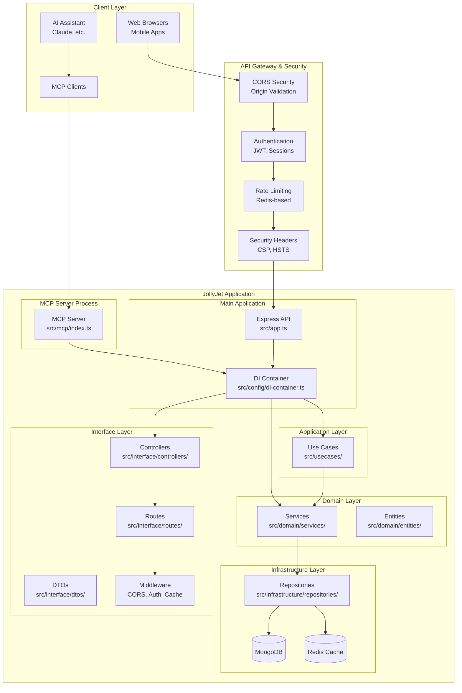
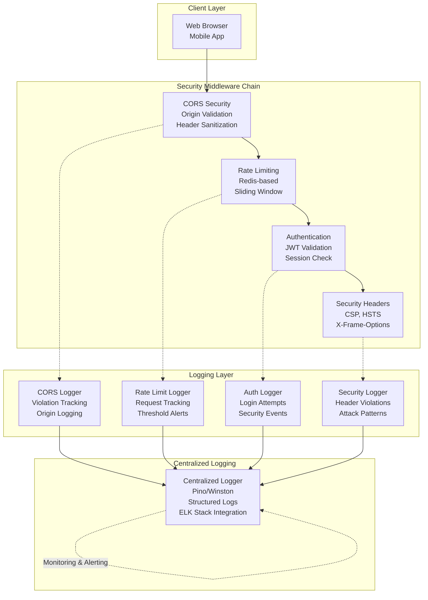
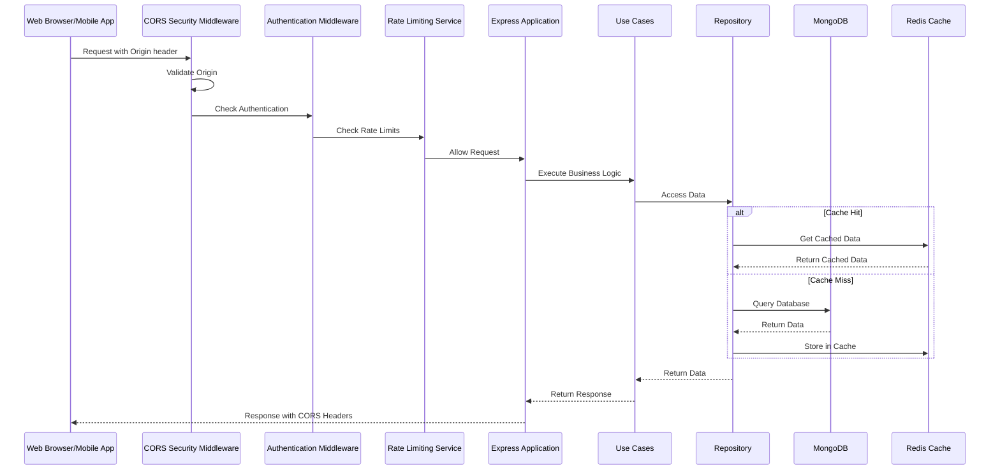

# CORS Policy & Security Implementation Plan

**Related Task:** [`04-cors-task.md`](../tasks/04-cors-task.md)  
**Branch:** `feature/jollyjet-11-cors-security`  
**Status:** Partially Implemented

## Overview

This document outlines the implementation plan for securing Cross-Origin Resource Sharing (CORS) in the JollyJet E-commerce API. CORS is a critical security feature that controls which external domains can access API resources, preventing unauthorized cross-origin attacks while maintaining flexibility for legitimate web applications.

**Current State:** The basic CORS middleware is integrated, but advanced security features and configuration management are pending.

## Table of Contents

1. [Overview](#overview)
2. [Goals](#goals)
3. [Non-Goals](#non-goals)
4. [Background](#background)
5. [Detailed Design](#detailed-design)
   - [Architecture](#architecture)
   - [CORS Configuration Strategy](#cors-configuration-strategy)
   - [Security Enhancements](#security-enhancements)
   - [Implementation Steps](#implementation-steps)
6. [Folder Structure](#folder-structure)
7. [API Reference](#api-reference)
8. [Testing Strategy](#testing-strategy)
9. [Security Considerations](#security-considerations)
10. [Deployment Considerations](#deployment-considerations)
11. [Rollback Plan](#rollback-plan)
12. [Status](#status)

## Goals

### Primary Objectives

1. **Secure Cross-Origin Access**: Implement robust CORS policies that restrict API access to authorized origins only
2. **Environment-Based Configuration**: Support different CORS settings for development, staging, and production environments
3. **Comprehensive Request Validation**: Validate all CORS preflight requests and headers before processing
4. **Security Logging**: Log all CORS violations and suspicious cross-origin activities for monitoring
5. **Compliance**: Meet security best practices for RESTful API design

### Secondary Objectives

1. **Performance Optimization**: Minimize CORS overhead through efficient caching and validation
2. **Flexibility**: Allow dynamic configuration of allowed origins without code changes
3. **Observability**: Provide detailed metrics and logging for CORS operations

## Non-Goals

- **Authentication/Authorization**: CORS operates at the browser level and doesn't replace proper authentication mechanisms
- **Rate Limiting**: While related to security, rate limiting is handled by a separate middleware
- **WebSocket Security**: WebSocket connections require different security considerations
- **Legacy Browser Support**: Focus on modern browsers with standard CORS support

## Background

### What is CORS?

Cross-Origin Resource Sharing (CORS) is an HTTP-header based mechanism that allows a server to indicate any origins (domain, scheme, or port) other than its own from which a browser should permit loading resources. CORS also relies on a mechanism by which browsers make a "preflight" request to the server hosting the cross-origin resource, in order to check that the server will permit the actual request.

### Why CORS Matters for E-commerce APIs

1. **Security Boundary**: Browsers enforce the same-origin policy by default, blocking malicious scripts from accessing sensitive API endpoints
2. **Third-Party Integrations**: E-commerce platforms often need to integrate with payment gateways, analytics services, and partner applications
3. **Mobile App Support**: Mobile applications may require API access from different origins
4. **PCI Compliance**: Payment Card Industry standards require strict control over cross-origin access to sensitive endpoints

### Current State

Currently, the JollyJet API does not have a dedicated CORS configuration. The application uses Express.js with basic CORS support, but lacks:

- Environment-specific CORS policies
- Comprehensive origin validation
- CORS security logging
- Request header sanitization
- Pre-flight request handling

## Detailed Design

### Architecture

The CORS security architecture is integrated into the comprehensive JollyJet e-commerce platform architecture, which follows Clean Architecture principles and includes multiple security layers.

#### System Architecture Overview



#### CORS Security Components

The CORS security architecture consists of the following specialized components:

1. **CORS Configuration Module**: Defines environment-specific CORS settings using the `ICorsConfig` interface with support for multiple environments (development, staging, production).

2. **CORS Security Middleware**: Validates origins, sanitizes headers, enforces security policies, and integrates with the broader security ecosystem including rate limiting and authentication.

3. **CORS Logger Middleware**: Logs CORS-related activities for monitoring, debugging, and security auditing, integrated with the centralized logging system.

4. **Integration Layer**: Applies CORS middleware to the Express application with environment-specific configurations, working alongside other security middleware.

#### CORS in the Security Stack



#### Data Flow with CORS Security



### Folder Structure

```
src/
├── app.ts                # CORS middleware integration (Step 6)
├── config/
│   ├── cors.ts            # CORS configuration module (Step 1)
│   └── index.ts           # Export CORS configuration (Step 2)
├── interface/
│   └── middlewares/
│       ├── corsSecurity.ts  # CORS security middleware (Step 3)
│       ├── corsLogger.ts    # CORS logging middleware (Step 4)
│       └── index.ts         # Export CORS middleware (Step 5)
└── tests/
    ├── unit/
    │   └── cors.test.ts      # CORS unit tests (Step 7)
    └── integration/
        └── cors.integration.test.ts  # CORS integration tests (Step 7)

# Step 1 Files (Define ICorsConfig Interface)
src/config/cors.ts        # ICorsConfig interface and configuration (Step 1)

# Step 2 Files (Update CORS Configuration)
src/config/index.ts       # Export CORS configuration (Step 2)

# Step 3 Files (Create CORS Security Middleware)
src/interface/middlewares/corsSecurity.ts  # Security middleware (Step 3)

# Step 4 Files (Create CORS Logger Middleware)
src/interface/middlewares/corsLogger.ts    # Logging middleware (Step 4)

# Step 5 Files (Update Middleware Exports)
src/interface/middlewares/index.ts         # Export middleware (Step 5)

# Step 6 Files (Integrate CORS Configuration)
src/app.ts                                # Integrate CORS (Step 6)

# Step 7 Files (Testing)
tests/unit/cors.test.ts                    # Unit tests (Step 7)
tests/integration/cors.integration.test.ts # Integration tests (Step 7)
```

---

## Implementation Steps

### Step 1: Define `ICorsConfig` Interface

**Files:** `src/config/cors.ts`
**Dependencies:** None

1. Create `src/config/cors.ts` and define the `ICorsConfig` interface
2. Implement environment-specific CORS configurations (development, staging, production)
3. Export `getCorsOptions()` function to return configured CORS options

### Step 2: Update CORS Configuration

**Files:** `src/config/index.ts`
**Dependencies:** Step 1

1. Update `src/config/index.ts` to export CORS configuration
2. Implement origin validation logic in `src/config/cors.ts`
3. Add configuration validation

### Step 3: Create CORS Security Middleware

**Files:** `src/interface/middlewares/corsSecurity.ts`
**Dependencies:** Step 2

1. Create `src/interface/middlewares/corsSecurity.ts`
2. Implement strict origin validation
3. Add request header sanitization
4. Integrate with configuration module
5. Add security logging

### Step 4: Create CORS Logger Middleware

**Files:** `src/interface/middlewares/corsLogger.ts`
**Dependencies:** Step 3

1. Create `src/interface/middlewares/corsLogger.ts`
2. Log all CORS preflight requests
3. Log CORS violations and blocked requests
4. Track CORS metrics

### Step 5: Update Middleware Exports

**Files:** `src/interface/middlewares/index.ts`
**Dependencies:** Step 4

1. Update `src/interface/middlewares/index.ts` to export CORS middleware

### Step 6: Integrate CORS Configuration

**Files:** `src/app.ts`
**Dependencies:** Step 5

1. Update `src/app.ts` to use the new CORS configuration
2. Replace the basic `cors()` middleware with the configured `cors(corsOptions)`

**Code Snippet - src/app.ts:**

```typescript
import cors from 'cors';
import { getCorsOptions } from '@/config';

// Apply CORS middleware with environment-specific configuration
const corsOptions = getCorsOptions();
app.use(cors(corsOptions));
```

#### Step 7: Testing

**Files:** `tests/unit/cors.test.ts`, `tests/integration/cors.integration.test.ts`
**Dependencies:** Step 6

1. Create unit tests for CORS configuration
2. Create unit tests for origin validation
3. Create integration tests for CORS middleware
4. Create security tests for header sanitization

---

## 🛠️ Proposed Changes

### Step 1: Define `ICorsConfig` Interface

**Files:** `src/config/cors.ts`  
**Dependencies:** None

**Code Snippet - src/config/cors.ts:**

```typescript
// Define the ICorsConfig interface for structured CORS configuration
interface ICorsConfig {
  allowedOrigins: string[]; // Array of allowed origins
  allowedMethods: string[]; // HTTP methods allowed
  allowedHeaders: string[]; // Request headers allowed
  exposedHeaders: string[]; // Response headers exposed to client
  maxAge: number; // Preflight cache duration (seconds)
  credentials: boolean; // Allow credentials (cookies, auth headers)
  originValidationEnabled: boolean; // Enable strict origin validation
  logViolations: boolean; // Log CORS violations
  blockNonCorsRequests: boolean; // Block requests without Origin header in prod
}

// Environment-specific CORS configurations
const corsConfig: Record<string, ICorsConfig> = {
  development: {
    allowedOrigins: ['http://localhost:3000', 'http://localhost:3001'],
    allowedMethods: ['GET', 'POST', 'PUT', 'DELETE', 'OPTIONS'],
    allowedHeaders: ['Content-Type', 'Authorization'],
    exposedHeaders: ['X-Total-Count'],
    maxAge: 86400,
    credentials: true,
    originValidationEnabled: false,
    logViolations: true,
    blockNonCorsRequests: false,
  },
  staging: {
    allowedOrigins: ['https://staging.jollyjet.com'],
    allowedMethods: ['GET', 'POST', 'PUT', 'DELETE', 'OPTIONS'],
    allowedHeaders: ['Content-Type', 'Authorization'],
    exposedHeaders: ['X-Total-Count'],
    maxAge: 86400,
    credentials: true,
    originValidationEnabled: true,
    logViolations: true,
    blockNonCorsRequests: false,
  },
  production: {
    allowedOrigins: ['https://jollyjet.com', 'https://www.jollyjet.com'],
    allowedMethods: ['GET', 'POST', 'PUT', 'DELETE', 'OPTIONS'],
    allowedHeaders: ['Content-Type', 'Authorization'],
    exposedHeaders: ['X-Total-Count'],
    maxAge: 86400,
    credentials: true,
    originValidationEnabled: true,
    logViolations: true,
    blockNonCorsRequests: true,
  },
};

// Get CORS options based on the current environment
export const getCorsOptions = (): CorsOptions => {
  const env = process.env.NODE_ENV || 'development';
  const config = corsConfig[env];

  return {
    origin: (origin, callback) => {
      if (!origin) return callback(null, true);
      if (config.allowedOrigins.includes(origin)) {
        callback(null, true);
      } else {
        callback(new Error('Not allowed by CORS'));
      }
    },
    methods: config.allowedMethods,
    allowedHeaders: config.allowedHeaders,
    exposedHeaders: config.exposedHeaders,
    credentials: config.credentials,
    maxAge: config.maxAge,
  };
};
```

### Step 2: Update CORS Configuration

**Files:** `src/config/index.ts`  
**Dependencies:** Step 1

**Code Snippet - src/config/index.ts:**

```typescript
// Export the CORS configuration
import { getCorsOptions } from './cors';

export { getCorsOptions };
```

#### Step 2.1: Environment-Specific Policies

**Files:** `src/config/cors.ts`, `.env`  
**Dependencies:** Step 2

**Code Snippet - .env:**

```env
# CORS Configuration
CORS_ORIGINS=https://jollyjet.com,https://www.jollyjet.com
```

**Code Snippet - src/config/cors.ts (Environment Handling):**

```typescript
// Environment-specific allowed origins
const allowedOrigins = {
  development: ['http://localhost:3000', 'http://localhost:3001'],
  staging: ['https://staging.jollyjet.com'],
  production: ['https://jollyjet.com', 'https://www.jollyjet.com'],
};
```

### Step 3: Security Enhancements

**Files:** `src/interface/middlewares/corsSecurity.ts`  
**Dependencies:** Step 2\*

**Code Snippet - src/interface/middlewares/corsSecurity.ts:**

```typescript
import { Request, Response, NextFunction } from 'express';

export const corsSecurityMiddleware = (req: Request, res: Response, next: NextFunction): void => {
  // Security headers
  res.setHeader('X-Frame-Options', 'DENY');
  res.setHeader('X-Content-Type-Options', 'nosniff');

  // Pre-flight caching
  if (req.method === 'OPTIONS') {
    res.setHeader('Access-Control-Max-Age', '86400');
  }

  next();
};
```

### Step 4 Monitoring and Logging

**Files:** `src/interface/middlewares/corsLogger.ts`  
**Dependencies:** Step 3

**Code Snippet - src/interface/middlewares/corsLogger.ts:**

```typescript
import { Request, Response, NextFunction } from 'express';
import { logger } from '@/shared/logger';

export const corsLoggerMiddleware = (req: Request, res: Response, next: NextFunction): void => {
  const origin = req.headers.origin;

  if (origin) {
    logger.info('CORS Request', {
      origin,
      method: req.method,
      path: req.path,
      timestamp: new Date().toISOString(),
    });
  }

  next();
};
```

### Step 5: Testing and Validation

**Files:** `tests/unit/cors.test.ts`, `tests/integration/cors.integration.test.ts`  
**Dependencies:** Step 4

**Code Snippet - tests/unit/cors.test.ts:**

```typescript
import { getCorsOptions } from '@/config/cors';

describe('CORS Configuration', () => {
  it('should allow valid origins', () => {
    const mockCallback = jest.fn();
    const corsOptions = getCorsOptions();
    corsOptions.origin('https://jollyjet.com', mockCallback);
    expect(mockCallback).toHaveBeenCalledWith(null, true);
  });

  it('should reject invalid origins', () => {
    const mockCallback = jest.fn();
    const corsOptions = getCorsOptions();
    corsOptions.origin('https://malicious.com', mockCallback);
    expect(mockCallback).toHaveBeenCalledWith(expect.any(Error));
  });
});
```

## API Reference

### Configuration Module

### `getCorsOptions(): CorsOptions`

Returns the configured CORS options based on the current environment.

```typescript
import { getCorsOptions } from '@/config/cors';

const corsOptions = getCorsOptions();
app.use(cors(corsOptions));
```

**Returns:**

- `CorsOptions` object compatible with the `cors` package

**Throws:**

- `ConfigurationError` if required environment variables are missing

---

## Security Middleware

#### `corsSecurity(req: Request, res: Response, next: NextFunction): void`

Middleware that performs additional CORS security checks beyond the basic `cors` middleware.

```typescript
import { corsSecurity } from '@/interface/middlewares/corsSecurity';

app.use(corsSecurity);
```

**Security Checks:**

1. Validates Origin header presence
2. Validates Origin against whitelist
3. Sanitizes CORS-related headers
4. Logs suspicious activities

## Logger Middleware

#### `corsLogger(req: Request, res: Response, next: NextFunction): void`

Middleware that logs all CORS-related activities.

```typescript
import { corsLogger } from '@/interface/middlewares/corsLogger';

app.use(corsLogger);
```

**Logged Events:**

- Preflight requests (OPTIONS)
- CORS violations
- Unauthorized origin attempts
- Invalid CORS headers

## CORS Configuration Strategy

### Environment-Based Configuration

The CORS configuration will be environment-aware, with different settings for development, staging, and production environments.

```typescript
interface ICorsConfig {
  allowedOrigins: string[]; // Array of allowed origins
  allowedMethods: string[]; // HTTP methods allowed
  allowedHeaders: string[]; // Request headers allowed
  exposedHeaders: string[]; // Response headers exposed to client
  maxAge: number; // Preflight cache duration (seconds)
  credentials: boolean; // Allow credentials (cookies, auth headers)
  originValidationEnabled: boolean; // Enable strict origin validation
  logViolations: boolean; // Log CORS violations
  blockNonCorsRequests: boolean; // Block requests without Origin header in prod
}
```

### Configuration Levels

1. **Development**: Permissive CORS for local development
2. **Staging**: Semi-restrictive CORS for testing environments
3. **Production**: Strict CORS with comprehensive validation

### Security Enhancements

#### 1. Origin Validation

```typescript
// Strict origin validation with fallback support
const validateOrigin = (origin: string): boolean => {
  if (config.isDevelopment) return true;

  return (
    config.allowedOrigins.includes(origin) ||
    isSubdomain(origin, config.baseDomain) ||
    isWhiteListed(origin, config.whitelist)
  );
};
```

#### 2. Request Header Sanitization

All incoming CORS-related headers will be sanitized to prevent header injection attacks:

```typescript
const sanitizeHeaders = (headers: IncomingHttpHeaders): SanitizedHeaders => {
  return {
    origin: sanitizeString(headers.origin),
    'access-control-request-method': sanitizeString(headers['access-control-request-method']),
    'access-control-request-headers': sanitizeString(headers['access-control-request-headers']),
  };
};
```

#### 3. Preflight Request Handling

Preflight OPTIONS requests will be validated before processing:

```typescript
const handlePreflight = (req: Request, res: Response): void => {
  const origin = req.headers.origin;

  if (!origin) {
    log.warn('Preflight request without Origin header', { ip: req.ip });
    if (config.blockNonCorsRequests) {
      res.status(403).json({ error: 'Origin header required' });
      return;
    }
  }

  if (origin && !validateOrigin(origin)) {
    log.warn('Preflight request from unauthorized origin', { origin, ip: req.ip });
    res.status(403).json({ error: 'Origin not allowed' });
    return;
  }

  // Set CORS headers for preflight response
  setCorsHeaders(res, origin);
  res.status(204).send();
};
```

---

## Testing Strategy

### Unit Tests

```typescript
describe('CORS Configuration', () => {
  describe('getCorsOptions', () => {
    it('should return development options in development', () => {
      // Test development configuration
    });

    it('should return production options in production', () => {
      // Test production configuration
    });
  });

  describe('Origin Validation', () => {
    it('should allow whitelisted origins', () => {
      // Test whitelist validation
    });

    it('should block non-whitelisted origins', () => {
      // Test rejection of unauthorized origins
    });
  });
});
```

### Integration Tests

```typescript
describe('CORS Integration', () => {
  it('should allow requests from whitelisted origins', async () => {
    const response = await request(app)
      .get('/api/products')
      .set('Origin', 'https://whitelisted-domain.com');

    expect(response.headers['access-control-allow-origin']).toBe('https://whitelisted-domain.com');
  });

  it('should block requests from non-whitelisted origins', async () => {
    const response = await request(app)
      .get('/api/products')
      .set('Origin', 'https://malicious-domain.com');

    expect(response.status).toBe(403);
  });
});
```

### Security Tests

```typescript
describe('CORS Security', () => {
  it('should sanitize malicious header values', async () => {
    // Test header sanitization
  });

  it('should log CORS violations', async () => {
    // Test logging behavior
  });
});
```

## Security Considerations

### 1. Origin Spoofing Prevention

The implementation will validate the Origin header against a strict whitelist, preventing spoofing attacks.

### 2. Header Injection Prevention

All CORS-related headers will be sanitized before processing to prevent injection attacks.

### 3. Preflight Request Security

Preflight OPTIONS requests will be validated before processing, preventing cache poisoning and other attacks.

### 4. Information Disclosure

CORS error messages will not disclose sensitive information about the application's internal structure.

### 5. Credential Security

Credentials will only be allowed from origins that explicitly require them, following the principle of least privilege.

## Deployment Considerations

### Environment Variables

```bash
# Required environment variables
CORS_ALLOWED_ORIGINS=https://example.com,https://www.example.com
CORS_ALLOWED_METHODS=GET,POST,PUT,DELETE
CORS_ALLOWED_HEADERS=Content-Type,Authorization
CORS_EXPOSED_HEADERS=X-Total-Count
CORS_MAX_AGE=86400
CORS_CREDENTIALS=true
CORS_ORIGIN_VALIDATION_ENABLED=true
CORS_LOG_VIOLATIONS=true
CORS_BLOCK_NON_CORS_REQUESTS=false
```

### Monitoring

- Set up alerts for CORS violations
- Monitor CORS preflight request rates
- Track origin distribution for unusual patterns

### Performance

- CORS validation is O(n) where n is the number of allowed origins
- Preflight responses are cached for the duration specified in maxAge
- Origin validation uses a Set for O(1) lookup time

## Rollback Plan

### Quick Rollback Steps

1. **Revert CORS Middleware**: Update `src/app.ts` to use basic `cors()` without options
2. **Environment Variables**: Set `CORS_ENABLED=false` to disable enhanced CORS
3. **Rollback Version**: Deploy previous version without CORS enhancements

### Verification Steps

1. Verify basic CORS functionality
2. Test with whitelisted domains
3. Check error logs for CORS-related issues

## Status

**PARTIALLY IMPLEMENTED**

The CORS Policy & Security implementation is partially completed. Step 1 (ICorsConfig Interface) has been completed, and the basic CORS middleware is integrated, but the advanced security features and remaining configuration steps are pending.

### Completed Components

| Component                    | Status      | Location                                    |
| ---------------------------- | ----------- | ------------------------------------------- |
| CORS Middleware Installation | ✅ Complete | `package.json`                              |
| Basic CORS Configuration     | ✅ Complete | `src/app.ts`                                |
| CORS Configuration Module    | ✅ Complete | `src/config/cors.ts`                        |
| CORS Security Middleware     | ❌ Pending  | `src/interface/middlewares/corsSecurity.ts` |
| CORS Logger Middleware       | ❌ Pending  | `src/interface/middlewares/corsLogger.ts`   |
| Middleware Exports           | ❌ Pending  | `src/interface/middlewares/index.ts`        |
| Config Exports               | ❌ Pending  | `src/config/index.ts`                       |
| Unit Tests                   | ❌ Pending  | `tests/unit/cors/`                          |
| Integration Tests            | ❌ Pending  | `tests/integration/cors.test.ts`            |

### Implementation Details

1. **Step 1 Complete** (`src/config/cors.ts`): `ICorsConfig` interface defined with environment-specific configurations and `getCorsOptions()` function implemented.
2. **Basic CORS Configuration** (`src/app.ts`): Uses the default `cors()` middleware without environment-specific settings.
3. **Pending Components**: Advanced security features, logging, configuration exports, and testing are not yet implemented.

### Current Implementation

```typescript
// Current CORS implementation in src/app.ts
import cors from 'cors';

app.use(cors()); // Basic CORS middleware without configuration

// Step 1 Complete: CORS Configuration Module available
import { getCorsOptions } from '@/config/cors';
const corsOptions = getCorsOptions(); // Ready for integration in Step 6
```

### Next Steps

1. **✅ COMPLETED: Implement `ICorsConfig`**: Define the `ICorsConfig` interface for structured CORS configuration.
2. **Update CORS Configuration**: Export CORS configuration in `src/config/index.ts` (Step 2).
3. **Develop Security Middleware**: Create `src/interface/middlewares/corsSecurity.ts` for strict origin validation (Step 3).
4. **Add Logging Middleware**: Implement `src/interface/middlewares/corsLogger.ts` for CORS activity logging (Step 4).
5. **Update Middleware Exports**: Export the new middleware in `src/interface/middlewares/index.ts` (Step 5).
6. **Integrate Configuration**: Update `src/app.ts` to use the new CORS configuration (Step 6).
7. **Write Tests**: Create unit and integration tests for the CORS implementation (Step 7).

### Usage Example (Planned)

```typescript
import { jollyJetApp } from '@/app';
import { getCorsOptions } from '@/config/cors';
import cors from 'cors';

const app = await jollyJetApp();
const corsOptions = getCorsOptions();
app.use(cors(corsOptions));
```
