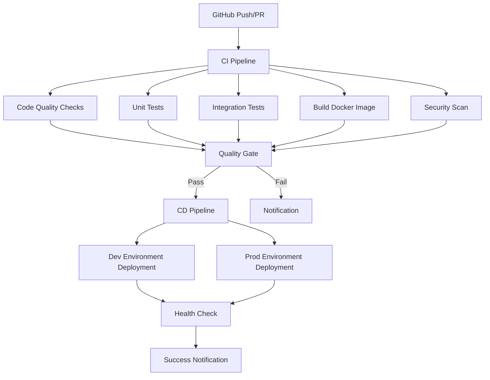

# Implementation Plan #15 - CI/CD Implementation with GitHub Actions & Docker

**Plan:** 15-ci-cd-implementation-plan  
**Branch:** `feature/jollyjet-15-ci-cd`  
**Status:** ✅ **Completed** - CI/CD Pipeline Fully Implemented

## 🎯 Objective

Implement a comprehensive CI/CD pipeline using GitHub Actions and Docker to automate testing, building, and deployment of the JollyJet e-commerce platform across development and production environments.

## 📋 Current Project Analysis

### Project Structure

- **Framework**: Node.js/TypeScript with Express
- **Architecture**: Clean Architecture with Clean Architecture
- **Database**: MongoDB (MongoDB Atlas in cloud-first approach)
- **Caching**: Redis (Upstash/Redis Cloud)
- **Testing**: Jest with comprehensive test coverage
- **Containerization**: Docker with multi-environment compose files
- **Dependencies**: Modern TypeScript stack with proper dependency injection

### Existing Infrastructure

- **Docker Setup**: Multi-environment compose files (`docker-compose.yml`, `.dev.yml`, `.prod.yml`)
- **Environment Management**: Cloud-first approach with environment-specific configs
- **Testing Framework**: Jest with unit, integration, and e2e tests
- **Code Quality**: ESLint, Prettier, and TypeScript validation
- **Documentation**: Comprehensive implementation guides and API documentation

## 🏗️ CI/CD Architecture Design

### Pipeline Overview



### Environment Strategy

| Environment    | Trigger        | Target      | Docker Compose            | Environment Variables |
| -------------- | -------------- | ----------- | ------------------------- | --------------------- |
| Development    | Push to `main` | Dev Cluster | `docker-compose.dev.yml`  | `.env.development`    |
| Production     | Tag push `v*`  | Production  | `docker-compose.prod.yml` | `.env.production`     |
| Feature Branch | PR to `main`   | Review App  | `docker-compose.yml`      | `.env.review`         |

## 📁 File Structure

```
.jollyJet/
├── .github/
│   └── workflows/
│       ├── ci.yml                          # Main CI pipeline with security checks
│       ├── ci-current-branch.yml           # Current branch CI/CD pipeline
│       ├── deploy-dev.yml                  # Development environment deployment
│       ├── deploy-prod.yml                 # Production environment deployment
│       ├── deployment-strategies.yml       # Deployment strategy selector
│       ├── pr-review.yml                   # PR review environment automation
│       ├── testing.yml                     # Comprehensive testing pipeline
│       ├── release.yml                     # Version bump and release creation
│       └── release-branch-validation.yml   # Release branch quality checks
├── .github/
│   └── branch-protection.yml               # Branch protection configuration
├── docker/
│   ├── Dockerfile                          # Multi-stage production build
│   ├── docker-compose.yml                  # Base configuration
│   ├── docker-compose.dev.yml              # Development environment
│   ├── docker-compose.prod.yml             # Production environment
│   └── README.md                           # Docker documentation
├── docs/
│   └── ci-cd/
│       ├── CI-CD_IMPLEMENTATION_GUIDE.md    # This guide
│       ├── CI-CD-FILE-STRUCTURE.md          # Detailed file structure documentation
│       └── RELEASE-BRANCH-GUIDE.md          # Release branch management
└── .env.sample                             # Environment variables template
```

## 🔧 Configuration Requirements

### GitHub Secrets

| Secret Name                | Purpose                       | Example                |
| -------------------------- | ----------------------------- | ---------------------- |
| `DOCKER_REGISTRY_USERNAME` | Container registry access     | `dockerhub-username`   |
| `DOCKER_REGISTRY_PASSWORD` | Container registry password   | `dockerhub-password`   |
| `PRODUCTION_SSH_KEY`       | Production server access      | `ssh-private-key`      |
| `MONGO_URI_PRODUCTION`     | Production database           | `mongodb://...`        |
| `REDIS_URL_PRODUCTION`     | Production Redis              | `redis://...`          |
| `SNYK_TOKEN`               | Security scanning token       | `snyk-api-token`       |
| `NPM_TOKEN`                | npm registry access token     | `npm-access-token`     |
| `GITHUB_TOKEN`             | GitHub API access token       | Automatically provided |
| `AWS_ACCESS_KEY_ID`        | AWS access key (if using ECS) | `AKIA...`              |
| `AWS_SECRET_ACCESS_KEY`    | AWS secret key (if using ECS) | `secret...`            |

### Environment Variables

| Variable          | Purpose                | Default       |
| ----------------- | ---------------------- | ------------- |
| `NODE_ENV`        | Environment type       | `development` |
| `PORT`            | Application port       | `3000`        |
| `LOG_LEVEL`       | Logging level          | `info`        |
| `DOCKER_REGISTRY` | Container registry URL | `ghcr.io`     |

---

## 📁 GitHub Actions Workflow Structure

### 1. Main CI Workflow (`.github/workflows/ci.yml`)

**Purpose**: Comprehensive pipeline for all code changes

**Triggers**:

- `push` to any branch
- `pull_request` to `main`

**Jobs**:

1. **Code Quality**
   - ESLint validation
   - Prettier formatting check
   - TypeScript compilation

2. **Testing**
   - Unit tests (Jest)
   - Integration tests
   - Coverage reporting

3. **Build**
   - Docker image build
   - Multi-platform build support

4. **Security**
   - Dependency vulnerability scan
   - Container security scan

### 2. Current Branch CI/CD Workflow (`.github/workflows/ci-current-branch.yml`)

**Purpose**: Advanced pipeline for feature branches with quality gate decisions

**Triggers**:

- Push to main, develop, or feature/\* branches
- Pull requests to main or develop branches
- Manual workflow dispatch

**Jobs**: 8 jobs (pre-flight-checks → code-quality → unit-tests → integration-tests → security-scan → build-docker → quality-gate-decision → publish-branch → deploy-dev → pr-approval → notify)

### 3. Development Deployment Workflow (`.github/workflows/deploy-dev.yml`)

**Purpose**: Automated deployment to development environment

**Triggers**:

- `push` to `main` branch
- Manual dispatch

**Jobs**:

1. **Deploy to Dev**
   - Docker compose up with dev config
   - Health check validation
   - Environment verification

### 4. Production Deployment Workflow (`.github/workflows/deploy-prod.yml`)

**Purpose**: Production deployment with manual approval

**Triggers**:

- `release` published (tag `v*`)
- Manual dispatch with production tag

**Jobs**:

1. **Approval Gate**
   - Manual approval required
   - Environment validation

2. **Production Deployment**
   - Docker compose up with prod config
   - Health check validation
   - Rollback preparation

### 5. PR Review Workflow (`.github/workflows/pr-review.yml`)

**Purpose**: Automated review environment for pull requests

**Triggers**:

- `pull_request` opened/updated

**Jobs**:

1. **Review Environment**
   - Build review Docker image
   - Deploy to temporary environment
   - Generate preview URL

### 6. Release Pipeline Workflow (`.github/workflows/release.yml`)

**Purpose**: Automated version bumping and GitHub release creation with manual override options

**Triggers**:

- Push to main or release/vX.Y.Z branches (automatic)
- Manual workflow dispatch with custom inputs (manual)

**Restrictions**:

- Only runs on main and release branches
- Prevents releases from develop or feature branches

**Manual Workflow Inputs**:

- **branch**: Branch to run release on (default: main)
- **force_bump**: Force specific version bump type (none/patch/minor/major)
- **release_notes**: Custom release notes to include in the GitHub Release

**Jobs**: 3 jobs (determine-version-bump → create-github-release → notify)

**Version Bump Rules**:

- **Manual Force Bump**: Overrides automatic detection
- **Breaking Change**: Contains "BREAKING CHANGE" or "!:" → Major version bump
- **New Feature**: Contains "feat" or "feature" → Minor version bump
- **Bug Fix**: Contains "fix" or "bug" → Patch version bump
- **Other Changes**: No version bump

**Output**:

- GitHub Release with tag (vX.Y.Z)
- Changelog from commit messages
- Custom release notes (if provided)
- Optional npm package publishing

### 7. Release Branch Validation Workflow (`.github/workflows/release-branch-validation.yml`)

**Purpose**: Validates PRs to main branch are from valid release branches

**Triggers**:

- Pull requests to main branch

**Jobs**: 4 jobs (validate-source-branch → check-commit-messages → security-checks → validate-merge-readiness)

**Validation Rules**:

- Source branch must match format: release/vX.Y.Z
- Version must be semantic version (X.Y.Z)
- PR must contain release notes
- Commit messages should follow Conventional Commits
- Security scan must pass

### 8. Comprehensive Testing Pipeline (`.github/workflows/testing.yml`)

**Purpose**: Runs all types of tests and enforces quality gates

**Key Features**:

- Code quality gates (ESLint, Prettier, TypeScript, GitHub CodeQL)
- Test matrix with Node.js 22
- Unit and integration tests
- E2E tests with Docker Compose
- Performance testing
- Security testing (Snyk, OWASP ZAP)
- Accessibility testing
- Coverage reporting with 80% threshold
- Quality gate decision

**Triggers**:

- Push to main or develop branches
- Pull requests to main branch
- Manual workflow dispatch

**Jobs**: 8 jobs (code-quality-gates → unit-tests-matrix → integration-tests-services → e2e-tests → performance-tests → coverage-reporting → security-testing → accessibility-testing → quality-gate-decision)

### 9. Deployment Strategies Workflow (`.github/workflows/deployment-strategies.yml`)

**Purpose**: Manual deployment with strategy selection

**Key Features**:

- Environment validation
- Strategy validation (blue-green, canary, rolling)
- Version validation
- Multiple deployment strategy options
- Post-deployment validation
- Automatic rollback on failure
- Deployment reporting

**Triggers**:

- Manual workflow dispatch only

**Jobs**: 4 jobs (validate-deployment → blue-green-deployment/canary-deployment/rolling-deployment → post-deployment-validation → rollback-deployment)

## 🛠️ Docker Strategy

### Multi-Stage Builds

```dockerfile
# Stage 1: Build
FROM node:18-alpine AS builder
WORKDIR /app
COPY package*.json ./
RUN npm ci --only=production
COPY . .
RUN npm run build

# Stage 2: Runtime
FROM node:18-alpine AS runtime
WORKDIR /app
COPY --from=builder /app/dist ./dist
COPY --from=builder /app/package*.json ./
RUN npm ci --only=production
EXPOSE 3000
CMD ["node", "dist/src/server.js"]
```

### Image Tagging Strategy

| Tag Type       | Format                                 | Use Case                   |
| -------------- | -------------------------------------- | -------------------------- |
| Development    | `dev-${GITHUB_SHA}`                    | Daily development builds   |
| Feature Branch | `feature-${BRANCH_NAME}-${GITHUB_SHA}` | PR review environments     |
| Production     | `v${VERSION}`                          | Stable production releases |
| Latest         | `latest`                               | Latest stable release      |

### Registry Strategy

- **Development**: GitHub Container Registry
- **Production**: Amazon ECR or Docker Hub (configurable)
- **Review**: Temporary registry with automatic cleanup

## 🧪 Testing Strategy

### Test Categories

1. **Unit Tests** (Fast, Local)
   - Domain logic
   - Service layer
   - Utility functions

2. **Integration Tests** (Medium, Requires Services)
   - Database operations
   - API endpoints
   - Middleware functionality

3. **E2E Tests** (Slow, Full Stack)
   - User workflows
   - System integration
   - Performance validation

### Test Environment Setup

```yaml
# Test services configuration
services:
  mongodb:
    image: mongo:6.0
    ports:
      - '27017:27017'
  redis:
    image: redis:7-alpine
    ports:
      - '6379:6379'
```

## 🔒 Security Implementation

### Code Security

- **Dependency Scanning**: `npm audit` and Snyk integration
- **Secret Detection**: Gitleaks integration
- **Container Scanning**: Trivy for Docker images

### Infrastructure Security

- **Network Policies**: Docker network isolation
- **Secrets Management**: GitHub Secrets for environment variables
- **Access Control**: Branch protection rules

## 📊 Monitoring & Observability

### Health Checks

- **Liveness Probe**: Application health endpoint
- **Readiness Probe**: Database connectivity check
- **Startup Probe**: Container initialization validation

### Logging Strategy

- **Structured Logging**: JSON format with correlation IDs
- **Log Aggregation**: Centralized logging setup
- **Metrics Collection**: Prometheus integration

## 🚀 Deployment Strategy

### Blue-Green Deployment

- **Preparation**: Two identical environments
- **Switch**: Traffic routing to new version
- **Validation**: Health checks before full switch
- **Rollback**: Instant traffic switch back if needed

### Canary Deployment

- **Initial Rollout**: Small percentage of traffic
- **Monitoring**: Real-time metrics and error rates
- **Gradual Increase**: Traffic percentage increase
- **Full Rollout**: Complete traffic switch

## 📋 Implementation Steps

### Phase 1: Foundation (Days 1-2)

1. **Setup GitHub Actions Infrastructure**
   - Create `.github/workflows/` directory
   - Set up basic CI workflow
   - Configure secrets and environment variables

2. **Docker Optimization**
   - Implement multi-stage builds
   - Add health checks
   - Optimize layer caching

3. **Testing Enhancement**
   - Add test matrix for different Node versions
   - Implement coverage reporting
   - Set up test artifacts

### Phase 2: Core CI/CD (Days 3-4)

1. **Complete CI Pipeline**
   - Add code quality checks
   - Implement security scanning
   - Set up build matrix

2. **Development Deployment**
   - Create dev deployment workflow
   - Add health check validation
   - Implement environment verification

3. **Review Environments**
   - Set up PR review workflow
   - Implement temporary environments
   - Add preview URL generation

### Phase 3: Production Readiness (Days 5-6)

1. **Production Deployment**
   - Create production workflow with approval
   - Implement blue-green deployment
   - Add rollback capabilities

2. **Monitoring & Observability**
   - Set up health checks
   - Implement logging strategy
   - Add metrics collection

3. **Documentation & Training**
   - Create deployment guides
   - Document troubleshooting procedures
   - Set up team training

### Phase 4: Optimization (Days 7-8)

1. **Performance Optimization**
   - Optimize Docker layer caching
   - Implement parallel job execution
   - Add caching strategies

2. **Security Hardening**
   - Enhance container scanning
   - Implement secret rotation
   - Add compliance checks

3. **Automation Enhancement**
   - Add auto-rollback on failure
   - Implement self-healing capabilities
   - Set up automated testing

## ✅ Success Criteria

### Technical Metrics

- **Build Time**: < 5 minutes for full pipeline
- **Test Coverage**: > 80% across all modules
- **Deployment Time**: < 2 minutes for production
- **Uptime**: > 99.9% availability

### Quality Gates

- **Code Quality**: Zero ESLint errors
- **Security**: No critical vulnerabilities
- **Performance**: < 3% performance regression
- **Compatibility**: Cross-platform compatibility

### Business Metrics

- **Deployment Frequency**: Multiple deployments per day
- **Lead Time**: < 1 hour from commit to production
- **Change Failure Rate**: < 5% of deployments cause issues
- **Mean Time to Recovery**: < 10 minutes for rollbacks

## 📁 File Structure Changes

```
.jollyJet/
├── .github/
│   ├── workflows/
│   │   ├── ci.yml                 # Main CI pipeline
│   │   ├── deploy-dev.yml         # Development deployment
│   │   ├── deploy-prod.yml        # Production deployment
│   │   └── pr-review.yml          # Pull request review
│   ├── scripts/                   # CI/CD helper scripts
│   └── templates/                 # Workflow templates
├── docker/
│   ├── Dockerfile                 # Multi-stage production build
│   ├── docker-compose.ci.yml      # CI/CD specific compose
│   └── docker-compose.review.yml  # Review environment compose
└── scripts/
    ├── ci/                        # CI/CD related scripts
    ├── test/                      # Test automation scripts
    └── deploy/                    # Deployment scripts
```

## 🔧 Configuration Requirements

### GitHub Secrets

| Secret Name                | Purpose                       | Example                |
| -------------------------- | ----------------------------- | ---------------------- |
| `DOCKER_REGISTRY_USERNAME` | Container registry access     | `dockerhub-username`   |
| `DOCKER_REGISTRY_PASSWORD` | Container registry password   | `dockerhub-password`   |
| `PRODUCTION_SSH_KEY`       | Production server access      | `ssh-private-key`      |
| `MONGO_URI_PRODUCTION`     | Production database           | `mongodb://...`        |
| `REDIS_URL_PRODUCTION`     | Production Redis              | `redis://...`          |
| `SNYK_TOKEN`               | Security scanning token       | `snyk-api-token`       |
| `NPM_TOKEN`                | npm registry access token     | `npm-access-token`     |
| `GITHUB_TOKEN`             | GitHub API access token       | Automatically provided |
| `AWS_ACCESS_KEY_ID`        | AWS access key (if using ECS) | `AKIA...`              |
| `AWS_SECRET_ACCESS_KEY`    | AWS secret key (if using ECS) | `secret...`            |

### Environment Variables

| Variable          | Purpose                | Default       |
| ----------------- | ---------------------- | ------------- |
| `NODE_ENV`        | Environment type       | `development` |
| `PORT`            | Application port       | `3000`        |
| `LOG_LEVEL`       | Logging level          | `info`        |
| `DOCKER_REGISTRY` | Container registry URL | `ghcr.io`     |

## 📚 Documentation Requirements

### Implementation Guide

- Step-by-step setup instructions
- Troubleshooting common issues
- Best practices and recommendations

### Team Training

- CI/CD workflow overview
- Deployment procedures
- Monitoring and alerting

### Maintenance Guide

- Pipeline updates and modifications
- Security patch procedures
- Performance optimization techniques

## 🔄 Rollback Strategy

### Automatic Rollback

- Health check failures trigger rollback
- Performance degradation triggers rollback
- Error rate spikes trigger rollback

### Manual Rollback

- One-click rollback button
- Version selection interface
- Rollback confirmation workflow

### Rollback Procedures

1. **Health Check Failure**
   - Detect health check failures
   - Trigger automatic rollback
   - Notify team members

2. **Performance Issues**
   - Monitor performance metrics
   - Compare with baseline
   - Execute rollback if thresholds exceeded

3. **Error Rate Spikes**
   - Monitor error rates
   - Compare with historical data
   - Execute rollback if thresholds exceeded

## 🎯 Next Steps

1. **Immediate Actions**
   - Create GitHub Actions directory structure
   - Set up basic CI workflow
   - Configure Docker multi-stage builds

2. **Short-term Goals**
   - Complete CI pipeline implementation
   - Set up development deployment
   - Implement review environments

3. **Long-term Goals**
   - Production deployment readiness
   - Advanced monitoring setup
   - Performance optimization

## 📊 Implementation Status

| Component                     | Status      | Priority | ETA   |
| ----------------------------- | ----------- | -------- | ----- |
| GitHub Actions Infrastructure | 📝 Planning | High     | Day 1 |
| Docker Optimization           | 📝 Planning | High     | Day 2 |
| CI Pipeline                   | 📝 Planning | High     | Day 3 |
| Development Deployment        | 📝 Planning | Medium   | Day 4 |
| Production Deployment         | 📝 Planning | Medium   | Day 5 |
| Monitoring Setup              | 📝 Planning | Low      | Day 6 |

**Phase 15: CI/CD Implementation - Planning Complete!** 🎉

**Next Action**: Begin implementation of GitHub Actions workflows and Docker optimizations.
