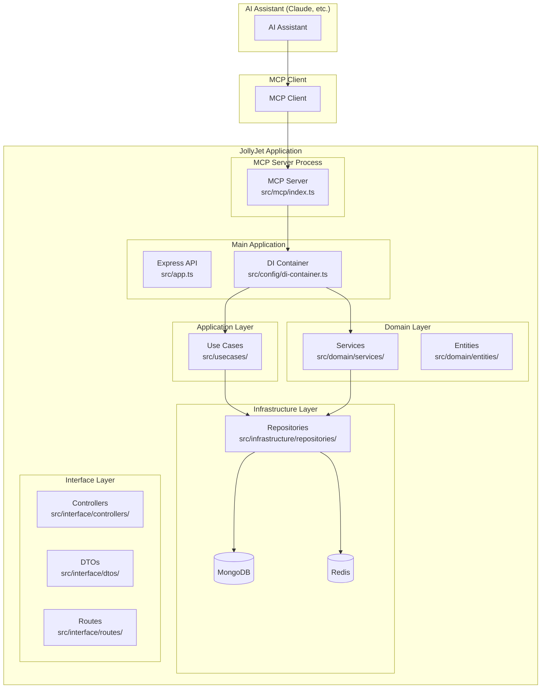
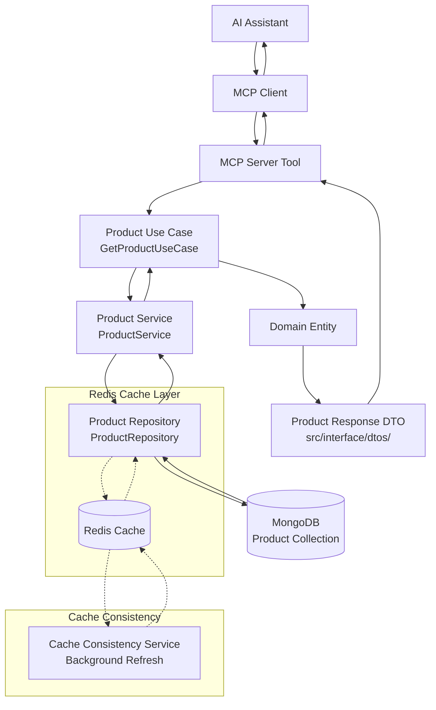
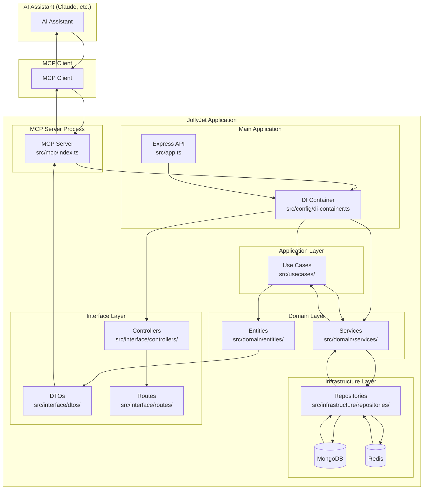
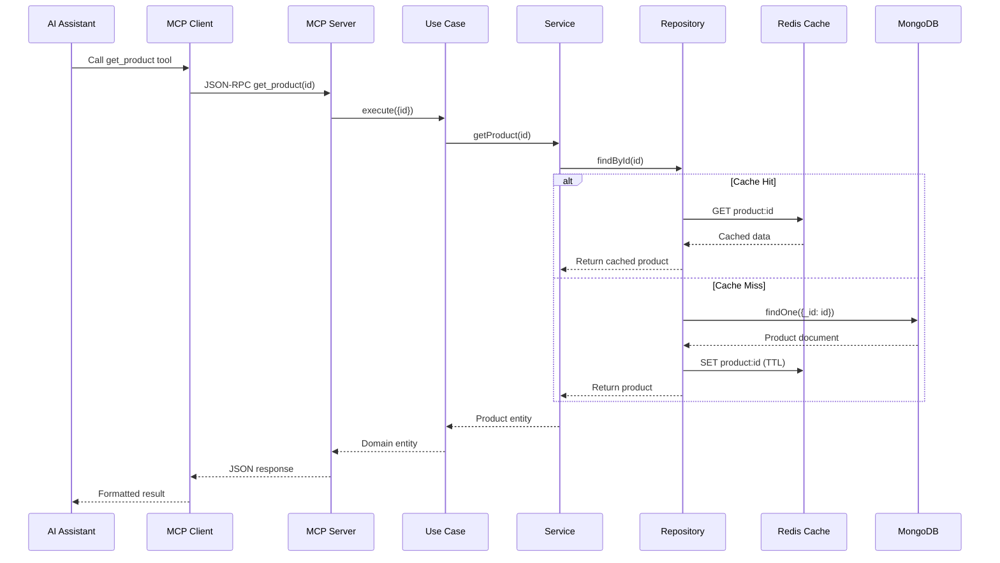
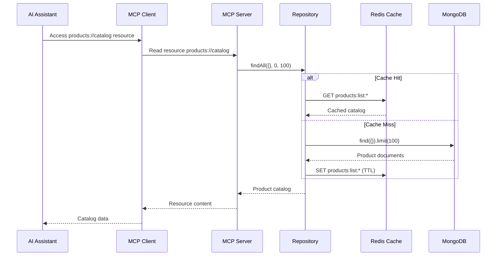

# MCP Server Integration Plan for JollyJet

## Overview

This plan outlines the complete integration of a Model Context Protocol (MCP) server into the JollyJet e-commerce application. The MCP server will allow AI assistants to securely interact with JollyJet's product data and services through standardized tools and resources.

### What is MCP?

MCP (Model Context Protocol) is a protocol that enables AI assistants to interact with external tools and data sources. Unlike a traditional API, MCP servers run as separate processes and communicate via stdio (standard input/output). AI assistants can invoke tools and access resources through the MCP protocol without needing to make HTTP requests.

### How MCP Works in Node.js

- MCP server runs as a Node.js process
- Communication happens via JSON-RPC over stdio
- AI assistants (like Claude) can call tools defined in the server
- Server can access JollyJet's database and services directly
- Not exposed as a web API - only accessible through MCP-compatible clients

## Prerequisites

### System Requirements

- Node.js 18+ installed
- npm or yarn package manager
- TypeScript compiler
- MongoDB database running
- Redis server running (optional, for caching)
- AI assistant with MCP support (e.g., Claude Desktop)

### Project Context

JollyJet is a Node.js/TypeScript e-commerce API with:

- Clean architecture (domain, infrastructure, interface layers)
- MongoDB for data persistence
- Redis for caching and sessions
- Express.js for HTTP API
- Product management with CRUD operations
- Rate limiting and CORS security

### Updated Project Folder Structure

After MCP integration, the project structure will be:

```
e:/Project/jollyJet/
├── src/
│   ├── mcp/                          # NEW: MCP server directory
│   │   ├── index.ts                  # Main MCP server with all tools
│   │   └── prototype.ts              # Prototype server for testing
│   ├── app.ts                        # Express app
│   ├── server.ts                     # Server entry point
│   ├── config/
│   │   ├── di-container.ts           # Dependency injection
│   │   └── swagger.ts                # API documentation
│   ├── usecases/                     # Application layer
│   │   └── product/
│   ├── domain/                       # Domain layer
│   │   ├── entities/
│   │   ├── interfaces/
│   │   └── services/
│   ├── infrastructure/               # Infrastructure layer
│   │   ├── database/
│   │   └── repositories/
│   └── interface/                    # Interface layer
│       ├── controllers/
│       ├── dtos/                     # Data Transfer Objects
│       ├── routes/
│       └── middlewares/
├── dist/                             # Build output
│   ├── mcp/                          # Compiled MCP server
│   │   ├── index.js
│   │   └── prototype.js
│   └── src/                          # Main application build
├── tests/
│   ├── mcp/                          # NEW: MCP-specific tests
│   │   └── product-tools.test.ts
│   └── integration/
├── docs/
│   ├── migrations/
│   │   └── mcp-server-integration-plan.md  # This plan
│   ├── troubleshooting/               # NEW: Troubleshooting docs
│   │   └── mcp-troubleshooting.md
│   └── implementation-plans/
├── package.json
├── tsconfig.json
└── .env                              # Environment variables
```

### MCP-Specific Files Created

- `src/mcp/index.ts` - Main MCP server with all product tools
- `src/mcp/prototype.ts` - Minimal prototype for initial testing
- `tests/mcp/product-tools.test.ts` - Unit tests for MCP tools
- `docs/troubleshooting/mcp-troubleshooting.md` - Troubleshooting guide
- `dist/mcp/` - Compiled MCP server output

## Complete Implementation Steps

### Phase 1: Environment Setup and Dependencies

#### 1.1 Install MCP SDK

Navigate to the project directory and install the MCP SDK:

```bash
cd e:/Project/jollyJet
npm install @modelcontextprotocol/sdk@^0.4.0
```

#### 1.2 Verify MCP SDK Installation

Check that the package was installed correctly:

```bash
npm list @modelcontextprotocol/sdk
```

Expected output should show the installed version.

#### 1.3 Create MCP Directory Structure

Create the directory for MCP server files:

```bash
mkdir -p src/mcp
```

#### 1.4 Update TypeScript Configuration

Edit `tsconfig.json` to include MCP source files in compilation:

```json
{
  "include": ["src/**/*", "src/mcp/**/*"],
  "exclude": ["node_modules", "dist"]
}
```

#### 1.5 Add Build Scripts to package.json

Update `package.json` to include MCP-specific build and run scripts:

```json
{
  "scripts": {
    "build:mcp": "tsc src/mcp/index.ts --outDir dist/mcp --module commonjs",
    "mcp": "node dist/mcp/index.js",
    "dev:mcp": "tsc --watch src/mcp/index.ts --outDir dist/mcp --module commonjs",
    "build": "tsc",
    "start": "node dist/server.js"
  }
}
```

#### 1.6 Install Additional Dependencies (if needed)

Ensure all required dependencies are installed:

```bash
npm install
```

### Phase 2: Prototype Implementation

#### 2.1 Create Prototype Server File

Create `src/mcp/prototype.ts` with a minimal MCP server:

```typescript
#!/usr/bin/env node
import { McpServer } from '@modelcontextprotocol/sdk/server/mcp.js';
import { StdioServerTransport } from '@modelcontextprotocol/sdk/server/stdio.js';

const server = new McpServer({
  name: 'jollyjet-prototype',
  version: '0.1.0',
});

server.tool('hello_jollyjet', {}, async () => {
  return {
    content: [
      {
        type: 'text',
        text: 'Hello from JollyJet MCP server! Ready for integration.',
      },
    ],
  };
});

const transport = new StdioServerTransport();
await server.connect(transport);
console.error('JollyJet prototype MCP server running');
```

#### 2.2 Build Prototype Server

Compile the prototype server:

```bash
npm run build:mcp
```

#### 2.3 Test Prototype Server Locally

Run the compiled prototype server to verify it starts correctly:

```bash
node dist/mcp/prototype.js
```

The server should start and display "JollyJet prototype MCP server running" in the console.

#### 2.4 Create MCP Settings Configuration

Create or update the MCP settings file at:
`c:\Users\chaim\AppData\Roaming\Code\User\globalStorage\kilocode.kilo-code\settings\mcp_settings.json`

```json
{
  "mcpServers": {
    "jollyjet-prototype": {
      "command": "node",
      "args": ["e:/Project/jollyJet/dist/mcp/prototype.js"],
      "env": {}
    }
  }
}
```

#### 2.5 Test AI Assistant Integration

1. Restart your AI assistant application
2. Ask the AI: "Say hello to JollyJet"
3. Verify that the tool response appears and contains the expected message

### Phase 3: Full MCP Server Implementation

#### 3.1 Create Main MCP Server File

Create `src/mcp/index.ts` with the full server structure:

```typescript
#!/usr/bin/env node
import { McpServer } from '@modelcontextprotocol/sdk/server/mcp.js';
import { StdioServerTransport } from '@modelcontextprotocol/sdk/server/stdio.js';
import { z } from 'zod';
import { container } from '../config/di-container';
import { GetProductUseCase } from '../usecases/product/GetProductUseCase';
import { ListProductsUseCase } from '../usecases/product/ListProductsUseCase';
import { CreateProductUseCase } from '../usecases/product/CreateProductUseCase';
import { UpdateProductUseCase } from '../usecases/product/UpdateProductUseCase';
import { DeleteProductUseCase } from '../usecases/product/DeleteProductUseCase';
import { CountProductsUseCase } from '../usecases/product/CountProductsUseCase';
import { ToggleWishlistProductUseCase } from '../usecases/product/ToggleWishlistProductUseCase';

const server = new McpServer({
  name: 'jollyjet-mcp-server',
  version: '1.0.0',
});

// Resolve dependencies from DI container
const getProductUseCase = container.resolve(GetProductUseCase);
const listProductsUseCase = container.resolve(ListProductsUseCase);
const createProductUseCase = container.resolve(CreateProductUseCase);
const updateProductUseCase = container.resolve(UpdateProductUseCase);
const deleteProductUseCase = container.resolve(DeleteProductUseCase);
const countProductsUseCase = container.resolve(CountProductsUseCase);
const toggleWishlistUseCase = container.resolve(ToggleWishlistProductUseCase);

// Tool implementations will be added here

const transport = new StdioServerTransport();
await server.connect(transport);
console.error('JollyJet MCP server running on stdio');
```

#### 3.2 Implement Get Product Tool

Add the get_product tool to `src/mcp/index.ts`:

```typescript
server.tool(
  'get_product',
  {
    id: z.string().describe('Product ID to retrieve'),
  },
  async ({ id }) => {
    try {
      const product = await getProductUseCase.execute({ id });
      return {
        content: [
          {
            type: 'text',
            text: JSON.stringify(product, null, 2),
          },
        ],
      };
    } catch (error) {
      return {
        content: [
          {
            type: 'text',
            text: `Error retrieving product: ${error.message}`,
          },
        ],
        isError: true,
      };
    }
  }
);
```

#### 3.3 Implement List Products Tool

Add the list_products tool:

```typescript
server.tool(
  'list_products',
  {
    limit: z
      .number()
      .min(1)
      .max(100)
      .optional()
      .describe('Maximum number of products to return (1-100)'),
    offset: z.number().min(0).optional().describe('Number of products to skip'),
    category: z.string().optional().describe('Filter by product category'),
  },
  async ({ limit = 10, offset = 0, category }) => {
    try {
      const products = await listProductsUseCase.execute({ limit, offset, category });
      return {
        content: [
          {
            type: 'text',
            text: JSON.stringify(products, null, 2),
          },
        ],
      };
    } catch (error) {
      return {
        content: [
          {
            type: 'text',
            text: `Error listing products: ${error.message}`,
          },
        ],
        isError: true,
      };
    }
  }
);
```

#### 3.4 Implement Create Product Tool

Add the create_product tool:

```typescript
server.tool(
  'create_product',
  {
    name: z.string().min(1).describe('Product name'),
    description: z.string().min(1).describe('Product description'),
    price: z.number().positive().describe('Product price (must be positive)'),
    category: z.string().min(1).describe('Product category'),
  },
  async ({ name, description, price, category }) => {
    try {
      const product = await createProductUseCase.execute({
        name,
        description,
        price,
        category,
      });
      return {
        content: [
          {
            type: 'text',
            text: `Product created successfully: ${JSON.stringify(product, null, 2)}`,
          },
        ],
      };
    } catch (error) {
      return {
        content: [
          {
            type: 'text',
            text: `Error creating product: ${error.message}`,
          },
        ],
        isError: true,
      };
    }
  }
);
```

#### 3.5 Implement Update Product Tool

Add the update_product tool:

```typescript
server.tool(
  'update_product',
  {
    id: z.string().describe('Product ID to update'),
    name: z.string().min(1).optional().describe('New product name'),
    description: z.string().min(1).optional().describe('New product description'),
    price: z.number().positive().optional().describe('New product price'),
    category: z.string().min(1).optional().describe('New product category'),
  },
  async ({ id, name, description, price, category }) => {
    try {
      const product = await updateProductUseCase.execute({
        id,
        name,
        description,
        price,
        category,
      });
      return {
        content: [
          {
            type: 'text',
            text: `Product updated successfully: ${JSON.stringify(product, null, 2)}`,
          },
        ],
      };
    } catch (error) {
      return {
        content: [
          {
            type: 'text',
            text: `Error updating product: ${error.message}`,
          },
        ],
        isError: true,
      };
    }
  }
);
```

#### 3.6 Implement Delete Product Tool

Add the delete_product tool:

```typescript
server.tool(
  'delete_product',
  {
    id: z.string().describe('Product ID to delete'),
  },
  async ({ id }) => {
    try {
      await deleteProductUseCase.execute({ id });
      return {
        content: [
          {
            type: 'text',
            text: `Product with ID ${id} deleted successfully`,
          },
        ],
      };
    } catch (error) {
      return {
        content: [
          {
            type: 'text',
            text: `Error deleting product: ${error.message}`,
          },
        ],
        isError: true,
      };
    }
  }
);
```

#### 3.7 Implement Count Products Tool

Add the count_products tool:

```typescript
server.tool(
  'count_products',
  {
    category: z.string().optional().describe('Filter by product category'),
  },
  async ({ category }) => {
    try {
      const count = await countProductsUseCase.execute({ category });
      return {
        content: [
          {
            type: 'text',
            text: `Total products${category ? ` in category "${category}"` : ''}: ${count}`,
          },
        ],
      };
    } catch (error) {
      return {
        content: [
          {
            type: 'text',
            text: `Error counting products: ${error.message}`,
          },
        ],
        isError: true,
      };
    }
  }
);
```

#### 3.8 Implement Toggle Wishlist Tool

Add the toggle_wishlist tool:

```typescript
server.tool(
  'toggle_wishlist',
  {
    productId: z.string().describe('Product ID to toggle in wishlist'),
    userId: z.string().describe('User ID for wishlist operation'),
  },
  async ({ productId, userId }) => {
    try {
      const result = await toggleWishlistUseCase.execute({ productId, userId });
      return {
        content: [
          {
            type: 'text',
            text: `Wishlist updated: ${JSON.stringify(result, null, 2)}`,
          },
        ],
      };
    } catch (error) {
      return {
        content: [
          {
            type: 'text',
            text: `Error toggling wishlist: ${error.message}`,
          },
        ],
        isError: true,
      };
    }
  }
);
```

#### 3.9 Build Full MCP Server

Compile the complete MCP server:

```bash
npm run build:mcp
```

#### 3.10 Test Full Server Locally

Run the compiled server to verify it starts without errors:

```bash
node dist/mcp/index.js
```

### Phase 4: Configuration and Environment Setup

#### 4.1 Update MCP Settings for Production

Update the MCP settings file to use the full server:

```json
{
  "mcpServers": {
    "jollyjet": {
      "command": "node",
      "args": ["e:/Project/jollyJet/dist/mcp/index.js"],
      "env": {
        "MONGODB_URI": "your-mongodb-connection-string",
        "REDIS_URL": "your-redis-url"
      }
    }
  }
}
```

#### 4.2 Configure Environment Variables

Ensure the following environment variables are set in your `.env` file or system environment:

```bash
MONGODB_URI=mongodb://localhost:27017/jollyjet
REDIS_URL=redis://localhost:6379
NODE_ENV=development
```

#### 4.3 Verify Database Connectivity

Test that the MCP server can connect to the database by running it and checking for connection errors.

### Phase 5: Testing and Validation

#### 5.1 Create Test Directory Structure

Create the test directory for MCP tests:

```bash
mkdir -p tests/mcp
```

#### 5.2 Create Unit Tests for MCP Tools

Create `tests/mcp/product-tools.test.ts`:

```typescript
import { describe, it, expect, jest } from '@jest/globals';
import { McpServer } from '@modelcontextprotocol/sdk/server/mcp.js';

describe('MCP Product Tools', () => {
  let server: McpServer;

  beforeEach(() => {
    server = new McpServer({
      name: 'jollyjet-test',
      version: '1.0.0',
    });
  });

  it('should initialize MCP server', () => {
    expect(server).toBeDefined();
  });

  // Add more specific tool tests here
});
```

#### 5.3 Run Tests

Execute the test suite:

```bash
npm test
```

#### 5.4 Test AI Assistant Integration

1. Restart your AI assistant
2. Test each tool:
   - "Get product with ID 507f1f77bcf86cd799439011"
   - "List all products"
   - "Create a new product named Test Product with description 'A test product' price 29.99 category 'Electronics'"
   - "Count all products"

#### 5.5 Integration Testing with Existing Services

Verify that MCP operations don't interfere with the main API by running both simultaneously and testing operations.

### Phase 6: Resources and Advanced Features

#### 6.1 Add Static Product Catalog Resource

Add a static resource for the complete product catalog:

```typescript
import { ResourceTemplate } from '@modelcontextprotocol/sdk/server/mcp.js';

// Add to src/mcp/index.ts
server.resource(
  'products_catalog',
  { uri: 'jollyjet://products/catalog', list: true },
  async (uri) => {
    try {
      const products = await listProductsUseCase.execute({ limit: 1000 });
      return {
        contents: [
          {
            uri: uri.href,
            mimeType: 'application/json',
            text: JSON.stringify(products, null, 2),
          },
        ],
      };
    } catch (error) {
      throw new Error(`Error fetching catalog: ${error.message}`);
    }
  }
);
```

#### 6.2 Add Dynamic Product Details Resource

Add a dynamic resource template for individual product details:

```typescript
server.resource(
  'product_details',
  new ResourceTemplate('jollyjet://products/{id}'),
  async (uri, { id }) => {
    try {
      const product = await getProductUseCase.execute({ id });
      return {
        contents: [
          {
            uri: uri.href,
            mimeType: 'application/json',
            text: JSON.stringify(product, null, 2),
          },
        ],
      };
    } catch (error) {
      throw new Error(`Error fetching product ${id}: ${error.message}`);
    }
  }
);
```

#### 6.3 Add Error Handling and Logging

Enhance error handling and add logging:

```typescript
// Add comprehensive error handling
process.on('uncaughtException', (error) => {
  console.error('Uncaught Exception in MCP server:', error);
  process.exit(1);
});

process.on('unhandledRejection', (reason, promise) => {
  console.error('Unhandled Rejection in MCP server:', reason);
  process.exit(1);
});
```

#### 6.4 Rebuild Server with Resources

Recompile the server with the new features:

```bash
npm run build:mcp
```

### Phase 7: Documentation and Deployment

#### 7.1 Update README.md

Add an MCP section to the project README:

````markdown
## MCP Server

JollyJet includes an MCP (Model Context Protocol) server that allows AI assistants to interact with product data.

### Available Tools

- `get_product`: Retrieve a single product by ID
- `list_products`: Get paginated list of products
- `create_product`: Add new product to catalog
- `update_product`: Modify existing product details
- `delete_product`: Remove product from catalog
- `count_products`: Get total product count
- `toggle_wishlist`: Manage product wishlist status

### Running the MCP Server

```bash
npm run build:mcp
npm run mcp
```
````

### Configuration

Configure your AI assistant to use the MCP server by adding it to your MCP settings.

````

#### 7.2 Create Troubleshooting Guide

Create `docs/troubleshooting/mcp-troubleshooting.md`:

```markdown
# MCP Server Troubleshooting

## Common Issues

### MCP server not connecting
**Solution**: Check that the path in `mcp_settings.json` is correct and the file exists

### Tools not appearing in AI assistant
**Solution**: Restart the AI assistant after updating MCP settings

### Database connection errors
**Solution**: Verify environment variables are set correctly in MCP configuration

### Build errors
**Solution**: Ensure TypeScript compilation includes MCP directory
````

#### 7.3 Production Build

Create production builds:

```bash
npm run build
npm run build:mcp
```

#### 7.4 Environment Configuration for Production

Set up production environment variables and MCP settings for deployment.

#### 7.5 Deploy Application

Deploy the application with MCP server support and verify connectivity in production.

## Architecture Overview

### System Architecture with MCP



### MCP Integration Flowcharts

#### MCP Server with Redis & MongoDB Data Flow



#### Complete MCP + Redis + MongoDB Architecture



#### MCP Tool Execution Flow with Caching



#### MCP Resource Access Flow



## Success Criteria

- [ ] MCP SDK installed and verified
- [ ] Prototype server working with AI assistant
- [ ] Full server with all product tools implemented
- [ ] AI assistant can perform all CRUD operations on products
- [ ] Resources accessible through MCP protocol
- [ ] All tests passing
- [ ] Documentation updated
- [ ] Production deployment successful
- [ ] No degradation in main API performance

## Benefits

### AI-Powered E-commerce Operations

- **Intelligent Product Management**: AI assistants can analyze inventory, suggest pricing, identify trends
- **Customer Support Automation**: AI can access product information for accurate responses
- **Content Generation**: AI can generate product descriptions using real data
- **Data Analysis**: AI can perform complex queries across products

### Technical Benefits

- **Secure Access**: MCP protocol provides controlled access without exposing public APIs
- **Performance**: Direct database access for AI operations
- **Scalability**: MCP servers can be scaled independently
- **Integration**: Seamless integration with existing clean architecture

## Next Steps

1. Review and approve this implementation plan
2. Begin with Phase 1: Environment Setup
3. Implement prototype and test basic connectivity
4. Build full server with all tools
5. Add resources and advanced features
6. Test thoroughly and deploy to production
7. Monitor performance and usage
8. Plan future enhancements (user management tools, etc.)
